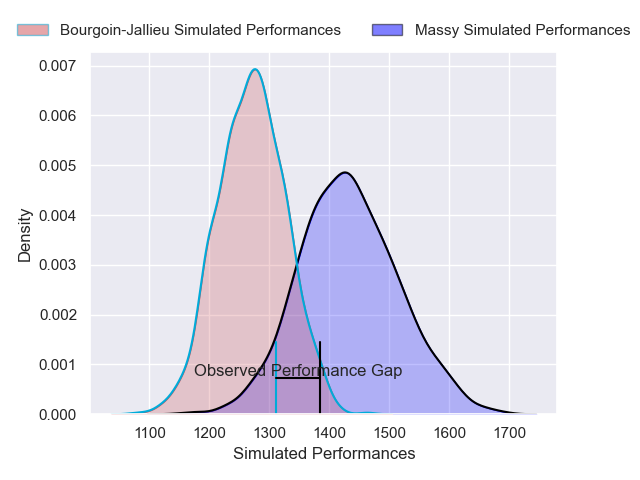
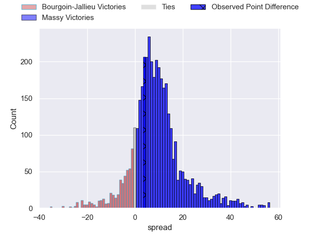
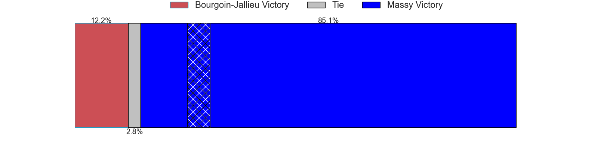
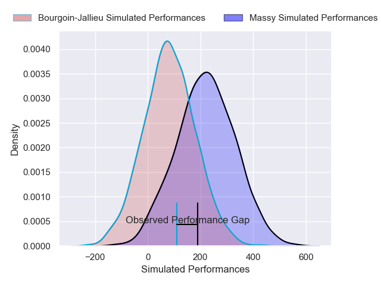
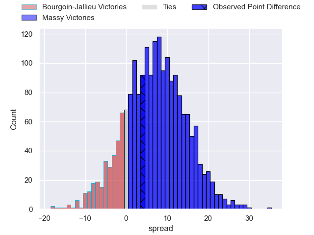
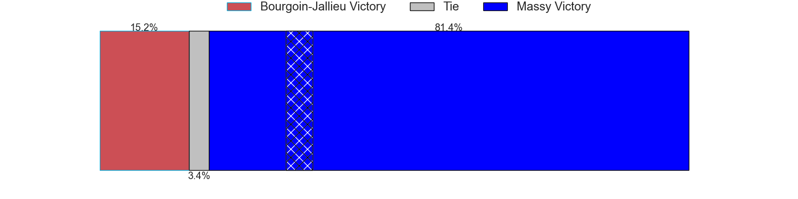

---  
layout: page  
title: Bourgoin-Jallieu at Massy; 13-17  
date: 2025-01-25 18:00:00 -0500  
categories: "Nationale 24/25" match review  
---
# Bourgoin-Jallieu at Massy; 13-17

# Club Level Predictions

The first set of predictions treats a club as the smallest object, as the club develops its members, organizes a gameplan, and deploys its players as needed for each match. This club model has a prediction of 0.718, which translates to predicting Massy to win by 8.2.

Our Over/Under is 45.5 - and combined with the spread above, we have a predicted scoreline of 19 to 27

Each club has a rating and a rating deviation (similar to a Glicko rating), and expected performances can be generated. This allows for simulated matches and spreads like the ones below.
## Projected Performances - Club Model

## Projected Spreads - Club Model

## Projected Results - Club Model

# Player Level Predictions

Treating teams instead as an entity made up of the currently active players, I have ratings for each player in an altogether different system. These can be combined to form team ratings once teamsheets are announced, weighting starters a bit higher than the reserves. After the match is played, players can be weighted by their minutes on the field, allowing for an accurate measure of the team's composition. With these compiled team ratings, we can make predictions, measure inaccuracy, and update the individual player ratings.
## Prediction without Player Minutes: Massy by 5.6

Bourgoin-Jallieu by 0.5 on a neutral pitch

## Projected Performances - Player Model

## Projected Spreads - Player Model

## Projected Results - Player Model

|   Away Minutes | Away Player      |   Away Percentile |   Number |   Home Percentile | Home Player         |   Home Minutes |
|---------------:|:-----------------|------------------:|---------:|------------------:|:--------------------|---------------:|
|             26 | Lucas Dycke      |             56.3  |        1 |             36.71 | Siegfried Fisi'ihoi |             48 |
|             40 | Maxime Castant   |             56.7  |        2 |             59.28 | Pierre Trassoudaine |             48 |
|             13 | Keynan Knox      |             49.49 |        3 |             43.19 | Nolan Pienaar       |             64 |
|             22 | Thomas Adélaïde  |             59    |        4 |             50.45 | Louis Bruinsma      |             29 |
|             15 | Léandre Cotte    |             56.02 |        5 |             56.82 | Andrei Mahu         |             22 |
|             17 | Kamil Bouregba   |             45.9  |        6 |             46.05 | Giani Gamba         |             20 |
|             17 | Mattéo Broeders  |             45.9  |        7 |             60.04 | Hilan Delbois       |             80 |
|             40 | Sam Daly         |             47.29 |        8 |             44.9  | Yohann Gbizié       |             80 |
|             68 | Louis Giamarchi  |             51.55 |        9 |             47.35 | Julien Blanc        |             74 |
|             51 | Tom Danovaro     |             54.17 |       10 |             39.91 | Christian Lacombe   |             53 |
|             80 | Hugo Desgrange   |             51.92 |       11 |             47.59 | Martin Carré        |             53 |
|             29 | Isaiah Leota     |             45.59 |       12 |             46.02 | Luca Mignot         |             80 |
|             38 | Pierre Mignot    |             47.74 |       13 |             44.84 | Arthur Seigneuret   |             80 |
|             29 | Adrian Fugit     |             51.52 |       14 |             52.51 | Giorgi Gogoladze    |             25 |
|             80 | Antoine Renaud   |             47.74 |       15 |             57.85 | Alexandre Borie     |             53 |
|             80 | Louis Ponton     |            nan    |       16 |             65.64 | Adrien Sonzogni     |             61 |
|             68 | Adrien Mallet    |            nan    |       17 |            nan    | Fernandez Corréa    |             53 |
|             63 | Talalelei Gray   |            nan    |       18 |            nan    | Saba Pesvianidze    |             29 |
|             20 | Kévin Rivoire    |            nan    |       19 |            nan    | Tony Tissot         |             19 |
|             17 | Liam Rimet       |             30.71 |       20 |            nan    | Lucas Rubio         |             26 |
|             17 | Clément Garnier  |            nan    |       21 |             42.69 | Tom Cusson          |             54 |
|             17 | Bynjamin Rabatel |            nan    |       22 |             52.21 | Ilian El Yahyaoui   |             47 |
|             18 | Oktay Yilmaz     |            nan    |       23 |             64.91 | Tijde Visser        |              0 |

