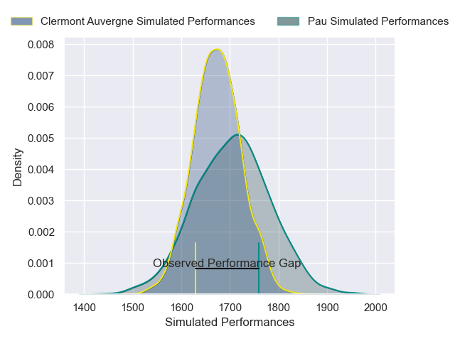
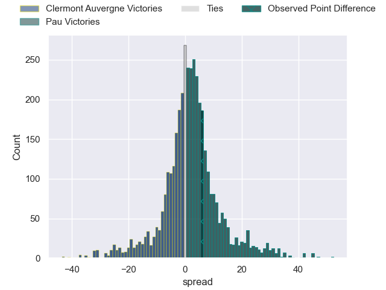
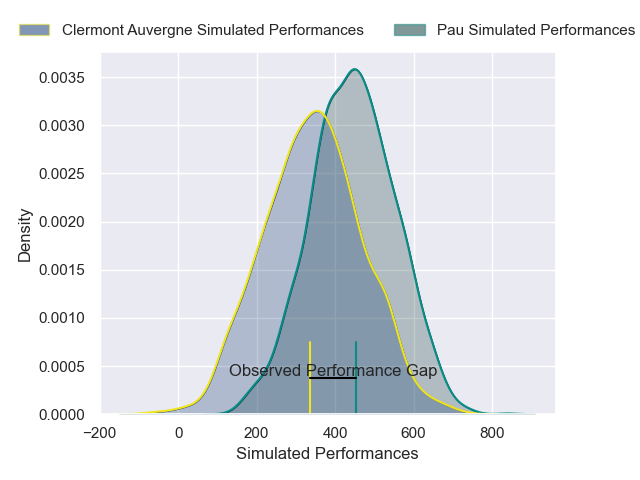
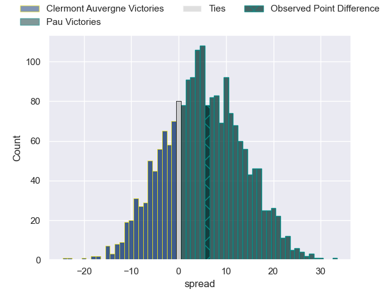

---  
layout: page  
title: Clermont Auvergne at Pau; 14-20  
date: 2025-01-25 18:00:00 -0500  
categories: "Top 14 Orange 24/25" match review  
---
# Clermont Auvergne at Pau; 14-20

# Club Level Predictions

The first set of predictions treats a club as the smallest object, as the club develops its members, organizes a gameplan, and deploys its players as needed for each match. This club model has a prediction of 0.541, which translates to predicting Pau to win by 1.4.

Our Over/Under is 40.5 - and combined with the spread above, we have a predicted scoreline of 19 to 21

Each club has a rating and a rating deviation (similar to a Glicko rating), and expected performances can be generated. This allows for simulated matches and spreads like the ones below.
## Projected Performances - Club Model

## Projected Spreads - Club Model

## Projected Results - Club Model

# Player Level Predictions

Treating teams instead as an entity made up of the currently active players, I have ratings for each player in an altogether different system. These can be combined to form team ratings once teamsheets are announced, weighting starters a bit higher than the reserves. After the match is played, players can be weighted by their minutes on the field, allowing for an accurate measure of the team's composition. With these compiled team ratings, we can make predictions, measure inaccuracy, and update the individual player ratings.
## Prediction without Player Minutes: Pau by 7.4

Clermont Auvergne by 5.9 on a neutral pitch

## Projected Performances - Player Model

## Projected Spreads - Player Model

## Projected Results - Player Model

|   Away Minutes | Away Player          |   Away Percentile |   Number |   Home Percentile | Home Player        |   Home Minutes |
|---------------:|:---------------------|------------------:|---------:|------------------:|:-------------------|---------------:|
|             55 | Etienne Falgoux      |             91.23 |        1 |             90.37 | Lekso Kaulashvili  |             56 |
|             75 | Barnabe Massa        |             63.57 |        2 |             68.21 | Youri Delhommel    |             32 |
|             62 | Cristian Ojovan      |             35.78 |        3 |             15.33 | Jon Zabala         |             61 |
|             53 | Rob Simmons          |             90.85 |        4 |             28.56 | Remi Picquette     |             10 |
|             16 | Thomas Ceyte         |             66.57 |        5 |             30.05 | Jimi Maximin       |             80 |
|              0 | Alexandre Fischer    |             83.22 |        6 |             97.4  | Luke Whitelock     |             80 |
|             40 | Marcos Kremer        |             90.41 |        7 |              9.99 | Loic Credoz        |             80 |
|              8 | Killian Tixeront     |             78.09 |        8 |             66.16 | Beka Gorgadze      |             80 |
|             80 | Baptiste Jauneau     |             88.12 |        9 |             88.3  | Thibault Daubagna  |             55 |
|             32 | Anthony Belleau      |             95.18 |       10 |             74.78 | Joe Simmonds       |             47 |
|             80 | Yerim Fall           |             65.39 |       11 |             47    | Théo Attissogbe    |             70 |
|             80 | Irae Simone          |             43.12 |       12 |             76.34 | Fabien Brau Boirie |             80 |
|             42 | Lucas Tauzin         |             86.24 |       13 |             71.4  | Nathan Decron      |             26 |
|             38 | Bautista Delguy      |             70.89 |       14 |             15.44 | Aymeric Luc        |             14 |
|             80 | Alex Newsome         |             70.75 |       15 |             66.24 | Jack Maddocks      |             22 |
|             38 | Etienne Fourcade     |             89    |       16 |             56.36 | Romain Ruffenach   |             50 |
|             80 | Michael Ala'alatoa   |             95.91 |       17 |             69.08 | Remi Seneca        |             18 |
|             80 | Anthime Hemery       |             71.73 |       18 |              6.79 | Thibaut Hamonou    |             27 |
|             80 | Fritz Lee            |             89.59 |       19 |             26.9  | Sacha Zegueur      |             10 |
|             38 | Sebastien Bezy       |             90.86 |       20 |             98.9  | Dan Robson         |             18 |
|             50 | Benjamin Urdapilleta |             89.47 |       21 |             89.69 | Axel Desperes      |              0 |
|             80 | Pierre Fouyssac      |             18.92 |       22 |             28.82 | Eliott Roudil      |             40 |
|             29 | Thomas Duchêne       |            nan    |       23 |             13.63 | Guram Papidze      |             55 |
|            nan | nan                  |            nan    |       24 |            nan    |                    |             40 |

