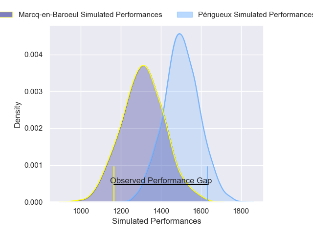
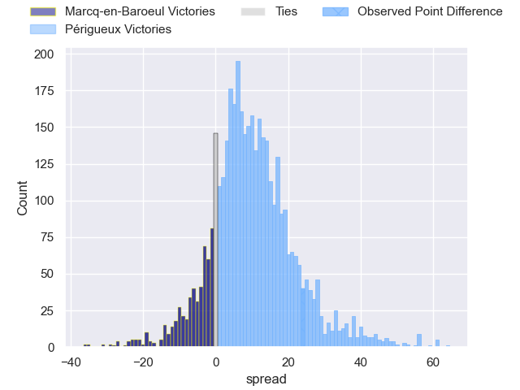
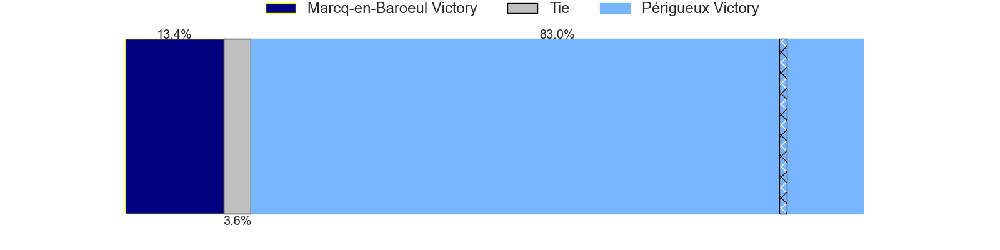
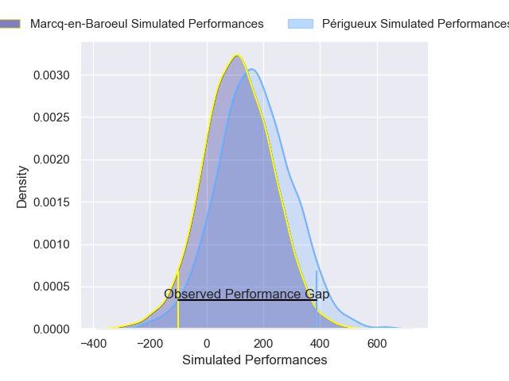
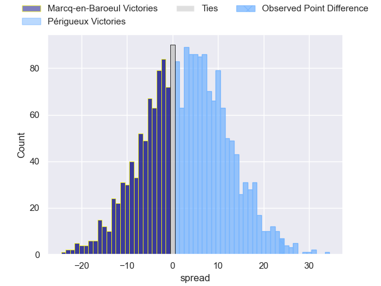
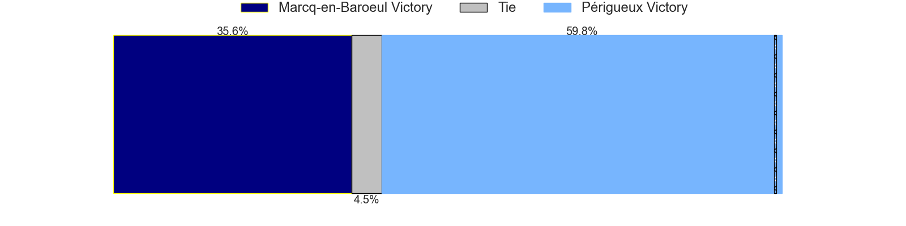

---  
layout: page  
title: Marcq-en-Baroeul at Perigueux; 0-24  
date: 2025-01-25 18:00:00 -0500  
categories: "Nationale 24/25" match review  
---
# Marcq-en-Baroeul at Perigueux; 0-24

# Club Level Predictions

The first set of predictions treats a club as the smallest object, as the club develops its members, organizes a gameplan, and deploys its players as needed for each match. This club model has a prediction of 0.737, which translates to predicting Périgueux to win by 9.5.

Our Over/Under is 31.5 - and combined with the spread above, we have a predicted scoreline of 11 to 20

Each club has a rating and a rating deviation (similar to a Glicko rating), and expected performances can be generated. This allows for simulated matches and spreads like the ones below.
## Projected Performances - Club Model

## Projected Spreads - Club Model

## Projected Results - Club Model

# Player Level Predictions

Treating teams instead as an entity made up of the currently active players, I have ratings for each player in an altogether different system. These can be combined to form team ratings once teamsheets are announced, weighting starters a bit higher than the reserves. After the match is played, players can be weighted by their minutes on the field, allowing for an accurate measure of the team's composition. With these compiled team ratings, we can make predictions, measure inaccuracy, and update the individual player ratings.
## Prediction without Player Minutes: Périgueux by 2.8

Marcq-en-Baroeul by 0.1 on a neutral pitch

## Projected Performances - Player Model

## Projected Spreads - Player Model

## Projected Results - Player Model

|   Away Minutes | Away Player           |   Away Percentile |   Number |   Home Percentile | Home Player      |   Home Minutes |
|---------------:|:----------------------|------------------:|---------:|------------------:|:-----------------|---------------:|
|             80 | Lewys Jones           |             22.15 |        1 |             55.88 | Thomas Vidal     |             80 |
|             63 | Matéo Saint-Germain   |             30.46 |        2 |             48.36 | Manu Leiataua    |             80 |
|             35 | Marius Pollet         |             36.2  |        3 |             53.24 | Kalivati Tawake  |             58 |
|              6 | Marius Ruyffelaere    |             45.08 |        4 |             44.19 | Clément Lanen    |             58 |
|             35 | Jean-Baptiste Rendé   |             33.07 |        5 |             60.97 | Damien Lavergne  |             80 |
|             80 | Thomas Simonet        |             26.65 |        6 |             57.11 | Karl Lambert     |             65 |
|             75 | Maxime Danton         |             23.35 |        7 |             60.82 | Afa Amosa        |             80 |
|             62 | Otilo Kafotamaki      |             21.69 |        8 |             65.51 | Nahum Merigan    |             80 |
|             52 | Dylan Nocète          |             29.74 |        9 |             46.9  | Max Green        |             80 |
|             62 | Mark Erasmus          |             27.35 |       10 |             51.64 | Anderson Neisen  |             77 |
|             80 | Jeannick Ouassiero    |             29.43 |       11 |             39.07 | Benjamin Yarde   |              8 |
|             52 | Mathias Ortiz         |             29.57 |       12 |             33.87 | Cyril Couturier  |             11 |
|             80 | Hugo Detré            |             18.28 |       13 |             31.18 | Dorian Lavernhe  |             17 |
|             50 | Ervin Muric           |             34.94 |       14 |             61.71 | Paul Piveteau    |             69 |
|             43 | Clément Unique        |             32.83 |       15 |             28.97 | Yon Camou        |             11 |
|             21 | Eliot Nazet           |            nan    |       16 |             26.33 | Louis Martin     |             11 |
|             27 | Sive Mazosiwe         |            nan    |       17 |            nan    | Jason Tindilière |             11 |
|             21 | Nino Maso             |            nan    |       18 |            nan    | Richard Fourcade |             58 |
|             27 | Arthur Bruges         |             27.35 |       19 |            nan    | Hendri Storm     |             80 |
|             28 | Antoine Soubirou      |            nan    |       20 |            nan    | Mattéo Bordenave |             22 |
|             23 | Rachid Bina           |            nan    |       21 |            nan    | Nicolas Piaton   |             80 |
|             80 | Hugues Crespo         |             30.56 |       22 |            nan    | Tim Giresse      |             80 |
|             80 | Victor-Fy Balas Burel |             27.26 |       23 |            nan    | Martin Augeix    |             80 |

