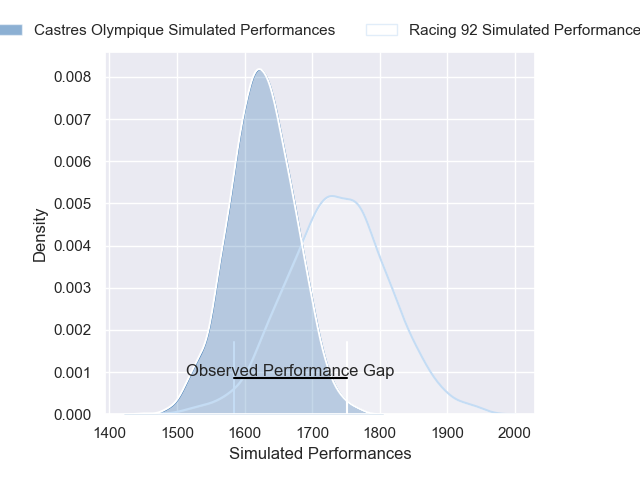
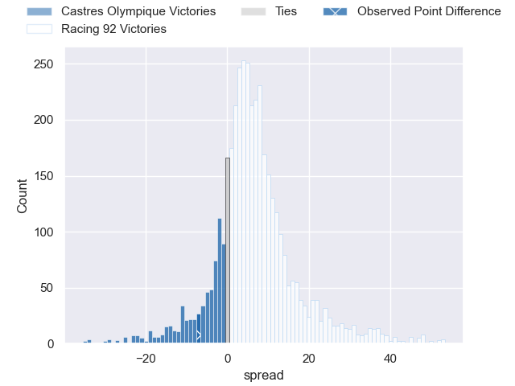
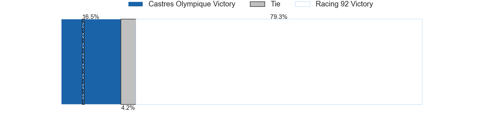
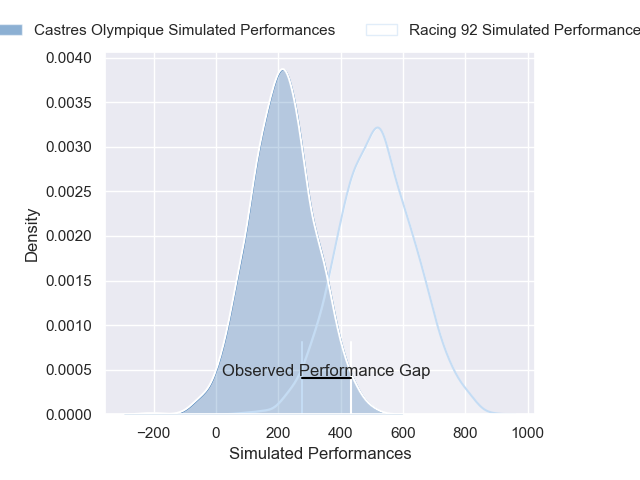
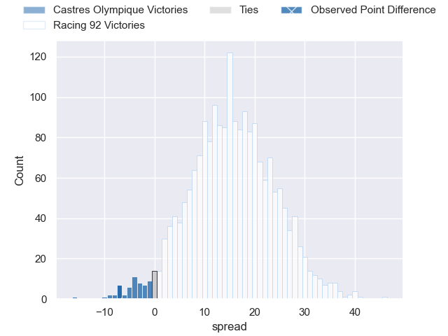
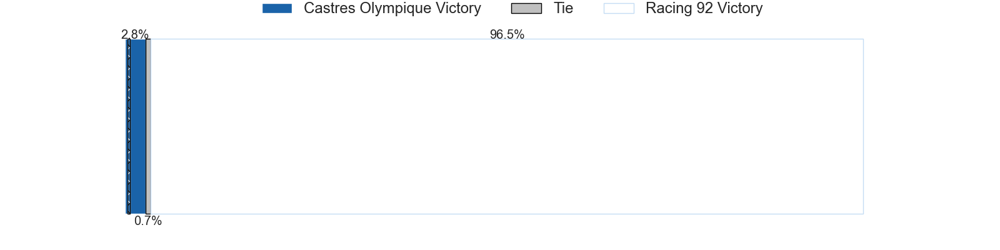

---  
layout: page  
title: Castres Olympique at Racing 92; 27-20  
date: 2025-01-25 18:00:00 -0500  
categories: "Top 14 Orange 24/25" match review  
---
# Castres Olympique at Racing 92; 27-20

# Club Level Predictions

The first set of predictions treats a club as the smallest object, as the club develops its members, organizes a gameplan, and deploys its players as needed for each match. This club model has a prediction of 0.66, which translates to predicting Racing 92 to win by 5.8.

Our Over/Under is 50.5 - and combined with the spread above, we have a predicted scoreline of 23 to 28

Each club has a rating and a rating deviation (similar to a Glicko rating), and expected performances can be generated. This allows for simulated matches and spreads like the ones below.
## Projected Performances - Club Model

## Projected Spreads - Club Model

## Projected Results - Club Model

# Player Level Predictions

Treating teams instead as an entity made up of the currently active players, I have ratings for each player in an altogether different system. These can be combined to form team ratings once teamsheets are announced, weighting starters a bit higher than the reserves. After the match is played, players can be weighted by their minutes on the field, allowing for an accurate measure of the team's composition. With these compiled team ratings, we can make predictions, measure inaccuracy, and update the individual player ratings.
## Prediction without Player Minutes: Racing 92 by 12.9

Racing 92 by 1.9 on a neutral pitch

## Projected Performances - Player Model

## Projected Spreads - Player Model

## Projected Results - Player Model

|   Away Minutes | Away Player          |   Away Percentile |   Number |   Home Percentile | Home Player           |   Home Minutes |
|---------------:|:---------------------|------------------:|---------:|------------------:|:----------------------|---------------:|
|             21 | Quentin Walcker      |             58.01 |        1 |             55.37 | Guram Gogichashvili   |             80 |
|             24 | Gaetan Barlot        |             75.09 |        2 |             29.55 | Janick Tarrit         |             78 |
|             42 | Levan Chilachava     |             84.5  |        3 |             40.97 | Thomas Laclayat       |             80 |
|             80 | Guillaume Ducat      |             25.77 |        4 |             93.53 | Cameron Woki          |             17 |
|             56 | Leone Nakarawa       |             96.52 |        5 |             81.59 | Boris Palu            |             68 |
|             63 | Mathieu Babillot     |             32.17 |        6 |             11.49 | Ibrahim Diallo        |             80 |
|              3 | Tyler Ardron         |             75.52 |        7 |             45.75 | Maxime Baudonne       |             80 |
|             12 | Abraham Papali'i     |             17.14 |        8 |             83.73 | Hacjivah Dayimani     |             80 |
|             44 | Santiago Arata       |             85.01 |        9 |             32.72 | Clovis Le Bail        |             42 |
|              8 | Louis Le Brun        |             73.46 |       10 |             98.68 | Owen Farrell          |             80 |
|             48 | Remy Baget           |             93.51 |       11 |             18.78 | Vinaya Habosi         |             57 |
|              0 | Adrea Cocagi         |             78.28 |       12 |              1.83 | Dan Lancaster         |             38 |
|             10 | Jack Goodhue         |             96.34 |       13 |             91.08 | Josua Tuisova         |             53 |
|             80 | Geoffrey Palis       |             97.94 |       14 |              3.93 | Max Spring            |             45 |
|             58 | Julien Dumora        |             70.54 |       15 |             14.19 | Tristan Tedder        |             42 |
|              0 | Loris Zarantonello   |             34.54 |       16 |             74.91 | Diego Escobar Alvarez |             68 |
|             80 | Antoine Tichit       |             84.75 |       17 |             14.99 | Hassane Kolingar      |             78 |
|              8 | Florent Vanverberghe |             81.89 |       18 |             24.58 | Fabien Sanconnie      |             42 |
|             18 | Gauthier Maravat     |              2.79 |       19 |             28.46 | Romain Taofifenua     |             80 |
|             80 | Jeremy Fernandez     |             74.41 |       20 |             84.6  | Jordan Joseph         |             14 |
|             54 | Josaia Raisuqe       |             94.89 |       21 |             94.96 | Antoine Gibert        |             36 |
|             77 | Vilimoni Botitu      |             72.8  |       22 |             99.89 | Henry Chavancy        |             21 |
|             50 | Aurelien Azar        |             60.9  |       23 |             77.51 | Lee-Marvin Mazibuko   |             56 |

