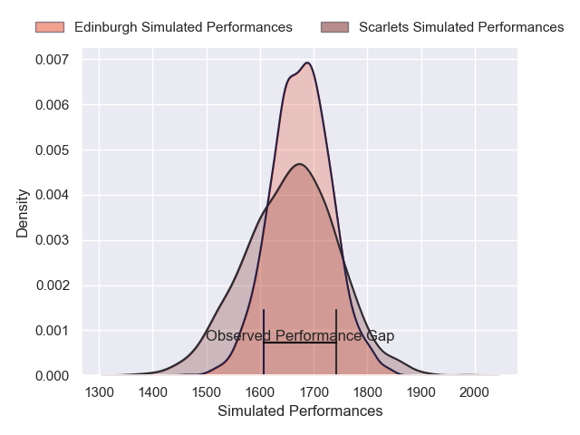
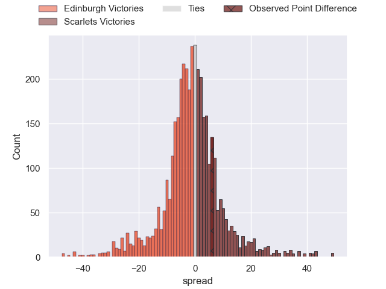
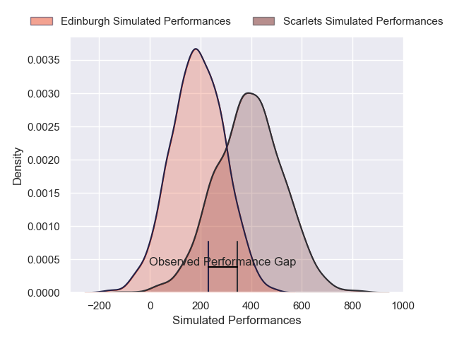
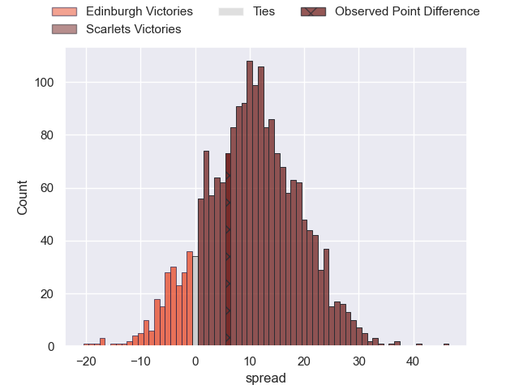

---  
layout: page  
title: Edinburgh at Scarlets; 24-30  
date: 2025-01-25 18:00:00 -0500  
categories: "United Rugby Championship 2024" match review  
---
# Edinburgh at Scarlets; 24-30

# Club Level Predictions

The first set of predictions treats a club as the smallest object, as the club develops its members, organizes a gameplan, and deploys its players as needed for each match. This club model has a prediction of 0.477, which translates to predicting Edinburgh to win by 0.8.

Our Over/Under is 44.5 - and combined with the spread above, we have a predicted scoreline of 23 to 22

Each club has a rating and a rating deviation (similar to a Glicko rating), and expected performances can be generated. This allows for simulated matches and spreads like the ones below.
## Projected Performances - Club Model

## Projected Spreads - Club Model

## Projected Results - Club Model

# Player Level Predictions

Treating teams instead as an entity made up of the currently active players, I have ratings for each player in an altogether different system. These can be combined to form team ratings once teamsheets are announced, weighting starters a bit higher than the reserves. After the match is played, players can be weighted by their minutes on the field, allowing for an accurate measure of the team's composition. With these compiled team ratings, we can make predictions, measure inaccuracy, and update the individual player ratings.
## Prediction without Player Minutes: Scarlets by 6.9

Edinburgh by 2.4 on a neutral pitch

## Projected Performances - Player Model

## Projected Spreads - Player Model

## Projected Results - Player Model

|   Away Minutes | Away Player      |   Away Percentile |   Number |   Home Percentile | Home Player          |   Home Minutes |
|---------------:|:-----------------|------------------:|---------:|------------------:|:---------------------|---------------:|
|             80 | Boan Venter      |             72.36 |        1 |             91.67 | Alec Hepburn         |           30   |
|             43 | Patrick Harrison |             18.24 |        2 |             93.8  | Marnus van der Merwe |           80   |
|             80 | Paul Hill        |             99.4  |        3 |             41.5  | Archer Holz          |           53   |
|             69 | Glen Young       |              3.97 |        4 |             76.98 | Alex Craig           |           80   |
|             71 | Sam Skinner      |             93.25 |        5 |             77.98 | Sam Lousi            |            9.5 |
|             80 | Liam Mcconnell   |             52.4  |        6 |             85.47 | Max Douglas          |           38   |
|              0 | Hamish Watson    |             76.55 |        7 |             57.52 | Josh MacLeod         |           80   |
|              0 | Tom Dodd         |             62.39 |        8 |             96.09 | Vaea Fifita          |           80   |
|              9 | Ali Price        |             91.59 |        9 |             32.72 | Gareth Davies        |           26   |
|             80 | Ben Healy        |             77.85 |       10 |             34.21 | Ioan Lloyd           |           28   |
|             21 | Lewis Wells      |             49.85 |       11 |             85.77 | Steffan Evans        |           80   |
|             17 | James Lang       |             74.52 |       12 |             88.82 | Johnny Williams      |           80   |
|             37 | Matt Currie      |             82.47 |       13 |             29.14 | Macs Page            |           63   |
|             16 | Harry Paterson   |             21.2  |       14 |             44.95 | Jac Davies           |           20   |
|             42 | Wes Goosen       |             86.48 |       15 |             15.24 | Ioan Nicholas        |           12   |
|             69 | Harri Morris     |            nan    |       16 |              8.26 | Shaun Evans          |           80   |
|              3 | Robin Hislop     |            nan    |       17 |            nan    | Sam O'Connor         |           80   |
|             19 | Javan Sebastian  |             66.16 |       18 |            nan    | Gabe Hawley          |           80   |
|             27 | Rob Carmichael   |            nan    |       19 |              3.67 | Jac Price            |           80   |
|             27 | Tom Currie       |            nan    |       20 |             91.52 | Taine Plumtree       |           80   |
|             60 | Ben Vellacott    |             51.74 |       21 |             47.35 | Efan Jones           |           80   |
|              6 | Ross Thompson    |             79.39 |       22 |            nan    | Charlie Titcombe     |           30   |
|              8 | Mosese Tuipulotu |             30.54 |       23 |             69.04 | Jarrod Taylor        |           80   |

