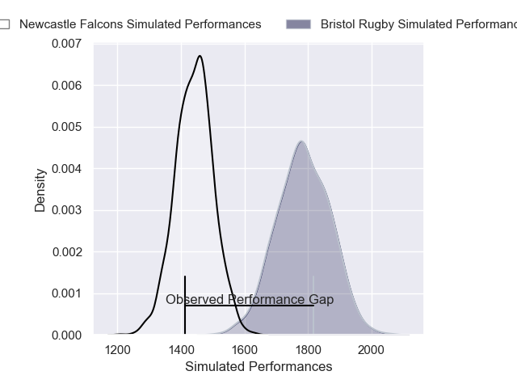
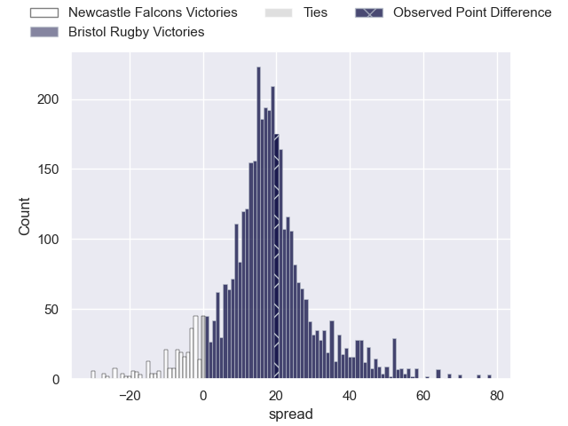
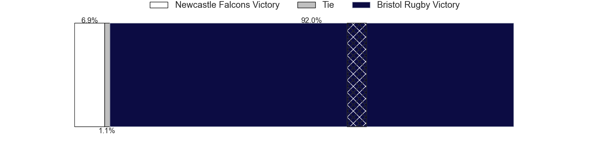
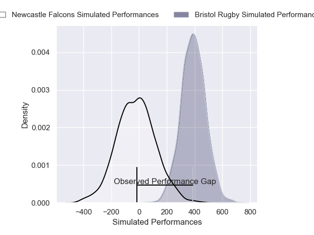
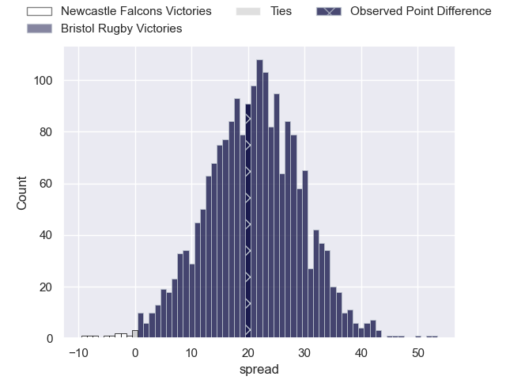
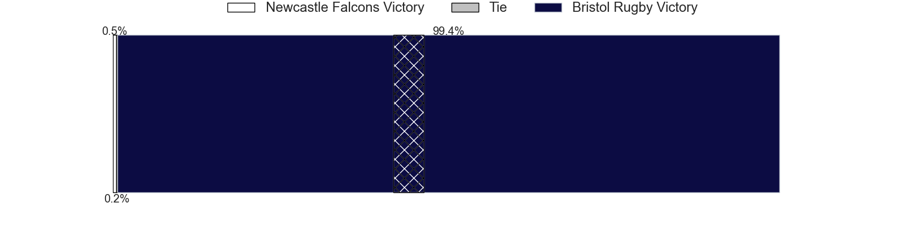

---  
layout: page  
title: Newcastle Falcons at Bristol Rugby; 35-55  
date: 2025-01-26 18:00:00 -0500  
categories: "Gallagher Premiership 24/25" match review  
---
# Newcastle Falcons at Bristol Rugby; 35-55

# Club Level Predictions

The first set of predictions treats a club as the smallest object, as the club develops its members, organizes a gameplan, and deploys its players as needed for each match. This club model has a prediction of 0.877, which translates to predicting Bristol Rugby to win by 17.3.

Our Over/Under is 56.5 - and combined with the spread above, we have a predicted scoreline of 20 to 37

Each club has a rating and a rating deviation (similar to a Glicko rating), and expected performances can be generated. This allows for simulated matches and spreads like the ones below.
## Projected Performances - Club Model

## Projected Spreads - Club Model

## Projected Results - Club Model

# Player Level Predictions

Treating teams instead as an entity made up of the currently active players, I have ratings for each player in an altogether different system. These can be combined to form team ratings once teamsheets are announced, weighting starters a bit higher than the reserves. After the match is played, players can be weighted by their minutes on the field, allowing for an accurate measure of the team's composition. With these compiled team ratings, we can make predictions, measure inaccuracy, and update the individual player ratings.
## Prediction without Player Minutes: Bristol Rugby by 31.8

Bristol Rugby by 24.8 on a neutral pitch

## Projected Performances - Player Model

## Projected Spreads - Player Model

## Projected Results - Player Model

|   Away Minutes | Away Player         |   Away Percentile |   Number |   Home Percentile | Home Player                |   Home Minutes |
|---------------:|:--------------------|------------------:|---------:|------------------:|:---------------------------|---------------:|
|             10 | Adam Brocklebank    |              0.51 |        1 |            nan    | nan                        |            nan |
|             80 | Jamie Blamire       |              0.52 |        2 |            nan    | nan                        |            nan |
|             80 | Murray McCallum     |              7.24 |        3 |            nan    | nan                        |            nan |
|             80 | Sebastian de Chaves |              1.79 |        4 |            nan    | nan                        |            nan |
|             80 | Kiran McDonald      |             11.22 |        5 |             83.42 | Joe Owen                   |             40 |
|             80 | Philip van der Walt |              1.8  |        6 |             92.69 | Santiago Grondona          |             44 |
|             22 | Freddie Lockwood    |             15.63 |        7 |             96.69 | Fitz Harding               |             73 |
|             22 | Callum Chick        |              1.3  |        8 |             70.07 | Viliame Mata               |             51 |
|             11 | Sam Stuart          |              0.18 |        9 |             94.34 | Kieran Marmion             |             19 |
|             21 | Brett Connon        |              3.72 |       10 |             90.15 | Harry Byrne                |             32 |
|             41 | Ben Stevenson       |             34.74 |       11 |             80.41 | Kalaveti Ravouvou          |             14 |
|             25 | Max Clark           |             27.74 |       12 |             96.67 | Benhard Janse van Rensburg |              9 |
|             79 | Alex Hearle         |             39.78 |       13 |             23.55 | Joe Jenkins                |              0 |
|             80 | Max Pepper          |             26.18 |       14 |             87.2  | Noah Heward                |             32 |
|             80 | Elliott Obatoyinbo  |             11.59 |       15 |             75.75 | Richard Lane               |             21 |
|              2 | Ollie Fletcher      |             21.34 |       16 |             30.29 | Will Capon                 |             27 |
|             80 | Mike Rewcastle      |             16.1  |       17 |             90.63 | Jake Woolmore              |             24 |
|             53 | Luan de Bruin       |             52.56 |       18 |             64.05 | George Kloska              |             80 |
|             80 | John Hawkins        |              4.67 |       19 |             99.5  | Steven Luatua              |             77 |
|             80 | Ollie Leatherbarrow |             15.13 |       20 |             67.23 | Jake Heenan                |             74 |
|             80 | Joe Davis           |            nan    |       21 |            nan    | Sam Wolstenholme           |             80 |
|             80 | Kieran Wilkinson    |             46.61 |       22 |             89.91 | Benjamin Elizalde          |             10 |
|             73 | Oliver Spencer      |             77.2  |       23 |            nan    | nan                        |            nan |

