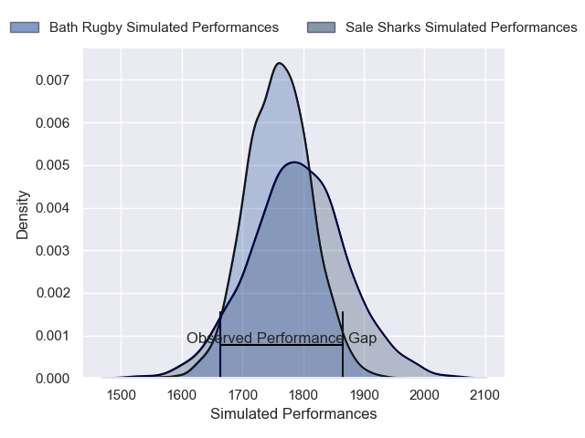
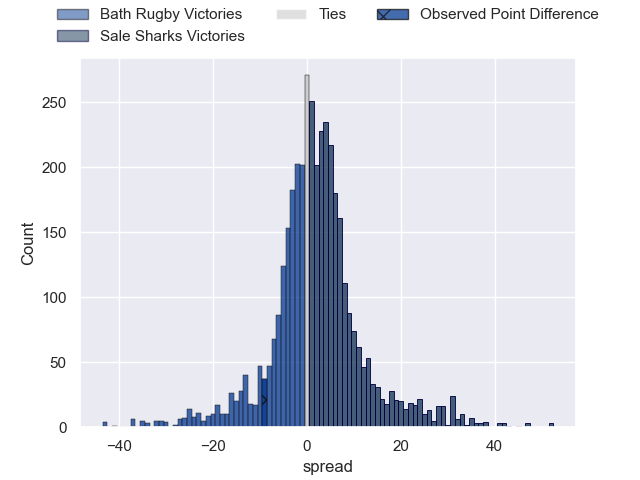
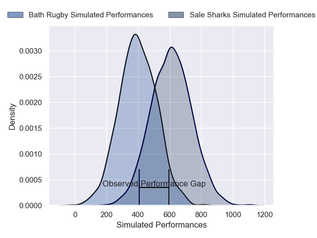
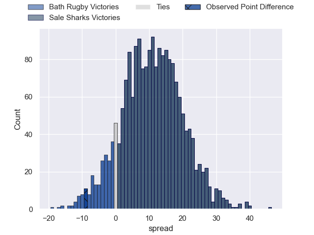
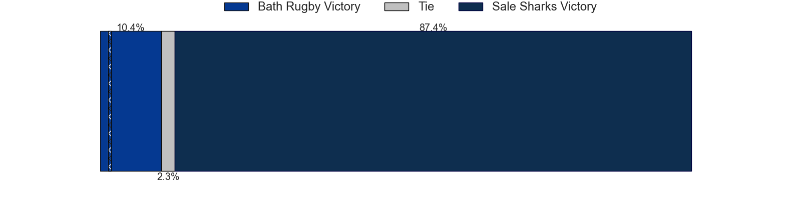

---  
layout: page  
title: Bath Rugby at Sale Sharks; 32-23  
date: 2025-01-26 18:00:00 -0500  
categories: "Gallagher Premiership 2024" match review  
---
# Bath Rugby at Sale Sharks; 32-23

# Club Level Predictions

The first set of predictions treats a club as the smallest object, as the club develops its members, organizes a gameplan, and deploys its players as needed for each match. This club model has a prediction of 0.543, which translates to predicting Sale Sharks to win by 1.5.

Our Over/Under is 44.5 - and combined with the spread above, we have a predicted scoreline of 22 to 23

Each club has a rating and a rating deviation (similar to a Glicko rating), and expected performances can be generated. This allows for simulated matches and spreads like the ones below.
## Projected Performances - Club Model

## Projected Spreads - Club Model

## Projected Results - Club Model

# Player Level Predictions

Treating teams instead as an entity made up of the currently active players, I have ratings for each player in an altogether different system. These can be combined to form team ratings once teamsheets are announced, weighting starters a bit higher than the reserves. After the match is played, players can be weighted by their minutes on the field, allowing for an accurate measure of the team's composition. With these compiled team ratings, we can make predictions, measure inaccuracy, and update the individual player ratings.
## Prediction without Player Minutes: Sale Sharks by 8.0

Bath Rugby by 5.5 on a neutral pitch

## Projected Performances - Player Model

## Projected Spreads - Player Model

## Projected Results - Player Model

|   Away Minutes | Away Player         |   Away Percentile |   Number |   Home Percentile | Home Player          |   Home Minutes |
|---------------:|:--------------------|------------------:|---------:|------------------:|:---------------------|---------------:|
|             73 | Beno Obano          |             97.7  |        1 |             89.46 | Simon McIntyre       |             80 |
|             48 | Niall Annett        |             77.28 |        2 |              9.47 | Ethan Caine          |             80 |
|             66 | Thomas du Toit      |             99.74 |        3 |             81.29 | WillGriff John       |             74 |
|             53 | Quinn Roux          |             95.44 |        4 |             85.42 | Ernst van Rhyn       |             80 |
|             67 | Charlie Ewels       |             83.93 |        5 |             29.07 | Hyron Andrews        |             80 |
|             69 | Josh Bayliss        |             37.68 |        6 |            100    | Jean-Luc du Preez    |             53 |
|             58 | Miles Reid          |             97.7  |        7 |             18.04 | Sam Dugdale          |              6 |
|             58 | Alfie Barbeary      |             90.87 |        8 |             91.96 | Daniel du Preez      |             27 |
|              9 | Louis Schreuder     |             85.56 |        9 |             54.11 | Gus Warr             |             80 |
|              1 | Finn Russell        |             99.78 |       10 |             68.2  | Robert du Preez      |             80 |
|             15 | Ruaridh McConnochie |             88.52 |       11 |             95.29 | Arron Reed           |             80 |
|             74 | Will Butt           |             89.35 |       12 |             15.59 | Rekeiti Ma'asi-White |             55 |
|             35 | Max Ojomoh          |             96.13 |       13 |             90.43 | Will Addison         |             61 |
|             54 | Joe Cokanasiga      |             96.57 |       14 |             97.64 | Tom O'Flaherty       |             13 |
|              9 | Tom de Glanville    |             54.94 |       15 |              7.94 | Joe Carpenter        |             59 |
|             10 | Tom Dunn            |             97.59 |       16 |             48.36 | Tadgh McElroy        |             78 |
|             80 | Francois van Wyk    |             86.48 |       17 |             19.73 | Tumy Onasanya        |              7 |
|             80 | Billy Sela          |             83.42 |       18 |            nan    | Tye Raymont          |             66 |
|             72 | Ross Molony         |             95.83 |       19 |            nan    | Jonny Hill           |             80 |
|             39 | Ewan Richards       |             64.09 |       20 |             18.55 | Ben Bamber           |             48 |
|             80 | Tom Carr-Smith      |            nan    |       21 |            nan    | Nye Thomas           |             21 |
|              0 | Orlando Bailey      |             77.04 |       22 |            nan    | Alex Wills           |             80 |
|            nan | nan                 |            nan    |       23 |             81.29 | Sam Bedlow           |             66 |

