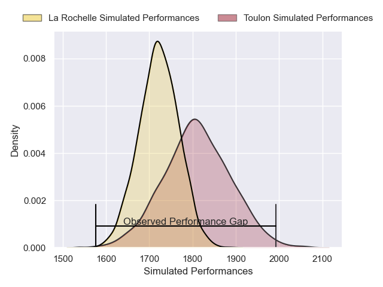
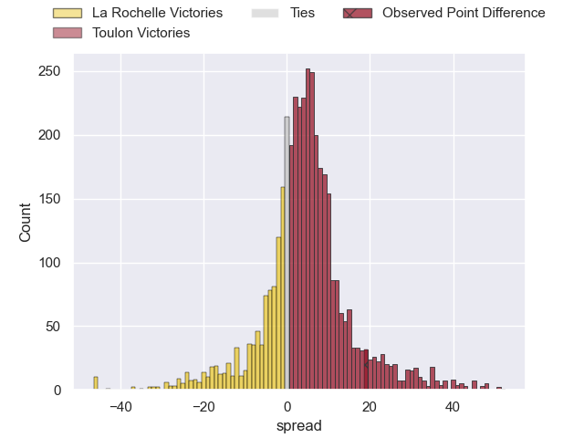
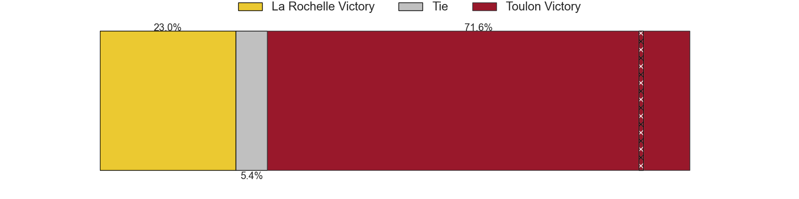
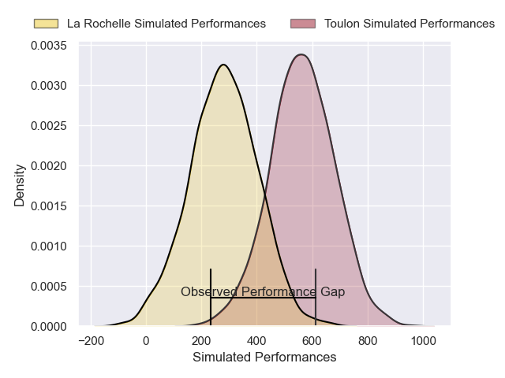
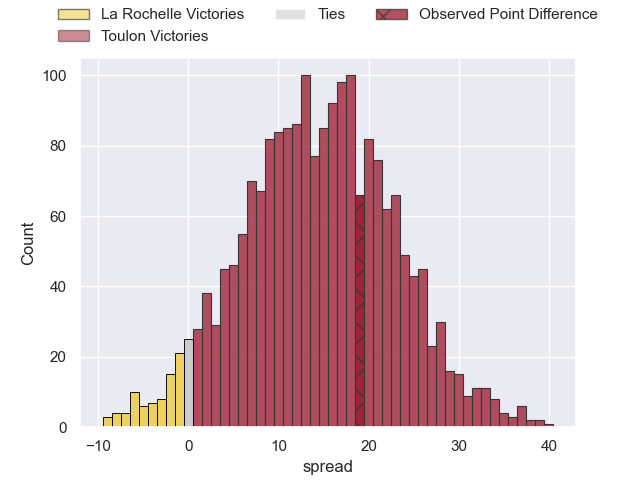
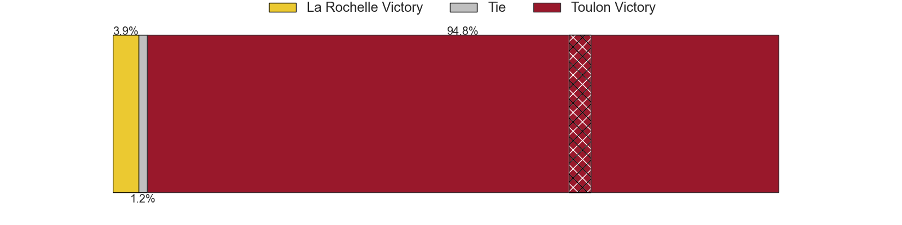

---  
layout: page  
title: La Rochelle at Toulon; 26-45  
date: 2025-01-26 18:00:00 -0500  
categories: "Top 14 Orange 24/25" match review  
---
# La Rochelle at Toulon; 26-45

# Club Level Predictions

The first set of predictions treats a club as the smallest object, as the club develops its members, organizes a gameplan, and deploys its players as needed for each match. This club model has a prediction of 0.625, which translates to predicting Toulon to win by 4.5.

Our Over/Under is 43.5 - and combined with the spread above, we have a predicted scoreline of 20 to 24

Each club has a rating and a rating deviation (similar to a Glicko rating), and expected performances can be generated. This allows for simulated matches and spreads like the ones below.
## Projected Performances - Club Model

## Projected Spreads - Club Model

## Projected Results - Club Model

# Player Level Predictions

Treating teams instead as an entity made up of the currently active players, I have ratings for each player in an altogether different system. These can be combined to form team ratings once teamsheets are announced, weighting starters a bit higher than the reserves. After the match is played, players can be weighted by their minutes on the field, allowing for an accurate measure of the team's composition. With these compiled team ratings, we can make predictions, measure inaccuracy, and update the individual player ratings.
## Prediction without Player Minutes: Toulon by 12.8

Toulon by 1.3 on a neutral pitch

## Projected Performances - Player Model

## Projected Spreads - Player Model

## Projected Results - Player Model

|   Away Minutes | Away Player         |   Away Percentile |   Number |   Home Percentile | Home Player            |   Home Minutes |
|---------------:|:--------------------|------------------:|---------:|------------------:|:-----------------------|---------------:|
|             70 | Alexandre Kaddouri  |             42.25 |        1 |             92.5  | Dany Priso             |              0 |
|             80 | Nika Sutidze        |             42.61 |        2 |             86.77 | Gianmarco Lucchesi     |              0 |
|             80 | Aleksandre Kuntelia |             45.83 |        3 |             72.74 | Beka Gigashvili        |             80 |
|             80 | Thomas Lavault      |             89.85 |        4 |             46.17 | Matthias Halagahu      |             80 |
|             80 | Simon Huchet        |             44.28 |        5 |             86.67 | David Ribbans          |             80 |
|             80 | Tyreese Leupolu     |             42.56 |        6 |             75.12 | Lewis Ludlam           |             73 |
|             80 | Levani Botia        |             96.4  |        7 |             74.73 | Esteban Abadie         |              7 |
|             21 | Matthias Haddad     |             57.7  |        8 |             85.47 | Facundo Isa            |             29 |
|             19 | Tawera Kerr-Barlow  |             97.99 |        9 |             98.54 | Baptiste Serin         |             36 |
|             70 | Antoine Hastoy      |             65.57 |       10 |             82.68 | Paolo Garbisi          |             43 |
|             69 | Hoani Bosmorin      |             43.66 |       11 |             92.33 | Gabin Villiere         |              6 |
|             71 | Jules Favre         |             89.57 |       12 |             48.17 | Jeremy Sinzelle        |              7 |
|             73 | Ulupano Seuteni     |             79.25 |       13 |             90.97 | Leicester Fainga'anuku |             80 |
|             80 | Jack Nowell         |             95.97 |       14 |             24.78 | Gael Drean             |             80 |
|             10 | Dillyn Leyds        |             97.2  |       15 |             58.49 | Marius Domon           |             70 |
|             21 | Quentin Lespiaucq   |             67.35 |       16 |             88.14 | Mickael Ivaldi         |             21 |
|            nan | nan                 |            nan    |       18 |             75.32 | Swan Rebbadj           |             80 |
|            nan | nan                 |            nan    |       19 |             75.22 | Matteo Le Corvec       |             59 |
|            nan | nan                 |            nan    |       20 |             97.42 | Antoine Frisch         |             70 |
|            nan | nan                 |            nan    |       21 |             89.76 | Ben White              |             80 |
|            nan | nan                 |            nan    |       22 |             81.58 | Enzo Herve             |             80 |
|            nan | nan                 |            nan    |       23 |             95.06 | Emerick Setiano        |             61 |

