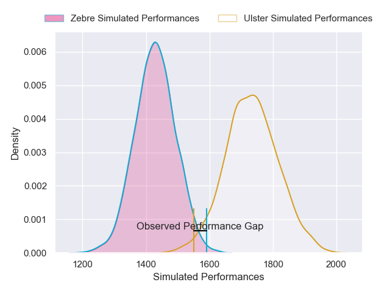
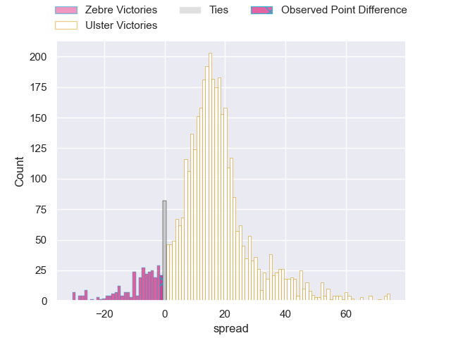
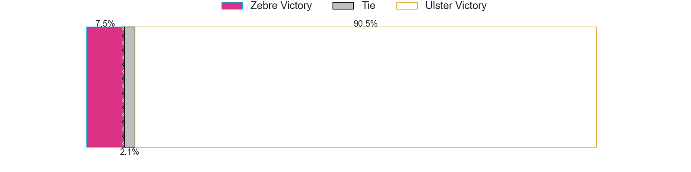
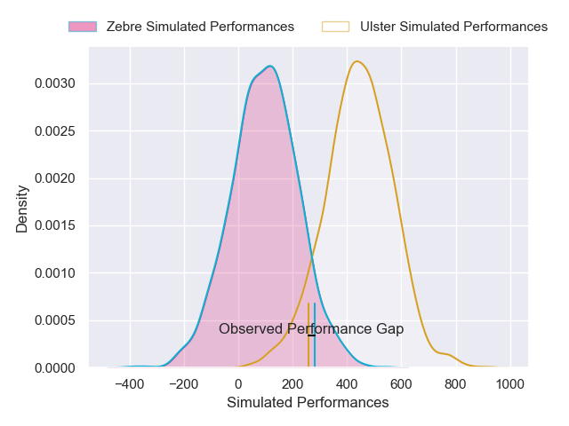
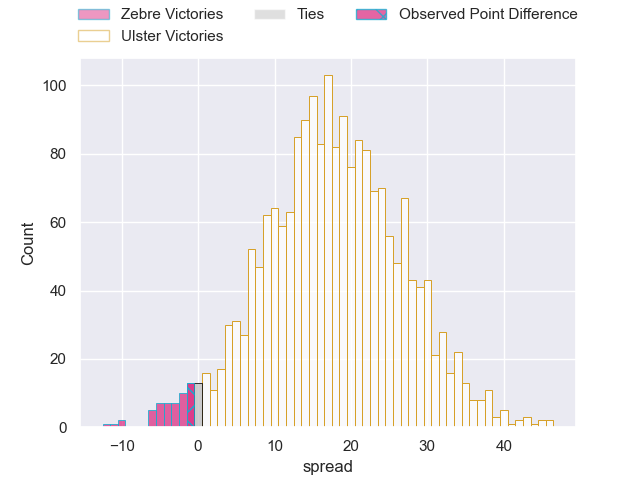
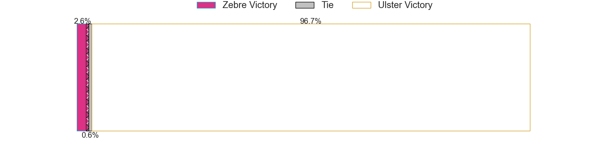

---  
layout: page  
title: Zebre at Ulster; 15-14  
date: 2025-01-26 18:00:00 -0500  
categories: "United Rugby Championship 24/25" match review  
---
# Zebre at Ulster; 15-14

# Club Level Predictions

The first set of predictions treats a club as the smallest object, as the club develops its members, organizes a gameplan, and deploys its players as needed for each match. This club model has a prediction of 0.848, which translates to predicting Ulster to win by 15.2.

Our Over/Under is 44.5 - and combined with the spread above, we have a predicted scoreline of 15 to 30

Each club has a rating and a rating deviation (similar to a Glicko rating), and expected performances can be generated. This allows for simulated matches and spreads like the ones below.
## Projected Performances - Club Model

## Projected Spreads - Club Model

## Projected Results - Club Model

# Player Level Predictions

Treating teams instead as an entity made up of the currently active players, I have ratings for each player in an altogether different system. These can be combined to form team ratings once teamsheets are announced, weighting starters a bit higher than the reserves. After the match is played, players can be weighted by their minutes on the field, allowing for an accurate measure of the team's composition. With these compiled team ratings, we can make predictions, measure inaccuracy, and update the individual player ratings.
## Prediction without Player Minutes: Ulster by 22.2

Ulster by 12.6 on a neutral pitch

## Projected Performances - Player Model

## Projected Spreads - Player Model

## Projected Results - Player Model

|   Away Minutes | Away Player         |   Away Percentile |   Number |   Home Percentile | Home Player        |   Home Minutes |
|---------------:|:--------------------|------------------:|---------:|------------------:|:-------------------|---------------:|
|             80 | Paolo Buonfiglio    |             54.09 |        1 |             87.65 | Eric O'Sullivan    |              0 |
|             80 | Luca Bigi           |             80.58 |        2 |              2.58 | Tom Stewart        |             59 |
|             30 | Muhamed Hasa        |             20.19 |        3 |             30.66 | Scott Wilson       |             67 |
|             30 | Matteo Canali       |             88.56 |        4 |             59.8  | Harry Sheridan     |             80 |
|             29 | Leonard Krumov      |              5.07 |        5 |             83.38 | Kieran Treadwell   |             80 |
|             80 | Rusiate Nasove      |             59.04 |        6 |             26.37 | Lorcan Mcloughlin  |             65 |
|             71 | Bautista Stavile    |             22.38 |        7 |             92.91 | Nick Timoney       |             80 |
|             17 | Giovanni Licata     |             12.8  |        8 |             79.83 | David McCann       |             45 |
|             17 | Gonzalo Garcia      |              2.38 |        9 |             92.5  | John Cooney        |             80 |
|             80 | Giovanni Montemauri |              2.85 |       10 |             52.85 | Jack Murphy        |             26 |
|             25 | Scott Gregory       |             81.02 |       11 |             28.52 | Zac Ward           |             70 |
|             25 | Damiano Mazza       |             53.76 |       12 |             59.25 | Jude Postlethwaite |             71 |
|              9 | Fetuli Paea         |             11.18 |       13 |             43.76 | Ben Carson         |             27 |
|             22 | Alessandro Gesi     |             36.77 |       14 |             12    | Mike Lowry         |             66 |
|             80 | Giacomo Da Re       |             61.51 |       15 |             97.85 | Stewart Moore      |              6 |
|             25 | Giovanni Quattrini  |            nan    |       16 |             20.45 | John Andrew        |             47 |
|             80 | Luca Franceschetto  |            nan    |       17 |            nan    | Callum Reid        |             51 |
|             46 | Juan Pitinari       |             49.83 |       18 |             33.48 | Corrie Barrett     |              0 |
|             80 | Giacomo Ferrari     |             49.46 |       19 |             95.22 | Alan O'Connor      |             80 |
|              0 | Luca Andreani       |              4.2  |       20 |             58.74 | Matty Rea          |             80 |
|             80 | Thomas Dominguez    |             22.67 |       21 |             55.03 | Nathan Doak        |             76 |
|             80 | Luca Morisi         |             92.37 |       22 |             44.3  | Jake Flannery      |             80 |
|             51 | Simone Brisighella  |            nan    |       23 |            nan    | Rob Lyttle         |              7 |

