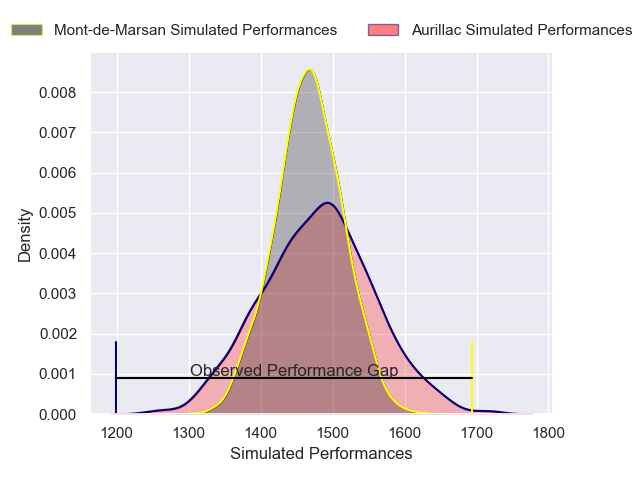
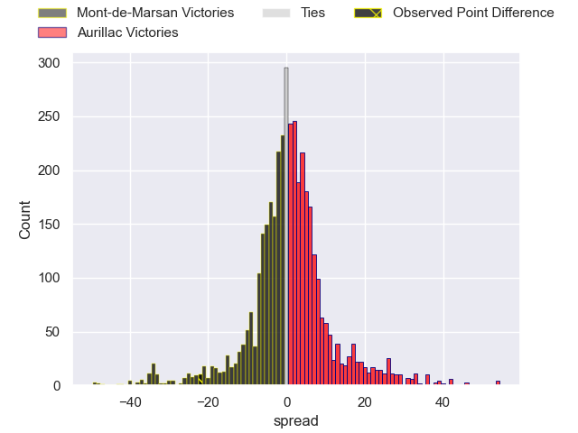
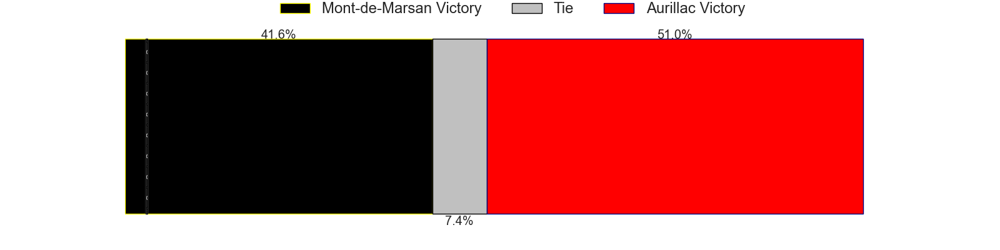
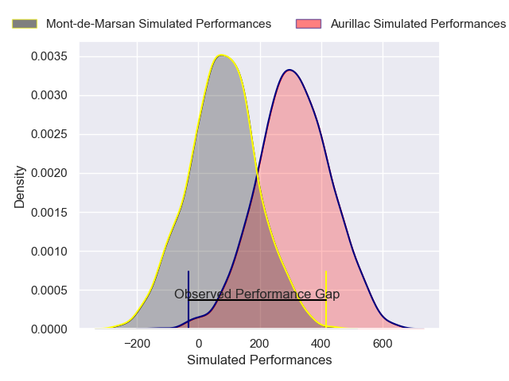
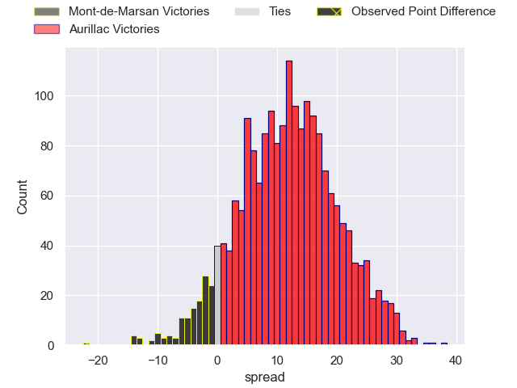
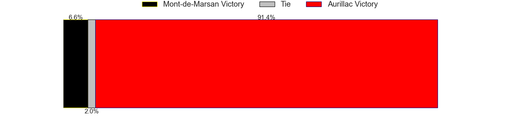

---  
layout: page  
title: Mont-de-Marsan at Aurillac; 43-21  
date: 2025-01-30 18:00:00 -0500  
categories: "Pro D2 24/25" match review  
---
# Mont-de-Marsan at Aurillac; 43-21

# Club Level Predictions

The first set of predictions treats a club as the smallest object, as the club develops its members, organizes a gameplan, and deploys its players as needed for each match. This club model has a prediction of 0.515, which translates to predicting Aurillac to win by 0.5.

Our Over/Under is 48.5 - and combined with the spread above, we have a predicted scoreline of 24 to 24

Each club has a rating and a rating deviation (similar to a Glicko rating), and expected performances can be generated. This allows for simulated matches and spreads like the ones below.
## Projected Performances - Club Model

## Projected Spreads - Club Model

## Projected Results - Club Model

# Player Level Predictions

Treating teams instead as an entity made up of the currently active players, I have ratings for each player in an altogether different system. These can be combined to form team ratings once teamsheets are announced, weighting starters a bit higher than the reserves. After the match is played, players can be weighted by their minutes on the field, allowing for an accurate measure of the team's composition. With these compiled team ratings, we can make predictions, measure inaccuracy, and update the individual player ratings.
## Prediction without Player Minutes: Aurillac by 9.7

Mont-de-Marsan by 3.2 on a neutral pitch

## Projected Performances - Player Model

## Projected Spreads - Player Model

## Projected Results - Player Model

|   Away Minutes | Away Player           |   Away Percentile |   Number |   Home Percentile | Home Player              |   Home Minutes |
|---------------:|:----------------------|------------------:|---------:|------------------:|:-------------------------|---------------:|
|             40 | Ali-Amjad Osman-Bosch |             66.83 |        1 |             10.97 | Irakli Mtchedlidze       |             80 |
|             80 | Florian Dufour        |             29.77 |        2 |              0.67 | Luka Nioradze            |             49 |
|             17 | Mattéo Lalanne        |             61.93 |        3 |              1.08 | Giorgi Kartvelishvili    |             80 |
|             49 | Albert Mataele        |             66.15 |        4 |             70.29 | Heath Backhouse          |             28 |
|             63 | Aston Fortuin         |             22.02 |        5 |             22.5  | Mehdi Slamani            |             80 |
|             80 | Yann Brethous         |             70.99 |        6 |              4.55 | Didier Tison             |             80 |
|             80 | Nicolas Garrault      |             33.75 |        7 |             21.95 | Lucas Oudard             |             17 |
|             80 | Ioane Iashagashvili   |             96.61 |        8 |              1.06 | Abongile Nonkontwana     |             31 |
|             24 | Christophe Loustalot  |             16.31 |        9 |             30.67 | Boris Hadinegoro         |             24 |
|             33 | Patricio Fernandez    |             54.47 |       10 |             31.28 | Jean-Luc Alewyn Cilliers |             63 |
|             80 | Alexandre de Nardi    |             28.07 |       11 |              6.37 | AJ Coertzen              |              6 |
|              4 | Nacani Wakaya         |             60.29 |       12 |             14.97 | Karsen Talalua           |             80 |
|             34 | Gatien Masse          |             53.33 |       13 |             45.95 | Karl Martin              |             33 |
|             34 | Mosese Dawai          |             82.49 |       14 |             63.37 | Juun Pieters             |             31 |
|             34 | Théo Cortes           |             63.52 |       15 |             62.89 | Ugo Seunes               |             63 |
|             16 | Aurélien Laforgue     |             30.08 |       16 |             48.55 | Aleksandre Burduli       |             80 |
|             72 | Jules Even            |             69.96 |       17 |             63.51 | Dominic Robertson-McCoy  |             20 |
|              9 | Jules Dussutour       |             51.83 |       18 |             29.87 | Mael Perrin              |             60 |
|             53 | Martin Villar         |             58.69 |       19 |             65.59 | Hugo Bastard             |             74 |
|             24 | Samuel Lagrange       |             68.39 |       20 |             13.25 | Théo Cambon              |             80 |
|             18 | Mathis Bats           |            nan    |       21 |             55.32 | Leo Salvan               |             31 |
|             62 | Willie du Plessis     |             62.98 |       22 |              9.03 | Ronan Loughnane          |             80 |
|             38 | Baptiste Canut        |            nan    |       23 |             58.35 | Gymael Jean-Jacques      |             47 |

