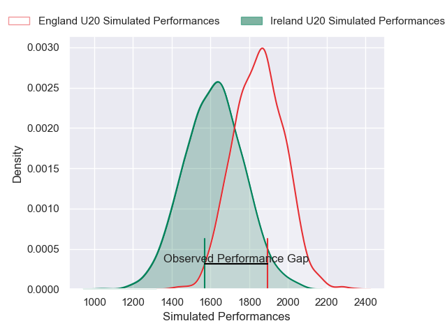
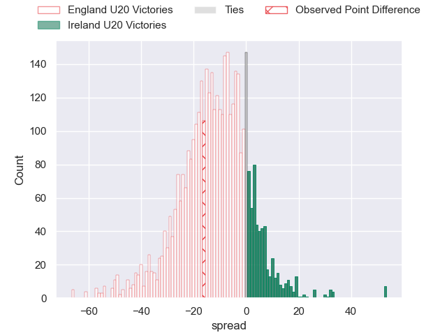
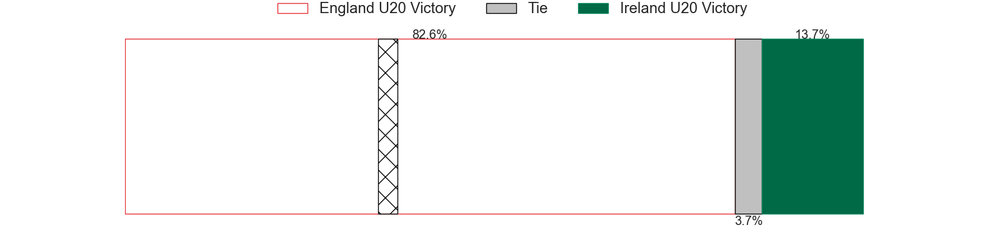
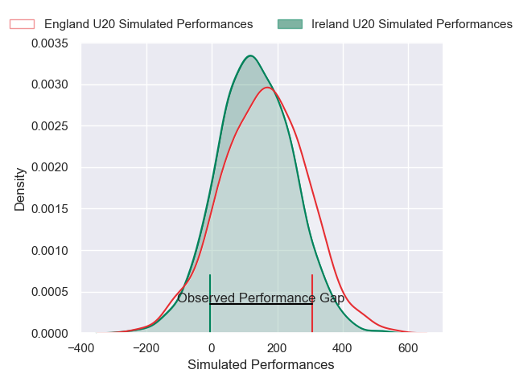
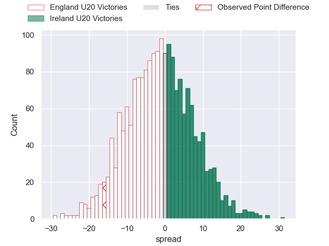

---  
layout: page  
title: England U20 at Ireland U20; 19-3  
date: 2025-01-30 18:00:00 -0500  
categories: "U20 Six Nations Championship 2025" match review  
---
# England U20 at Ireland U20; 19-3

# Club Level Predictions

The first set of predictions treats a club as the smallest object, as the club develops its members, organizes a gameplan, and deploys its players as needed for each match. This club model has a prediction of 0.226, which translates to predicting England U20 to win by 11.5.

Our Over/Under is 47.5 - and combined with the spread above, we have a predicted scoreline of 29 to 18

Each club has a rating and a rating deviation (similar to a Glicko rating), and expected performances can be generated. This allows for simulated matches and spreads like the ones below.
## Projected Performances - Club Model

## Projected Spreads - Club Model

## Projected Results - Club Model

# Player Level Predictions

Treating teams instead as an entity made up of the currently active players, I have ratings for each player in an altogether different system. These can be combined to form team ratings once teamsheets are announced, weighting starters a bit higher than the reserves. After the match is played, players can be weighted by their minutes on the field, allowing for an accurate measure of the team's composition. With these compiled team ratings, we can make predictions, measure inaccuracy, and update the individual player ratings.
## Prediction without Player Minutes: England U20 by 1.6

England U20 by 3.9 on a neutral pitch

## Projected Performances - Player Model

## Projected Spreads - Player Model

## Projected Results - Player Model

|   Away Minutes | Away Player          |   Away Percentile |   Number |   Home Percentile | Home Player         |   Home Minutes |
|---------------:|:---------------------|------------------:|---------:|------------------:|:--------------------|---------------:|
|             60 | Ralph Mceachran      |             61.98 |        1 |             28.03 | Alex Usanov         |             74 |
|             80 | Kepu Tuipulotu       |             68.82 |        2 |             41.23 | Henry Walker        |             13 |
|             80 | Billy Sela           |             93.14 |        3 |             26.93 | Alex Mullan         |             80 |
|             80 | Olamide Sodeke       |             64    |        4 |             32.32 | Mahon Ronan         |             71 |
|             80 | Tom Burrow           |             64    |        5 |             44.99 | Billy Corrigan      |              7 |
|              0 | Junior Kpoku         |             81.54 |        6 |             44.92 | Michael Foy         |              2 |
|             29 | Henry Pollock        |             94.77 |        7 |             31.1  | Bobby Power         |             60 |
|             29 | Kane James           |             49.14 |        8 |             39.48 | Éanna Mccarthy      |              2 |
|             18 | Archie McParland     |             83.42 |        9 |             35.32 | Clark Logan         |             46 |
|             31 | Ben Coen             |             50.22 |       10 |             28.14 | Sam Wisniewski      |             55 |
|             20 | Charlie Griffin      |             52.57 |       11 |             44.62 | Ciarán Mangan       |              6 |
|             13 | Nic Allison          |             46.98 |       12 |             40.21 | Eoghan Smyth        |              9 |
|             73 | Angus Hall           |             46.46 |       13 |             42.33 | Connor Fahy         |              0 |
|             65 | Jack Bracken         |             61.2  |       14 |             29.29 | Derry Moloney       |             78 |
|             80 | Jack Kinder          |             59.79 |       15 |             42.53 | Charlie Molony      |              0 |
|             19 | Louie Gulley         |            nan    |       16 |            nan    | Connor Magee        |             14 |
|             78 | Ollie Scola          |            nan    |       17 |            nan    | Billy Bohan         |             50 |
|             73 | Tye Raymont          |            nan    |       18 |            nan    | Tom Mcallister      |             66 |
|             76 | Aiden Ainsworth-Cave |            nan    |       19 |            nan    | David Walsh         |             80 |
|             80 | George Timmins       |            nan    |       20 |            nan    | Oisin Minogue       |             80 |
|             34 | Lucas Friday         |            nan    |       21 |            nan    | Andrew Doyle        |              4 |
|             80 | Josh Bellamy         |            nan    |       22 |            nan    | Gene O'Leary Kareem |             80 |
|             80 | Nick Lilley          |            nan    |       23 |            nan    | Daniel Green        |             80 |
|            nan | nan                  |            nan    |       24 |            nan    |                     |             25 |

