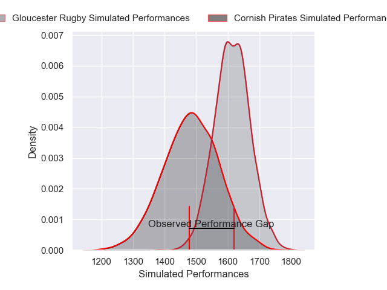
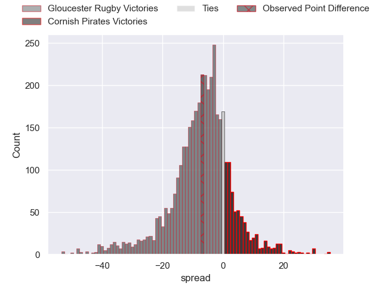
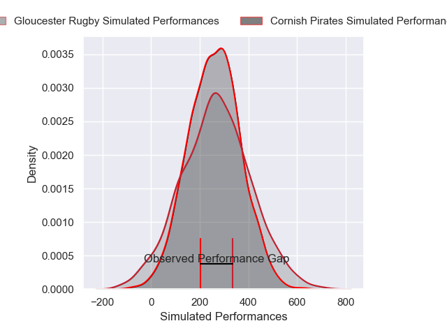
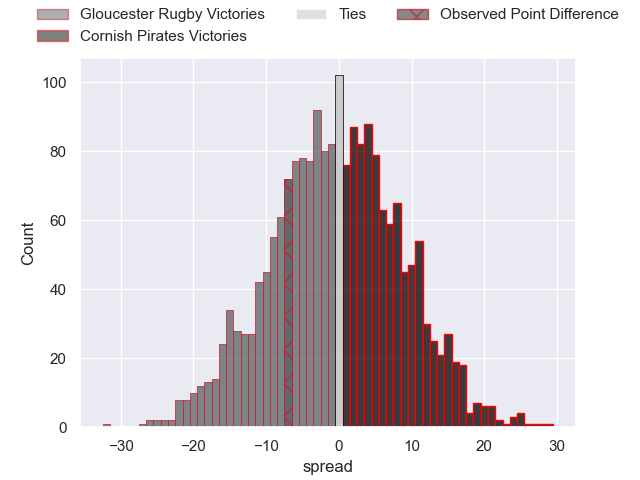

---  
layout: page  
title: Gloucester Rugby at Cornish Pirates; 26-19  
date: 2025-01-31 18:00:00 -0500  
categories: "Premiership Rugby Cup 24/25" match review  
---
# Gloucester Rugby at Cornish Pirates; 26-19

# Club Level Predictions

The first set of predictions treats a club as the smallest object, as the club develops its members, organizes a gameplan, and deploys its players as needed for each match. This club model has a prediction of 0.324, which translates to predicting Gloucester Rugby to win by 6.5.

Our Over/Under is 47.5 - and combined with the spread above, we have a predicted scoreline of 27 to 20

Each club has a rating and a rating deviation (similar to a Glicko rating), and expected performances can be generated. This allows for simulated matches and spreads like the ones below.
## Projected Performances - Club Model

## Projected Spreads - Club Model

## Projected Results - Club Model

# Player Level Predictions

Treating teams instead as an entity made up of the currently active players, I have ratings for each player in an altogether different system. These can be combined to form team ratings once teamsheets are announced, weighting starters a bit higher than the reserves. After the match is played, players can be weighted by their minutes on the field, allowing for an accurate measure of the team's composition. With these compiled team ratings, we can make predictions, measure inaccuracy, and update the individual player ratings.
## Prediction without Player Minutes: Cornish Pirates by 1.8

Gloucester Rugby by 2.7 on a neutral pitch

## Projected Performances - Player Model

## Projected Spreads - Player Model

## Projected Results - Player Model

|   Away Minutes | Away Player           |   Away Percentile |   Number |   Home Percentile | Home Player       |   Home Minutes |
|---------------:|:----------------------|------------------:|---------:|------------------:|:------------------|---------------:|
|             80 | Archie McArthur       |             78.65 |        1 |             42.61 | Billy Young       |             24 |
|             80 | Sebastian Blake       |             63.76 |        2 |             71.81 | Sol Moody         |             18 |
|             50 | Alfie Petch           |              6.98 |        3 |             81.23 | Ollie Andrews     |             24 |
|             80 | Freddie Clarke        |             38.83 |        4 |             55.42 | Alfie Bell        |             18 |
|             54 | Cameron Jordan        |             89.84 |        5 |             45.45 | Matt Cannon       |             11 |
|              5 | Cameron Jordan        |             89.84 |        5 |             45.45 | Matt Cannon       |             11 |
|             80 | Danny Eite            |             83.03 |        6 |             47.16 | Josh King         |             80 |
|             80 | Jack Gilbert          |             59.5  |        7 |             34.52 | Lucas Dorrell     |             80 |
|             80 | Albert Tuisue         |             95.17 |        8 |             87.61 | Hugh Bokenham     |             80 |
|             80 | Caolan Englefield     |             71.81 |        9 |             31.56 | Dan Hiscocks      |             49 |
|             18 | Charlie Atkinson      |             82.91 |       10 |             16.45 | Iwan Jenkins      |             59 |
|             10 | Jake Morris           |             12.81 |       11 |             91.75 | Will Trewin       |             80 |
|             13 | William Butler        |             75.95 |       12 |             78.95 | Joe Elderkin      |             28 |
|             80 | Louis Hillman-Cooper  |             33.33 |       13 |             15.27 | Tom Georgiou      |             52 |
|             59 | Ioan Jones            |             95.07 |       14 |             77.32 | Arthur Relton     |             62 |
|             80 | George Barton         |             58.2  |       15 |             37.3  | Iwan Price-Thomas |             80 |
|             48 | Caio James            |            nan    |       16 |             28.57 | Tomiwa Agbongbon  |             62 |
|             66 | Jayden Wrottesley     |            nan    |       17 |            nan    | Tom Connolly      |             21 |
|             56 | Morgan Adderly-Jones  |             71.1  |       18 |            nan    | Fintan Coleman    |             18 |
|             80 | Jonathan Benz-Salomon |             90.86 |       19 |             63.7  | James French      |             32 |
|             80 | Toti Benz-Salomon     |             60.55 |       20 |             85.26 | Bruce Houston     |             62 |
|            nan | nan                   |            nan    |       21 |             80.03 | Harry Hocking     |             24 |
|            nan | nan                   |            nan    |       22 |             37.59 | Cam Jones         |             30 |
|            nan | nan                   |            nan    |       23 |             44.58 | Harry Yates       |             80 |

