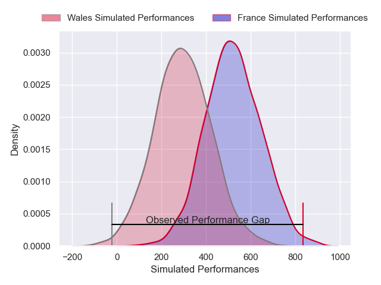
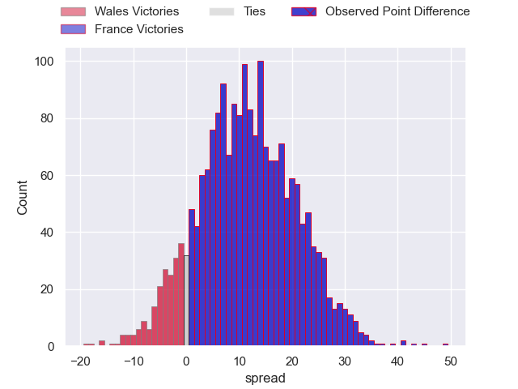
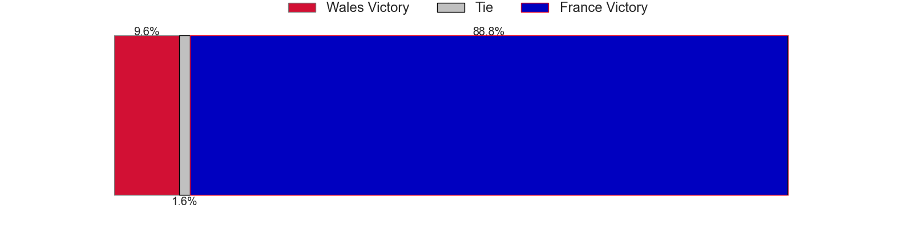

---  
layout: page  
title: Wales at France; 0-43  
date: 2025-01-31 18:00:00 -0500  
categories: "Six Nations Championship 2025" match review  
---
# Wales at France; 0-43

# Club Level Predictions

The first set of predictions treats a club as the smallest object, as the club develops its members, organizes a gameplan, and deploys its players as needed for each match. This club model has a prediction of 0.881, which translates to predicting France to win by 18.0.

Our Over/Under is 55.5 - and combined with the spread above, we have a predicted scoreline of 19 to 37

Each club has a rating and a rating deviation (similar to a Glicko rating), and expected performances can be generated. This allows for simulated matches and spreads like the ones below.
## Projected Performances - Club Model

## Projected Spreads - Club Model

## Projected Results - Club Model

# Player Level Predictions

Treating teams instead as an entity made up of the currently active players, I have ratings for each player in an altogether different system. These can be combined to form team ratings once teamsheets are announced, weighting starters a bit higher than the reserves. After the match is played, players can be weighted by their minutes on the field, allowing for an accurate measure of the team's composition. With these compiled team ratings, we can make predictions, measure inaccuracy, and update the individual player ratings.
## Prediction without Player Minutes: France by 14.7

France by 8.6 on a neutral pitch

## Projected Performances - Player Model

## Projected Spreads - Player Model

## Projected Results - Player Model

|   Away Minutes | Away Player      |   Away Percentile |   Number |   Home Percentile | Home Player           |   Home Minutes |
|---------------:|:-----------------|------------------:|---------:|------------------:|:----------------------|---------------:|
|             30 | Gareth Thomas    |             51.62 |        1 |             98.09 | Jean-Baptiste Gros    |              2 |
|             80 | Evan Lloyd       |             32.27 |        2 |             94.82 | Peato Mauvaka         |             61 |
|             80 | Henry Thomas     |             43.89 |        3 |             98.34 | Uini Atonio           |             50 |
|             56 | Will Rowlands    |             17.79 |        4 |             97.02 | Alexandre Roumat      |             80 |
|             61 | Dafydd Jenkins   |             84.71 |        5 |             79.62 | Emmanuel Meafou       |             19 |
|             19 | James Botham     |             78.63 |        6 |             96.52 | Francois Cros         |             80 |
|             50 | Jac Morgan       |             94.29 |        7 |             10.35 | Paul Boudehent        |             80 |
|             30 | Aaron Wainwright |             30.08 |        8 |             99.79 | Gregory Alldritt      |             80 |
|             30 | Tomos Williams   |             80.14 |        9 |             99.82 | Antoine Dupont        |              2 |
|             30 | Ben Thomas       |             45.11 |       10 |             96.81 | Romain Ntamack        |              2 |
|             30 | Josh Adams       |             87.54 |       11 |             75.74 | Louis Bielle-Biarrey  |             40 |
|             30 | Owen Watkin      |             98.96 |       12 |             89.4  | Yoram Moefana         |             24 |
|             46 | Nick Tompkins    |             99.79 |       13 |             88.57 | Pierre-Louis Barassi  |             80 |
|             46 | Tom Rogers       |             78.12 |       14 |             26.64 | Theo Attissogbe       |             19 |
|             46 | Tom Rogers       |             78.12 |       14 |             26.64 | Theo Attissogbe       |             57 |
|             50 | Liam Williams    |             99.37 |       15 |             96.23 | Thomas Ramos          |             80 |
|             46 | Elliot Dee       |             81.27 |       16 |             99.16 | Julien Marchand       |             80 |
|             80 | Nicky Smith      |             76.81 |       17 |             97.34 | Cyril Baille          |             13 |
|             50 | Keiron Assiratti |              1.91 |       18 |              5.9  | Georges-Henri Colombe |             80 |
|             64 | Keiron Assiratti |              1.91 |       18 |              5.9  | Georges-Henri Colombe |             80 |
|             27 | Freddie Thomas   |             77.69 |       19 |             40.52 | Hugo Auradou          |             50 |
|             80 | Tommy Reffell    |             84.53 |       20 |             64.81 | Mickael Guillard      |             61 |
|             80 | Rhodri Williams  |             78.55 |       21 |             70.12 | Oscar Jegou           |             19 |
|             71 | Dan Edwards      |             80    |       22 |             80.32 | Nolann Le Garrec      |             50 |
|             67 | Blair Murray     |             33.3  |       23 |             60.91 | Emilien Gailleton     |             80 |

