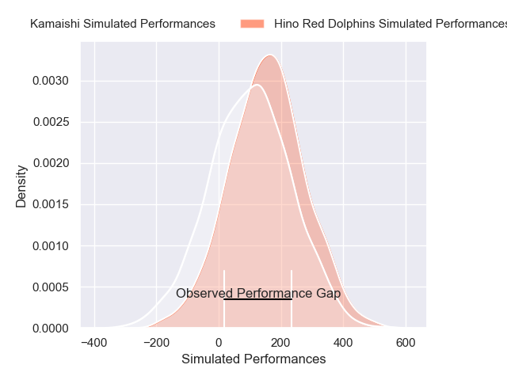
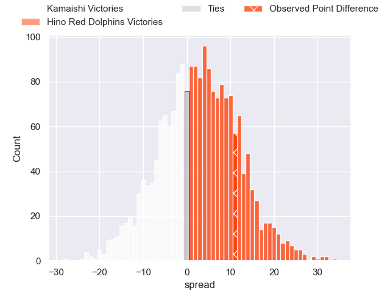
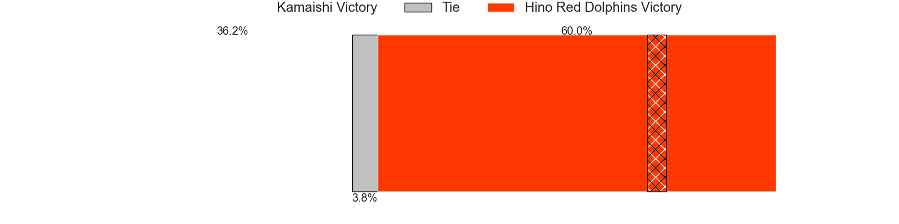

---  
layout: page  
title: Kamaishi at Hino Red Dolphins; 35-46  
date: 2025-01-31 18:00:00 -0500  
categories: "Japan Rugby League One - Division 2 2025" match review  
---
# Kamaishi at Hino Red Dolphins; 35-46

# Club Level Predictions

The first set of predictions treats a club as the smallest object, as the club develops its members, organizes a gameplan, and deploys its players as needed for each match. This club model has a prediction of 0.242, which translates to predicting Kamaishi to win by 17.0.

Our Over/Under is 61.5 - and combined with the spread above, we have a predicted scoreline of 39 to 22

Each club has a rating and a rating deviation (similar to a Glicko rating), and expected performances can be generated. This allows for simulated matches and spreads like the ones below.
## Projected Performances - Club Model

## Projected Spreads - Club Model

## Projected Results - Club Model

# Player Level Predictions

Treating teams instead as an entity made up of the currently active players, I have ratings for each player in an altogether different system. These can be combined to form team ratings once teamsheets are announced, weighting starters a bit higher than the reserves. After the match is played, players can be weighted by their minutes on the field, allowing for an accurate measure of the team's composition. With these compiled team ratings, we can make predictions, measure inaccuracy, and update the individual player ratings.
## Prediction without Player Minutes: Hino Red Dolphins by 2.7

Kamaishi by 0.0 on a neutral pitch

## Projected Performances - Player Model

## Projected Spreads - Player Model

## Projected Results - Player Model

|   Away Minutes | Away Player         |   Away Percentile |   Number |   Home Percentile | Home Player     |   Home Minutes |
|---------------:|:--------------------|------------------:|---------:|------------------:|:----------------|---------------:|
|             80 | Yusuke Yamada       |             34.39 |        1 |             56.23 | Yuto Tokuda     |             58 |
|              1 | Taiki Ito           |             44.63 |        2 |             56.21 | Towa Taniguchi  |             62 |
|              0 | Satoshi Ueda        |             47.01 |        3 |             59.97 | Shosuke Funaki  |             80 |
|             53 | Satoshi Hatazawa    |             39.12 |        4 |             57.24 | Noah Tovio      |             64 |
|             21 | Hamish Dalzell      |             47.65 |        5 |             60.02 | Rory Arnold     |             80 |
|             43 | Ben Nee Nee         |              7.81 |        6 |             59.21 | Shun Nakashika  |             80 |
|              5 | Ryota Kono          |             44.36 |        7 |             51.11 | Shun Tomonaga   |             28 |
|              5 | Sam Henwood         |             39.92 |        8 |             41.18 | Shoei Ijima     |              3 |
|             80 | Yohei Murakami      |             35.82 |        9 |             51.24 | Kotaro Hatada   |             34 |
|             80 | Mitch Hunt          |             29.91 |       10 |             45.73 | Simon Hickey    |             22 |
|              0 | Jamie Henry         |             45.92 |       11 |             45.92 | Moeki Fukushi   |              0 |
|             80 | Gerdus Van Der Walt |             33.95 |       12 |             14.65 | Augustine Pulu  |             22 |
|              0 | Katsuto Hatanaka    |             42.98 |       13 |             29.21 | Murray Koster   |             34 |
|             80 | Gosuke Kawakami     |             36.34 |       14 |             45.92 | Sora Ouchi      |              0 |
|             66 | Kazushi Ochi        |             34.63 |       15 |             54.92 | Kyoji Takano    |             80 |
|             50 | Hayato Nishibayashi |            nan    |       16 |            nan    | Kousei Tamaki   |             80 |
|             50 | Suguru Aoyaki       |            nan    |       17 |            nan    | Junki Tokota    |             63 |
|             80 | Taiki Noguchi       |            nan    |       18 |            nan    | Makoto Tsuchiya |             10 |
|             80 | Dallas Tatana       |            nan    |       19 |            nan    | Aj Woulf        |             75 |
|             63 | Kohei Ishigaki      |            nan    |       20 |            nan    | Josh Fenner     |             80 |
|             80 | Atsushi Minami      |            nan    |       21 |            nan    | Taroma Togo     |             75 |
|             80 | Mosese Tonga        |            nan    |       22 |            nan    | Arito Takahashi |             61 |
|             80 | Sho Kataoka         |            nan    |       23 |            nan    | Yuto Mizuma     |             80 |

