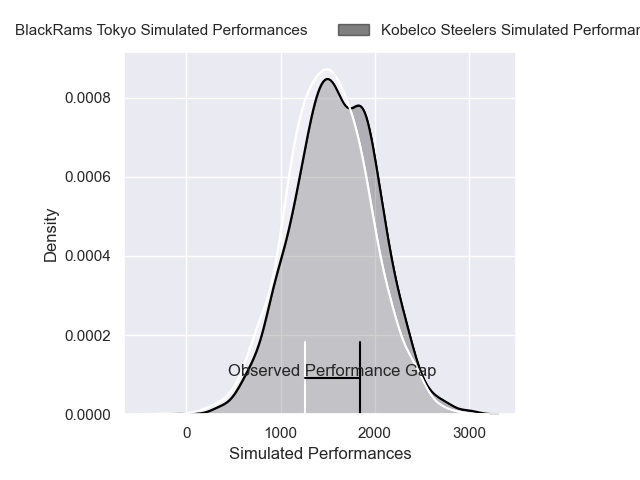
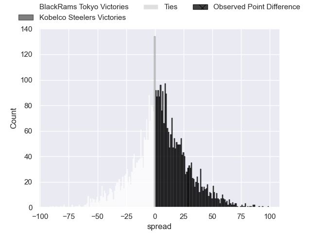
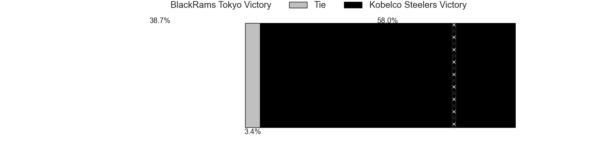
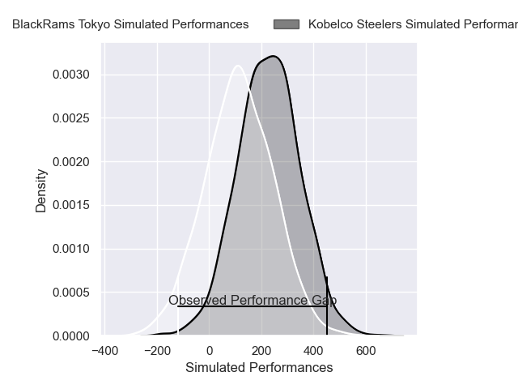
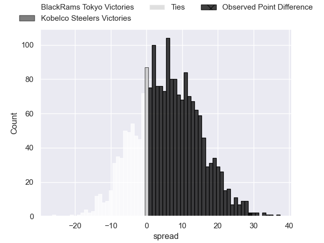
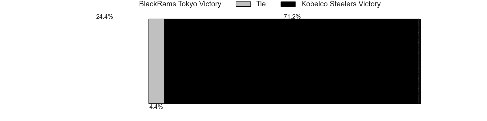

---  
layout: page  
title: BlackRams Tokyo at Kobelco Steelers; 15-44  
date: 2025-01-31 18:00:00 -0500  
categories: "Japan Rugby League One - Division 1 2025" match review  
---
# BlackRams Tokyo at Kobelco Steelers; 15-44

# Club Level Predictions

The first set of predictions treats a club as the smallest object, as the club develops its members, organizes a gameplan, and deploys its players as needed for each match. This club model has a prediction of 0.575, which translates to predicting Kobelco Steelers to win by 4.5.

Our Over/Under is 17.5 - and combined with the spread above, we have a predicted scoreline of 6 to 11

Each club has a rating and a rating deviation (similar to a Glicko rating), and expected performances can be generated. This allows for simulated matches and spreads like the ones below.
## Projected Performances - Club Model

## Projected Spreads - Club Model

## Projected Results - Club Model

# Player Level Predictions

Treating teams instead as an entity made up of the currently active players, I have ratings for each player in an altogether different system. These can be combined to form team ratings once teamsheets are announced, weighting starters a bit higher than the reserves. After the match is played, players can be weighted by their minutes on the field, allowing for an accurate measure of the team's composition. With these compiled team ratings, we can make predictions, measure inaccuracy, and update the individual player ratings.
## Prediction without Player Minutes: Kobelco Steelers by 6.0

Kobelco Steelers by 3.9 on a neutral pitch

## Projected Performances - Player Model

## Projected Spreads - Player Model

## Projected Results - Player Model

|   Away Minutes | Away Player            |   Away Percentile |   Number |   Home Percentile | Home Player          |   Home Minutes |
|---------------:|:-----------------------|------------------:|---------:|------------------:|:---------------------|---------------:|
|             80 | Taishi Tsumura         |             28.55 |        1 |             63.84 | Shigure Takao        |             74 |
|             80 | Ko Sato                |             29.1  |        2 |             68.23 | Kenta Matsuoka       |             40 |
|             80 | Shohei Oyama           |             28.55 |        3 |             63.18 | Sho Maeda            |             72 |
|             80 | Harrison Fox           |             31.92 |        4 |             55    | Gerard Cowley-Tuioti |             40 |
|             28 | Pohiva Yamato Lotoahea |             40.48 |        5 |            100    | Brodie Retallick     |             26 |
|              3 | Mike Stolberg          |             44.68 |        6 |             79.59 | Tiennan Costley      |             13 |
|             34 | Shuhei Matsuhashi      |             38.39 |        7 |             54.06 | Willie Potgieter     |             32 |
|             22 | Liam Gill              |             36.02 |        8 |             67.8  | Amanaki Saumaki      |             34 |
|              0 | TJ Perenara            |             96.99 |        9 |             48.58 | Atsushi Hiwasa       |              6 |
|             22 | Ichigo Nakakusu        |             38.51 |       10 |             65.53 | Bryn Gatland         |             80 |
|             34 | Amanaki Lotoahea       |             39.01 |       11 |             55.47 | Kanta Matsunaga      |             40 |
|              0 | Yuki Ikeda             |             42.67 |       12 |             54.68 | Timothy Lafaele      |             54 |
|             80 | Larzlo Sword           |             29.31 |       13 |             48.13 | Michael Little       |             19 |
|             80 | Taira Main             |             31.11 |       14 |             29.4  | Ataata Moeakiola     |             80 |
|             80 | Kotaro Ito             |             28.93 |       15 |             55.56 | Rakuhei Yamashita    |             61 |
|             68 | Shin Ouchi             |            nan    |       16 |             99.67 | George Turner        |             63 |
|             67 | Kazuma Nishi           |            nan    |       17 |            nan    | Hikaru Moriwaki      |             55 |
|             80 | Daigo Sasagawa         |            nan    |       18 |            nan    | Hiroshi Yamashita    |             60 |
|             48 | Josh Goodhue           |            nan    |       19 |            nan    | Waisake Raratubua    |             80 |
|             80 | Samuel Waqabaca        |            nan    |       20 |            nan    | Hikaru Hashimoto     |             80 |
|              6 | Toshiya Takahashi      |            nan    |       21 |            nan    | Daiki Nakajima       |             54 |
|             80 | Tomoya Yamamura        |            nan    |       22 |            nan    | Ngani Laumape        |             48 |
|             46 | Semisi Tupou           |            nan    |       23 |            nan    | Ryota Funabiki       |             80 |

