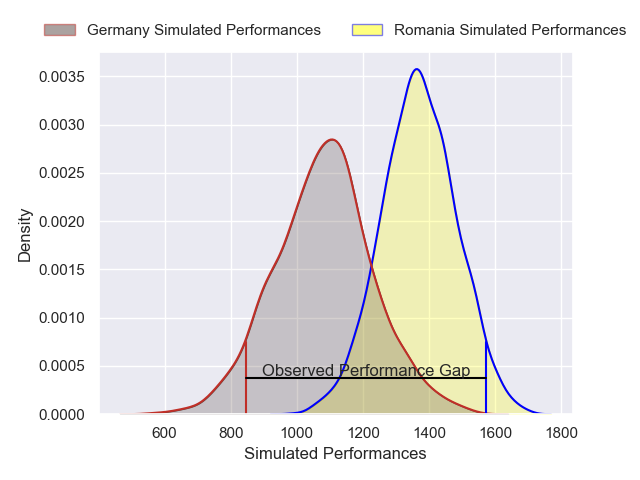
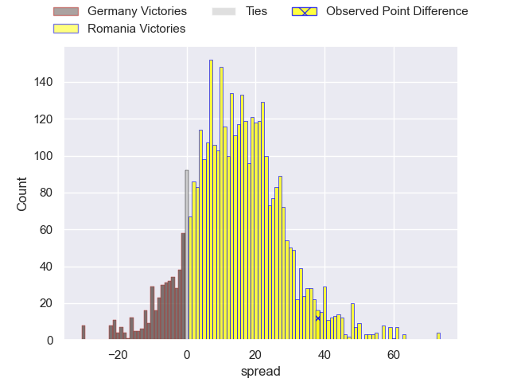
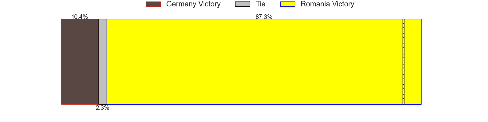
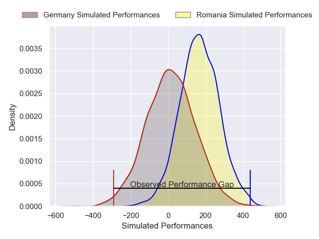
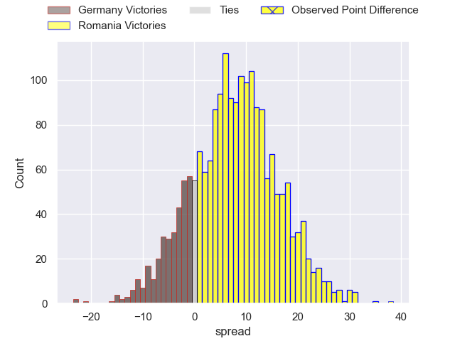
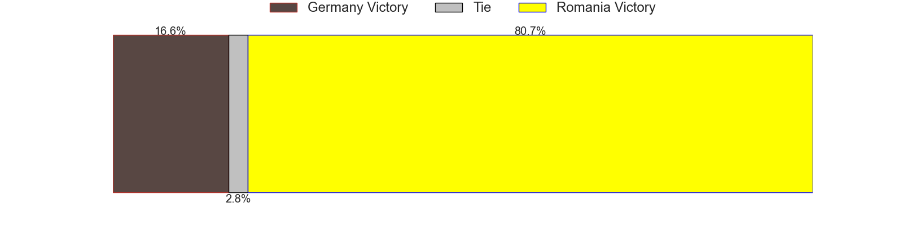

---  
layout: page  
title: Germany at Romania; 10-48  
date: 2025-01-31 18:00:00 -0500  
categories: "Rugby Europe Championship 2025" match review  
---
# Germany at Romania; 10-48

# Club Level Predictions

The first set of predictions treats a club as the smallest object, as the club develops its members, organizes a gameplan, and deploys its players as needed for each match. This club model has a prediction of 0.819, which translates to predicting Romania to win by 14.4.

Our Over/Under is 47.5 - and combined with the spread above, we have a predicted scoreline of 16 to 31

Each club has a rating and a rating deviation (similar to a Glicko rating), and expected performances can be generated. This allows for simulated matches and spreads like the ones below.
## Projected Performances - Club Model

## Projected Spreads - Club Model

## Projected Results - Club Model

# Player Level Predictions

Treating teams instead as an entity made up of the currently active players, I have ratings for each player in an altogether different system. These can be combined to form team ratings once teamsheets are announced, weighting starters a bit higher than the reserves. After the match is played, players can be weighted by their minutes on the field, allowing for an accurate measure of the team's composition. With these compiled team ratings, we can make predictions, measure inaccuracy, and update the individual player ratings.
## Prediction without Player Minutes: Romania by 6.8

Romania by 2.6 on a neutral pitch

## Projected Performances - Player Model

## Projected Spreads - Player Model

## Projected Results - Player Model

|   Away Minutes | Away Player            |   Away Percentile |   Number |   Home Percentile | Home Player       |   Home Minutes |
|---------------:|:-----------------------|------------------:|---------:|------------------:|:------------------|---------------:|
|             49 | Jörn Schröder          |              7.4  |        1 |             33    | Alexandru Savin   |             28 |
|             63 | Mika Tyumenev          |              6.86 |        2 |             18.9  | Ovidiu Cojocaru   |             15 |
|             80 | Henry Pearson          |             29.01 |        3 |             55.28 | Cosmin Manole     |             32 |
|             23 | Eric Marks             |             12.02 |        4 |             83.08 | Nicolaas Immelman |             40 |
|             80 | Hassan Rayan           |             13.56 |        5 |             62.31 | Andrei Mahu       |             29 |
|             40 | Oliver Stein           |             36.75 |        6 |             42.55 | Cristi Boboc      |             25 |
|             68 | Shawn Ingle            |             13.54 |        7 |              5.9  | Cristian Chirica  |             20 |
|             53 | Marcel Henn            |             10.38 |        8 |             46.4  | Adrian Mitu       |             13 |
|             64 | Tim Menzel             |             34.57 |        9 |             57.09 | Alin Conache      |             29 |
|             68 | Bader-Werner Pretorius |             28.94 |       10 |             44.68 | Hinckley Vaovasa  |             40 |
|             23 | Felix Lammers          |             16.46 |       11 |              3.9  | Tevita Manumua    |             13 |
|              9 | Leo Wolf               |             10.5  |       12 |             71.73 | Jason Tomane      |             24 |
|             55 | Robin PlüMpe           |             33.26 |       13 |             85.34 | Taylor Gontineac  |             40 |
|             57 | Howard Packman         |             35.11 |       14 |             61.47 | Iliesa Tiqe       |             80 |
|              0 | Nikolai Klewinghaus    |             18.45 |       15 |              2.52 | Marius Simionescu |             52 |
|             70 | Andrew Reintges        |            nan    |       16 |             65.38 | Stefan Buruiana   |             80 |
|             20 | Daniel Wolf            |             27.85 |       17 |            nan    | Ciprian Chiriac   |             65 |
|             80 | Chris Edene            |            nan    |       18 |             75.81 | Alex Gordas       |             80 |
|             51 | Sione Havili Talitui   |             90.33 |       19 |             12.79 | Marius Iftimiciuc |             48 |
|             80 | Nico Windemuth         |            nan    |       20 |            nan    | Matthew Tweddle   |             80 |
|             80 | Jan Piosik             |            nan    |       21 |            nan    | Gabriel Rupanu    |             23 |
|             80 | Bastian Van Der Bosch  |            nan    |       22 |             64.24 | Mihai Graure      |             80 |
|             80 | Zinzan Hees            |             24.83 |       23 |            nan    | Kemal Altinok     |             49 |
|            nan | nan                    |            nan    |       24 |            nan    | Ange Capuozzo     |              0 |

