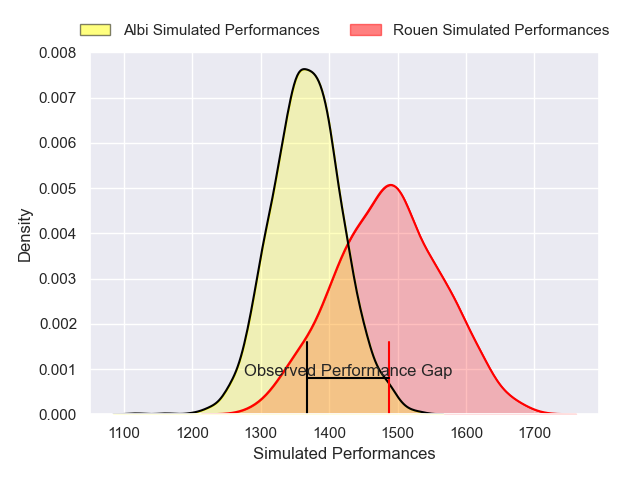
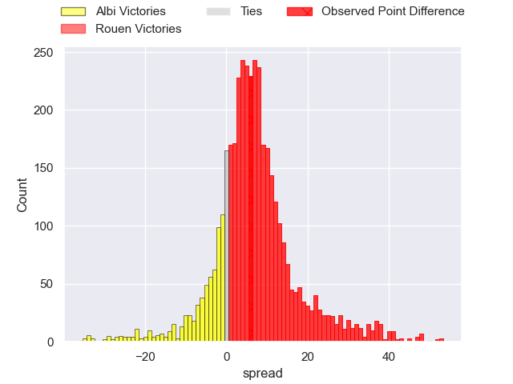
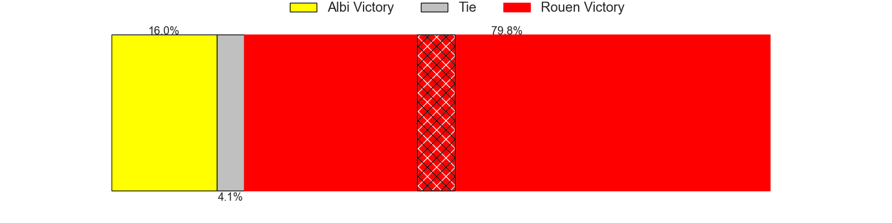
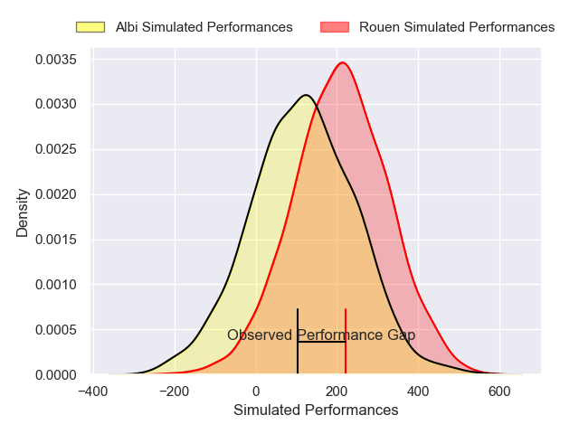
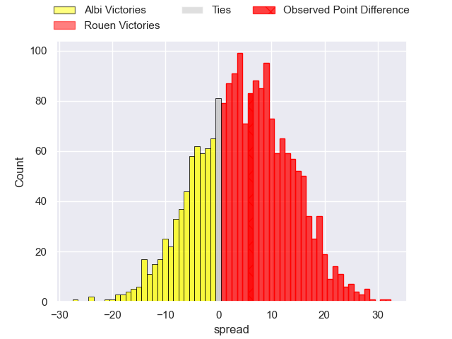
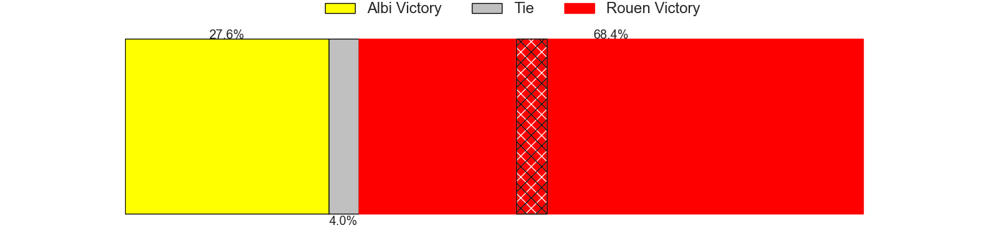

---  
layout: page  
title: Albi at Rouen; 14-20  
date: 2025-01-31 18:00:00 -0500  
categories: "Nationale 24/25" match review  
---
# Albi at Rouen; 14-20

# Club Level Predictions

The first set of predictions treats a club as the smallest object, as the club develops its members, organizes a gameplan, and deploys its players as needed for each match. This club model has a prediction of 0.659, which translates to predicting Rouen to win by 5.8.

Our Over/Under is 44.5 - and combined with the spread above, we have a predicted scoreline of 19 to 25

Each club has a rating and a rating deviation (similar to a Glicko rating), and expected performances can be generated. This allows for simulated matches and spreads like the ones below.
## Projected Performances - Club Model

## Projected Spreads - Club Model

## Projected Results - Club Model

# Player Level Predictions

Treating teams instead as an entity made up of the currently active players, I have ratings for each player in an altogether different system. These can be combined to form team ratings once teamsheets are announced, weighting starters a bit higher than the reserves. After the match is played, players can be weighted by their minutes on the field, allowing for an accurate measure of the team's composition. With these compiled team ratings, we can make predictions, measure inaccuracy, and update the individual player ratings.
## Prediction without Player Minutes: Rouen by 5.0

Rouen by 0.9 on a neutral pitch

## Projected Performances - Player Model

## Projected Spreads - Player Model

## Projected Results - Player Model

|   Away Minutes | Away Player            |   Away Percentile |   Number |   Home Percentile | Home Player           |   Home Minutes |
|---------------:|:-----------------------|------------------:|---------:|------------------:|:----------------------|---------------:|
|             28 | Antoine Soave          |             34.8  |        1 |             36.38 | Soulemane Camara      |             80 |
|             53 | Arthur Castant         |             25.17 |        2 |             54.03 | Mathieu Bonnot        |             15 |
|             48 | Maks van Dyk           |             89.45 |        3 |             80.48 | Soso Bekoshvili       |             21 |
|             80 | Vincent Mutel          |             71.52 |        4 |             47.84 | Ernest Eudier         |             27 |
|             18 | Dion Evrard Oulai      |             15.15 |        5 |             63.18 | John-Charles Astle    |             27 |
|             50 | Mattéo Coustalat       |             10.99 |        6 |             13.4  | Willy N'Diaye         |             32 |
|             80 | Robin Dione            |             58.63 |        7 |             87.95 | Tienie Burger         |             28 |
|             80 | Camille Jarreau        |             27.31 |        8 |             85.5  | Julien Ruaud          |             80 |
|             27 | Alexandre Favretto     |             54.96 |        9 |              6.38 | Ilan El Khattabi      |             40 |
|             80 | Thibault Olender       |             66.24 |       10 |             52.14 | Maxime Javaux         |             62 |
|             66 | Paul Clergue           |             77.23 |       11 |             69.45 | Benjamin Descamps     |             65 |
|             80 | Leo Treilles           |             10.94 |       12 |              4.44 | Theo Dachary          |             59 |
|             56 | Baptiste Couchinave    |             71.72 |       13 |             21.05 | Opetera Peleseuma     |             40 |
|             21 | Simon Hartmann         |             64.14 |       14 |             59.87 | Sakiusa Bureitakiyaca |             74 |
|             14 | Victor Pisano          |             22.13 |       15 |             44.26 | Aloïs Chayla          |             80 |
|             14 | Guillem Calmon         |             35.92 |       16 |             41.61 | Octave Leleu          |             80 |
|             80 | Lucas Pindor           |             21.59 |       17 |             83.22 | Alexis Decaux         |             80 |
|             62 | Reinach Venter         |             11.58 |       18 |            nan    | Sidi-Mohammed Diallo  |             53 |
|             80 | Thomas Cretu           |             40.28 |       19 |             79.7  | Benjamin Pehau        |             80 |
|             80 | Gilen Queheille        |             72.16 |       20 |             47.16 | Marin Boulier         |             80 |
|             69 | Jonathan Kpoku         |             61.07 |       21 |             20.97 | Lucas Malbert         |             40 |
|             48 | Théo Vidal             |             82.27 |       22 |            nan    | nan                   |            nan |
|             30 | Nasoni Naqiri Kunavore |             91.95 |       23 |            nan    | nan                   |            nan |

