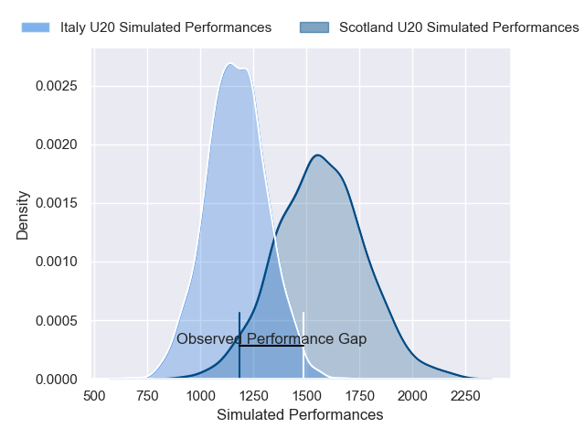
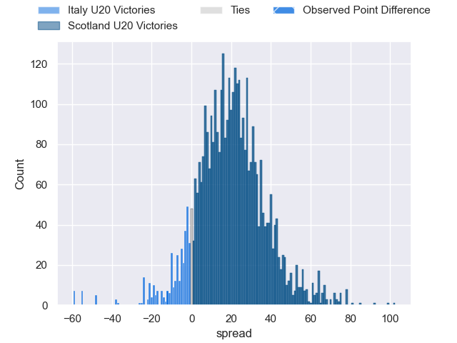
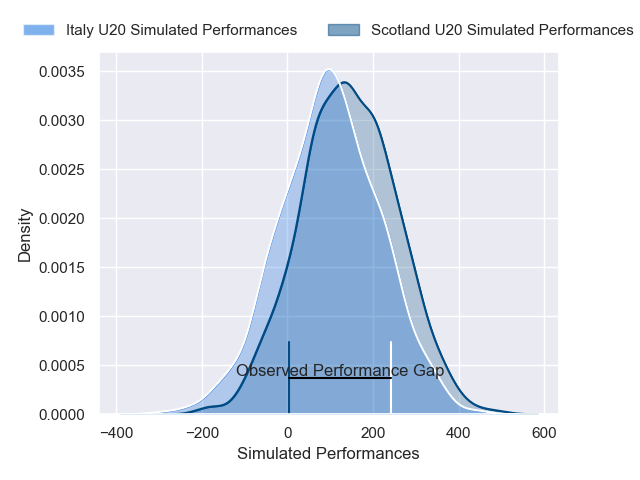
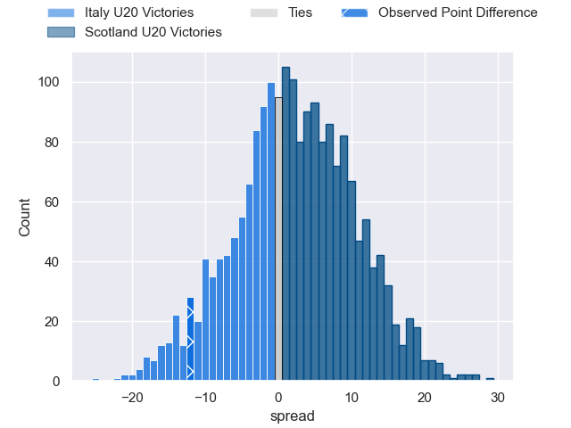

---  
layout: page  
title: Italy U20 at Scotland U20; 22-10  
date: 2025-01-31 18:00:00 -0500  
categories: "U20 Six Nations Championship 2025" match review  
---
# Italy U20 at Scotland U20; 22-10

# Club Level Predictions

The first set of predictions treats a club as the smallest object, as the club develops its members, organizes a gameplan, and deploys its players as needed for each match. This club model has a prediction of 0.884, which translates to predicting Scotland U20 to win by 19.4.

Our Over/Under is 50.5 - and combined with the spread above, we have a predicted scoreline of 15 to 35

Each club has a rating and a rating deviation (similar to a Glicko rating), and expected performances can be generated. This allows for simulated matches and spreads like the ones below.
## Projected Performances - Club Model

## Projected Spreads - Club Model

## Projected Results - Club Model

# Player Level Predictions

Treating teams instead as an entity made up of the currently active players, I have ratings for each player in an altogether different system. These can be combined to form team ratings once teamsheets are announced, weighting starters a bit higher than the reserves. After the match is played, players can be weighted by their minutes on the field, allowing for an accurate measure of the team's composition. With these compiled team ratings, we can make predictions, measure inaccuracy, and update the individual player ratings.
## Prediction without Player Minutes: Scotland U20 by 2.4

Scotland U20 by 0.2 on a neutral pitch

## Projected Performances - Player Model

## Projected Spreads - Player Model

## Projected Results - Player Model

|   Away Minutes | Away Player           |   Away Percentile |   Number |   Home Percentile | Home Player          |   Home Minutes |
|---------------:|:----------------------|------------------:|---------:|------------------:|:---------------------|---------------:|
|             17 | Sergio Pelliccioli    |             51.79 |        1 |             26.18 | Ollie Mckenna        |             78 |
|             30 | Alessio Caïolo        |             55.18 |        2 |             24.58 | Joe Roberts          |             80 |
|             14 | Bruno Vallesi         |             51.12 |        3 |             32.17 | Ollie Blyth-Lafferty |             49 |
|             31 | Tommaso Redondi       |             54.62 |        4 |             43.17 | Charlie Moss         |             12 |
|             74 | Enoch Opoku-Gyamfi    |             64.23 |        5 |             45.38 | Dan Halkon           |              6 |
|             68 | Antony Miranda        |             63.2  |        6 |             42.46 | Christian Lindsay    |             12 |
|             68 | Nelson Casartelli     |             63.2  |        7 |             37.62 | Billy Allen          |             30 |
|             16 | Giacomo Milano        |             27.97 |        8 |             36.23 | Reuben Logan         |             17 |
|              4 | Niccolò Beni          |             48.05 |        9 |             29.96 | Noah Cowan           |             80 |
|             31 | Roberto Fasti         |             51.06 |       10 |             27.02 | Mathew Urwin         |             65 |
|             31 | Malik Faissal         |             54.9  |       11 |             28.59 | Fergus Watson        |             80 |
|             80 | Edoardo Todaro        |             61.02 |       12 |             29.73 | Kerr Yule            |             63 |
|              2 | Federico Zanandrea    |             43.87 |       13 |             34.72 | Johnny Ventisei      |             37 |
|             22 | Jules Ducros          |             53.38 |       14 |             28.59 | Guy Rogers           |             80 |
|             19 | Gianmarco Pietramala  |             48.01 |       15 |             25.37 | Jack Brown           |             80 |
|             80 | Giacomo Casiraghi     |            nan    |       16 |            nan    | Seb Stephen          |             59 |
|             80 | Cristian Brasini      |            nan    |       17 |            nan    | Jake Shearer         |             27 |
|             80 | Nicola Bolognini      |            nan    |       18 |            nan    | Ryan Whitefield      |             79 |
|             80 | Pietro Melegari       |            nan    |       19 |            nan    | Bart Godsell         |             80 |
|             50 | Carlo Antonio Bianchi |            nan    |       20 |            nan    | Ollie Duncan         |              0 |
|             80 | Matteo Bellotto       |            nan    |       21 |            nan    | Hector Patterson     |              0 |
|             21 | Pietro Celi           |            nan    |       22 |            nan    | Ross Wolfenden       |             30 |
|             69 | Giacomo Ndoumbe-Lobe  |            nan    |       23 |            nan    | Nairn Moncrieff      |             17 |

