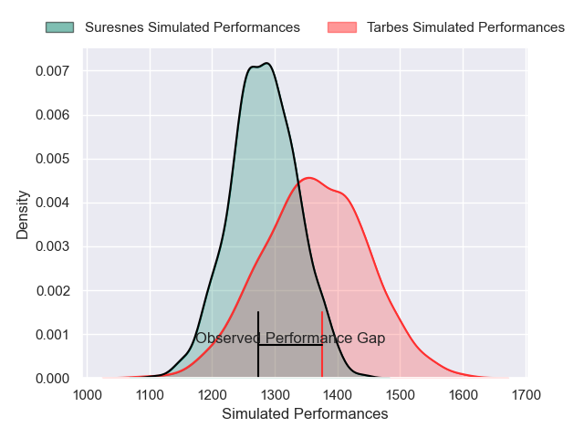
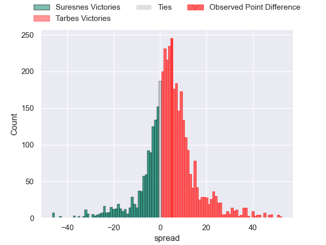
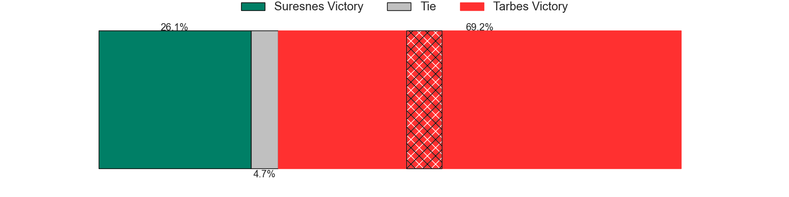
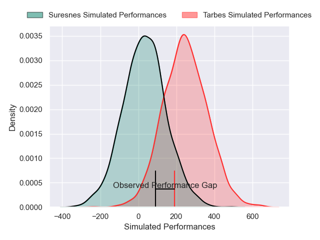
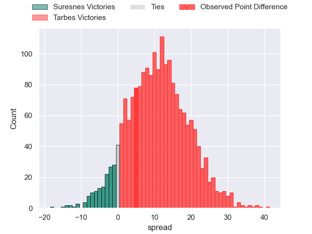
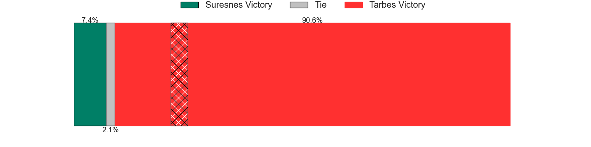

---  
layout: page  
title: Suresnes at Tarbes; 15-20  
date: 2025-01-31 18:00:00 -0500  
categories: "Nationale 24/25" match review  
---
# Suresnes at Tarbes; 15-20

# Club Level Predictions

The first set of predictions treats a club as the smallest object, as the club develops its members, organizes a gameplan, and deploys its players as needed for each match. This club model has a prediction of 0.613, which translates to predicting Tarbes to win by 4.1.

Our Over/Under is 44.5 - and combined with the spread above, we have a predicted scoreline of 20 to 24

Each club has a rating and a rating deviation (similar to a Glicko rating), and expected performances can be generated. This allows for simulated matches and spreads like the ones below.
## Projected Performances - Club Model

## Projected Spreads - Club Model

## Projected Results - Club Model

# Player Level Predictions

Treating teams instead as an entity made up of the currently active players, I have ratings for each player in an altogether different system. These can be combined to form team ratings once teamsheets are announced, weighting starters a bit higher than the reserves. After the match is played, players can be weighted by their minutes on the field, allowing for an accurate measure of the team's composition. With these compiled team ratings, we can make predictions, measure inaccuracy, and update the individual player ratings.
## Prediction without Player Minutes: Tarbes by 12.7

Tarbes by 1.9 on a neutral pitch

## Projected Performances - Player Model

## Projected Spreads - Player Model

## Projected Results - Player Model

|   Away Minutes | Away Player             |   Away Percentile |   Number |   Home Percentile | Home Player         |   Home Minutes |
|---------------:|:------------------------|------------------:|---------:|------------------:|:--------------------|---------------:|
|             63 | Yanis Trabelsi          |             29.24 |        1 |             48.26 | Enzo Baggiani       |             19 |
|             34 | Jean-Étienne Lesueur    |             14.43 |        2 |             15.94 | Florian Lamothe     |             35 |
|             68 | Leandro Mario Assi      |             31.89 |        3 |             44.27 | Luka Vea            |             23 |
|             56 | Leo Vallee              |             52.92 |        4 |             35.67 | Baptiste Peytavi    |             61 |
|             78 | Nikita Bekov            |             84.37 |        5 |             62.51 | Mathieu Soufflet    |             80 |
|             46 | Simon Veyrac            |             34.04 |        6 |             63.84 | Jean Guicherd       |              2 |
|             19 | Wian Vosloo             |             72.81 |        7 |             49.66 | Léo Saint-Guilhem   |             24 |
|             80 | Boaventura Almeida      |             36.13 |        8 |              1.05 | Filipe Manu         |             80 |
|             80 | Thomas Lacroix          |             10.99 |        9 |             37.94 | Matias Brocal       |             80 |
|              2 | Tanguy Lacoste          |             49.15 |       10 |             16.88 | Alexandre Perez     |             40 |
|             78 | Alexis Clement          |             13.95 |       11 |              4.93 | Johan Paulet        |             62 |
|              2 | JJ Taulagi              |              0.93 |       12 |             12.07 | Savenaca Rawaca     |             80 |
|             19 | Gauthier Wolf           |             44.48 |       13 |             48.61 | Osea Waqaninavatu   |             40 |
|             78 | Yohan Fournier          |             10.82 |       14 |             32.45 | Amona Artaud        |             80 |
|             19 | Goulwen Gueho           |              2.66 |       15 |             40.16 | Hugo Cellier        |             18 |
|             80 | Yakine Mohamed Djebarri |             25.12 |       16 |             35.29 | Pierre Descoubet    |             17 |
|             40 | Jean Chezeau            |             67.74 |       17 |             76.95 | Mickael Thébault    |             80 |
|             21 | Théo Bachiri            |             10.28 |       18 |             80.15 | Irakli Mirtskhulava |             52 |
|             19 | Noureddine Agsib        |            nan    |       19 |             15.81 | Joris Pialot        |             52 |
|             12 | Victor Barnier          |             77.4  |       20 |            nan    | Nolhan Bizien       |             53 |
|             12 | Nail Audoire            |             24.83 |       21 |            nan    | Lasha Mirtskhulava  |              6 |
|             80 | Gauthier Brute de Remur |             73.49 |       22 |             61.07 | Vincent Dolier      |             80 |
|             45 | Elias Coulibaly         |             68.19 |       23 |             46.43 | Joeli Matalaweru    |             80 |

