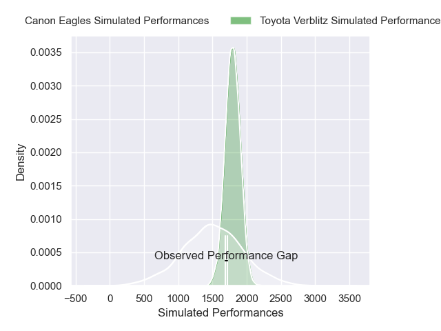
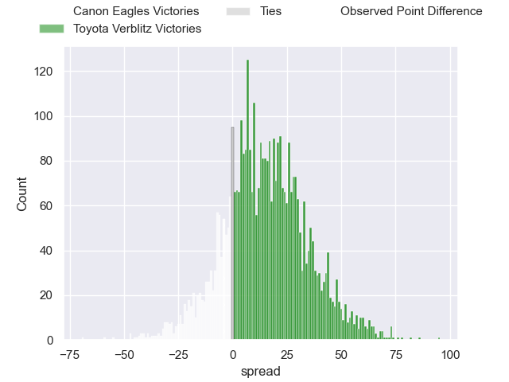
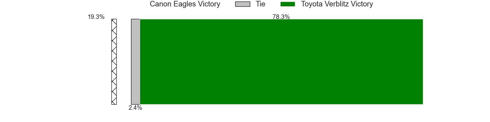
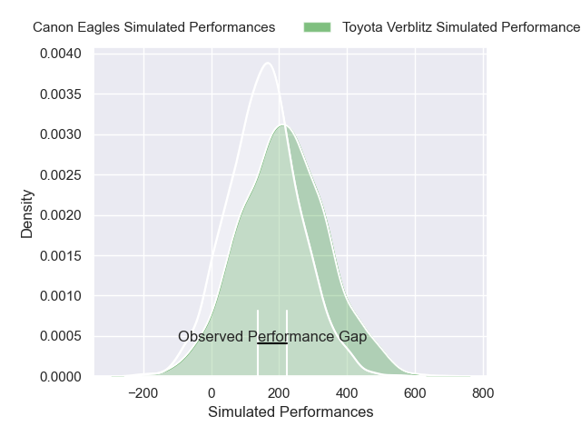
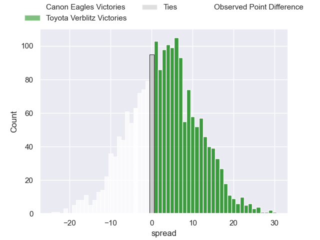
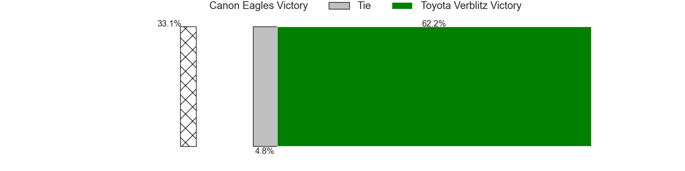

---  
layout: page  
title: Canon Eagles at Toyota Verblitz; 24-20  
date: 2025-01-31 18:00:00 -0500  
categories: "Japan Rugby League One - Division 1 2025" match review  
---
# Canon Eagles at Toyota Verblitz; 24-20

# Club Level Predictions

The first set of predictions treats a club as the smallest object, as the club develops its members, organizes a gameplan, and deploys its players as needed for each match. This club model has a prediction of 0.727, which translates to predicting Toyota Verblitz to win by 14.6.

Our Over/Under is 52.5 - and combined with the spread above, we have a predicted scoreline of 19 to 34

Each club has a rating and a rating deviation (similar to a Glicko rating), and expected performances can be generated. This allows for simulated matches and spreads like the ones below.
## Projected Performances - Club Model

## Projected Spreads - Club Model

## Projected Results - Club Model

# Player Level Predictions

Treating teams instead as an entity made up of the currently active players, I have ratings for each player in an altogether different system. These can be combined to form team ratings once teamsheets are announced, weighting starters a bit higher than the reserves. After the match is played, players can be weighted by their minutes on the field, allowing for an accurate measure of the team's composition. With these compiled team ratings, we can make predictions, measure inaccuracy, and update the individual player ratings.
## Prediction without Player Minutes: Toyota Verblitz by 2.6

Canon Eagles by 1.8 on a neutral pitch

## Projected Performances - Player Model

## Projected Spreads - Player Model

## Projected Results - Player Model

|   Away Minutes | Away Player        |   Away Percentile |   Number |   Home Percentile | Home Player         |   Home Minutes |
|---------------:|:-------------------|------------------:|---------:|------------------:|:--------------------|---------------:|
|             12 | Takato Okabe       |             37.41 |        1 |             20.53 | Shogo Miura         |             80 |
|             20 | Shunta Nakamura    |             48.83 |        2 |             34.62 | Yoshikatsu Hikosaka |             73 |
|             72 | Ryosuke Iwaihara   |             59.35 |        3 |             33.58 | Genki Sudo          |             80 |
|             65 | Liaki Moli         |             56.92 |        4 |             77.4  | Richie Gray         |             20 |
|             80 | Matt Philip        |             59.71 |        5 |             35.1  | Daichi Akiyama      |             80 |
|             80 | Billy Harmon       |             59.09 |        6 |             43.04 | Isaiah Mapusua      |             60 |
|             16 | Masato Furukawa    |             48.74 |        7 |             33.56 | Kosei Miki          |             80 |
|             12 | Amanaki Mafi       |             43.22 |        8 |             39.83 | Akito Okui          |              6 |
|             27 | Faf de Klerk       |             93.97 |        9 |             41.84 | Kaito Shigeno       |             26 |
|             40 | Yu Tamura          |             48.94 |       10 |             97.02 | Rikiya Matsuda      |             64 |
|             12 | Masayoshi Takezawa |             47.76 |       11 |              0.57 | Siosaia Fifita      |             80 |
|             17 | Yusuke Kajimura    |             65.38 |       12 |             31.6  | Nik McCurran        |             62 |
|             80 | Jesse Kriel        |             99.38 |       13 |             36.38 | Joseph Manu         |             58 |
|             15 | Kippei Ishida      |             48.53 |       14 |             67.84 | Taichi Takahashi    |              0 |
|             17 | Jumpei Ogura       |             19.92 |       15 |             41.09 | Tiaan Falcon        |             15 |
|             15 | Yusuke Niwai       |            nan    |       16 |            nan    | Ryusei Kato         |             20 |
|             15 | Sioeli Vakalahi    |            nan    |       17 |            nan    | Ryunosuke Momoji    |             77 |
|             80 | Tatsuro Sugimoto   |            nan    |       18 |            nan    | Shunsuke Asaoka     |             52 |
|             64 | Tom Jeffries       |            nan    |       19 |            nan    | Josh Dickson        |             46 |
|             76 | Naoto Shimada      |            nan    |       20 |             79.42 | Adre Smith          |             80 |
|             49 | Toshiki Amano      |            nan    |       21 |            nan    | Jongchu Ryang       |             58 |
|             19 | Ryo Tabata         |            nan    |       22 |            nan    | Matt Mcgahan        |             80 |
|             58 | Viliame Takayawa   |            nan    |       23 |            nan    | William Tupou       |             80 |

