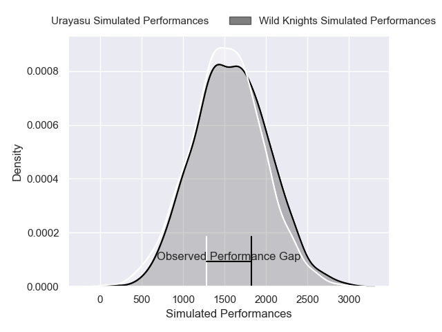
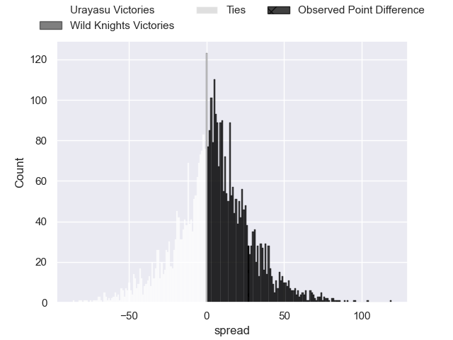
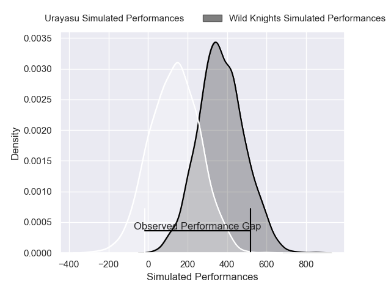
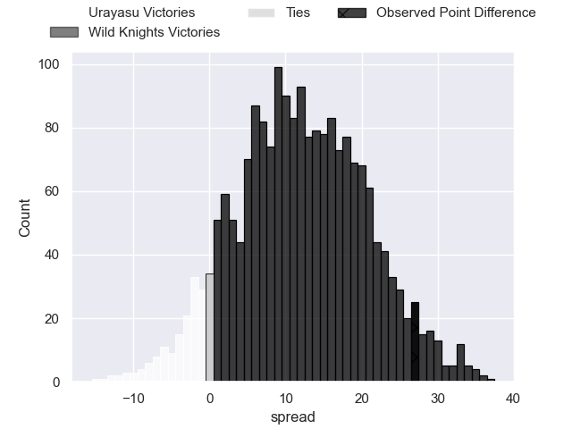
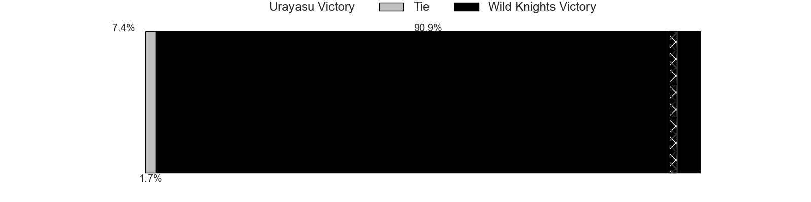

---  
layout: page  
title: Urayasu at Wild Knights; 26-53  
date: 2025-01-31 18:00:00 -0500  
categories: "Japan Rugby League One - Division 1 2025" match review  
---
# Urayasu at Wild Knights; 26-53

# Club Level Predictions

The first set of predictions treats a club as the smallest object, as the club develops its members, organizes a gameplan, and deploys its players as needed for each match. This club model has a prediction of 0.575, which translates to predicting Wild Knights to win by 4.5.

Our Over/Under is 24.5 - and combined with the spread above, we have a predicted scoreline of 10 to 14

Each club has a rating and a rating deviation (similar to a Glicko rating), and expected performances can be generated. This allows for simulated matches and spreads like the ones below.
## Projected Performances - Club Model

## Projected Spreads - Club Model

## Projected Results - Club Model

# Player Level Predictions

Treating teams instead as an entity made up of the currently active players, I have ratings for each player in an altogether different system. These can be combined to form team ratings once teamsheets are announced, weighting starters a bit higher than the reserves. After the match is played, players can be weighted by their minutes on the field, allowing for an accurate measure of the team's composition. With these compiled team ratings, we can make predictions, measure inaccuracy, and update the individual player ratings.
## Prediction without Player Minutes: Wild Knights by 16.7

Wild Knights by 14.5 on a neutral pitch

## Projected Performances - Player Model

## Projected Spreads - Player Model

## Projected Results - Player Model

|   Away Minutes | Away Player          |   Away Percentile |   Number |   Home Percentile | Home Player       |   Home Minutes |
|---------------:|:---------------------|------------------:|---------:|------------------:|:------------------|---------------:|
|             80 | Hidetomo Nabeshima   |             35.94 |        1 |             96.87 | Keita Inagaki     |             68 |
|             51 | Junichiro Matsushita |             38.16 |        2 |             56.73 | Kazuma Shimane    |             80 |
|             80 | Kim Ryom             |             35.94 |        3 |             98.56 | Asaeli Ai Valu    |             80 |
|             80 | Uwe Helu             |             62.77 |        4 |             53.73 | Esei Ha'Angana    |             60 |
|             80 | Lourens Erasmus      |             37.43 |        5 |             98.33 | Lood de Jager     |             80 |
|             16 | Zephaniah Tuinona    |             43.44 |        6 |             96.64 | Ben Gunter        |             80 |
|             12 | Daishi Kojima        |             43.83 |        7 |             50.25 | Itsuki Onishi     |             29 |
|             27 | Jasper Wiese         |             78.76 |        8 |             97.21 | Jack Cornelsen    |             20 |
|             40 | Ren Iinuma           |             40.9  |        9 |             95.86 | Taiki Koyama      |             24 |
|             12 | Hikaru Tamura        |             40.48 |       10 |             44.59 | Kyohei Yamasawa   |             13 |
|             17 | Caleb Cavubati       |             43.94 |       11 |             52.38 | Vince Aso         |             40 |
|             17 | Samu Kerevi          |             93.76 |       12 |            100    | Damian de Allende |             29 |
|             17 | Tana Tuhakaraina     |             64.13 |       13 |             54.92 | Tomoki Osada      |             51 |
|             51 | Kai Ishii            |             39.67 |       14 |             47.14 | Koki Takeyama     |              7 |
|             80 | Takuhei Yasuda       |             35.58 |       15 |             86.74 | Tom Parton        |             20 |
|             60 | Kianu Kereru-Symes   |             76.66 |       16 |             84.67 | Atsushi Sakate    |             20 |
|             56 | Kazuma Nishikawa     |            nan    |       17 |             57.24 | Craig Millar      |             51 |
|             53 | Shuhei Takeuchi      |              5.93 |       18 |            nan    | Taiki Fujii       |             80 |
|             67 | Wimpie Van Der Walt  |            nan    |       19 |            nan    | Lachlan Boshier   |             49 |
|             67 | Hendrik Tui          |            nan    |       20 |            nan    | Ryota Hasegawa    |             62 |
|             80 | Tone Tukufuka        |            nan    |       21 |            nan    | Yuta Takagi       |             80 |
|             80 | Norifumi Hashimoto   |            nan    |       22 |            nan    | Seijun Kawasaki   |             80 |
|             80 | Otere Black          |            nan    |       23 |            nan    | Ryuji Noguchi     |             67 |

