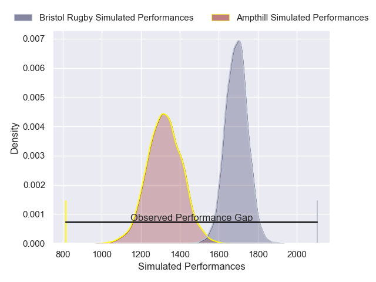
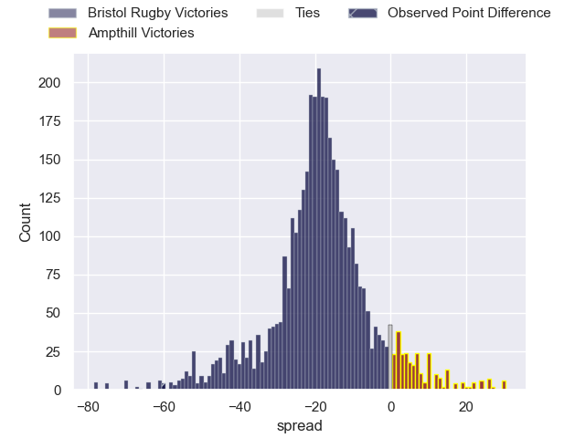
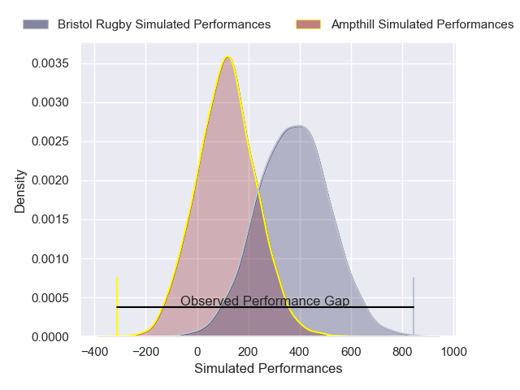
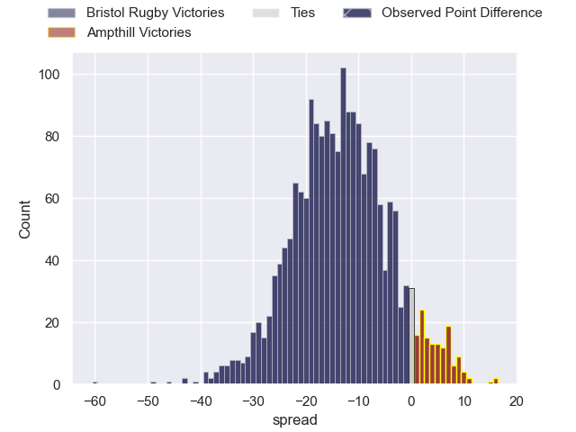

---  
layout: page  
title: Bristol Rugby at Ampthill; 74-14  
date: 2025-02-01 18:00:00 -0500  
categories: "Premiership Rugby Cup 24/25" match review  
---
# Bristol Rugby at Ampthill; 74-14

# Club Level Predictions

The first set of predictions treats a club as the smallest object, as the club develops its members, organizes a gameplan, and deploys its players as needed for each match. This club model has a prediction of 0.112, which translates to predicting Bristol Rugby to win by 18.3.

Our Over/Under is 55.5 - and combined with the spread above, we have a predicted scoreline of 37 to 19

Each club has a rating and a rating deviation (similar to a Glicko rating), and expected performances can be generated. This allows for simulated matches and spreads like the ones below.
## Projected Performances - Club Model

## Projected Spreads - Club Model

## Projected Results - Club Model

# Player Level Predictions

Treating teams instead as an entity made up of the currently active players, I have ratings for each player in an altogether different system. These can be combined to form team ratings once teamsheets are announced, weighting starters a bit higher than the reserves. After the match is played, players can be weighted by their minutes on the field, allowing for an accurate measure of the team's composition. With these compiled team ratings, we can make predictions, measure inaccuracy, and update the individual player ratings.
## Prediction without Player Minutes: Bristol Rugby by 14.3

Bristol Rugby by 17.6 on a neutral pitch

## Projected Performances - Player Model

## Projected Spreads - Player Model

## Projected Results - Player Model

|   Away Minutes | Away Player          |   Away Percentile |   Number |   Home Percentile | Home Player                 |   Home Minutes |
|---------------:|:---------------------|------------------:|---------:|------------------:|:----------------------------|---------------:|
|             80 | Yann Thomas          |             94.93 |        1 |              4.74 | James Flynn                 |             28 |
|             80 | Will Capon           |             41.64 |        2 |             59.87 | Luke Thompson               |             80 |
|             80 | George Kloska        |             73.48 |        3 |             13.05 | James Johnston              |             28 |
|             80 | Josh Caulfield       |             83.46 |        4 |             24.62 | Arthur Thomas               |             80 |
|             80 | Steele Robert Barker |             90    |        5 |             14.52 | Jake Parkinson              |             51 |
|             80 | Santiago Grondona    |             93.71 |        6 |             13.73 | Charles Rylands             |             80 |
|             80 | Kofi Cripps          |             58.9  |        7 |             23.4  | Max Clementson              |             52 |
|             80 | Benjamin Grondona    |             82.84 |        8 |             18.86 | Lekima Ravuvu               |             61 |
|             80 | Kieran Marmion       |             94.86 |        9 |             17.91 | Rory Morgan                 |             80 |
|             80 | Harry Byrne          |             91.91 |       10 |             14.68 | Josh Barton                 |             80 |
|             80 | Deago Bailey         |             56.04 |       11 |             17.6  | Vereimi Qorowale            |             80 |
|             80 | Joe Jenkins          |             74.01 |       12 |             75.36 | Fraser James Kevin Strachan |             80 |
|             80 | Kalaveti Ravouvou    |             80.77 |       13 |             22.56 | Sione Va'enuku              |             80 |
|             80 | Noah Heward          |             90.58 |       14 |             21.22 | Mason Cullen                |             80 |
|             80 | Benjamin Elizalde    |             91.82 |       15 |             13.84 | Evan Mitchell               |             80 |

