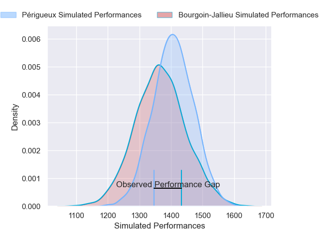
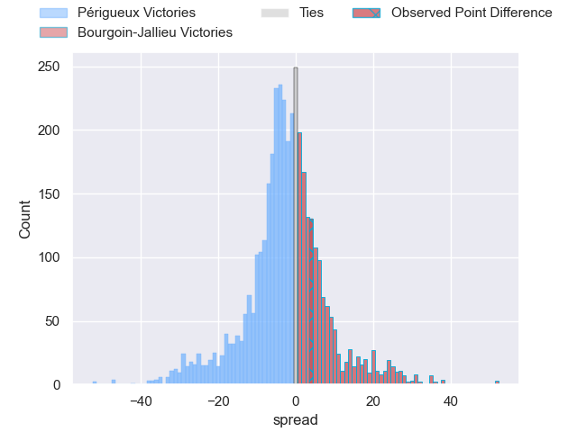
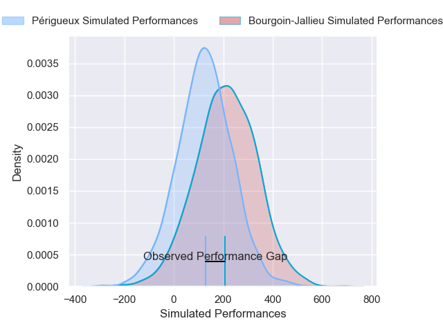
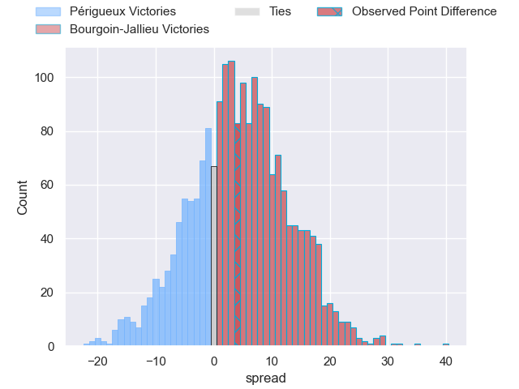
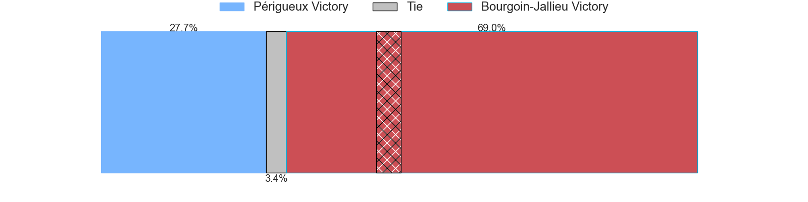

---  
layout: page  
title: Perigueux at Bourgoin-Jallieu; 16-20  
date: 2025-02-01 18:00:00 -0500  
categories: "Nationale 24/25" match review  
---
# Perigueux at Bourgoin-Jallieu; 16-20

# Club Level Predictions

The first set of predictions treats a club as the smallest object, as the club develops its members, organizes a gameplan, and deploys its players as needed for each match. This club model has a prediction of 0.447, which translates to predicting Périgueux to win by 1.9.

Our Over/Under is 44.5 - and combined with the spread above, we have a predicted scoreline of 23 to 21

Each club has a rating and a rating deviation (similar to a Glicko rating), and expected performances can be generated. This allows for simulated matches and spreads like the ones below.
## Projected Performances - Club Model

## Projected Spreads - Club Model

## Projected Results - Club Model

# Player Level Predictions

Treating teams instead as an entity made up of the currently active players, I have ratings for each player in an altogether different system. These can be combined to form team ratings once teamsheets are announced, weighting starters a bit higher than the reserves. After the match is played, players can be weighted by their minutes on the field, allowing for an accurate measure of the team's composition. With these compiled team ratings, we can make predictions, measure inaccuracy, and update the individual player ratings.
## Prediction without Player Minutes: Bourgoin-Jallieu by 1.5

Périgueux by 11.7 on a neutral pitch

## Projected Performances - Player Model

## Projected Spreads - Player Model

## Projected Results - Player Model

|   Away Minutes | Away Player         |   Away Percentile |   Number |   Home Percentile | Home Player      |   Home Minutes |
|---------------:|:--------------------|------------------:|---------:|------------------:|:-----------------|---------------:|
|             16 | Jason Tindiliere    |             29.84 |        1 |             23.36 | Romain Favaretto |             51 |
|             47 | Manu Leiataua       |              1.34 |        2 |             11.71 | Julien Ratajczak |             80 |
|             58 | Kalaveti Tawake     |             51.7  |        3 |              8.56 | Keynan Knox      |             80 |
|             47 | Richard Fourcade    |             32.02 |        4 |              0.96 | Morgan Eames     |             64 |
|             80 | Mathieu Pace        |             74.33 |        5 |             33.37 | Thomas Adélaïde  |             80 |
|             47 | Bastien Gest        |             47.1  |        6 |             11.03 | Kevin Chaudouard |             16 |
|             22 | Hendri Storm        |             47.49 |        7 |             75.63 | Bynjamin Rabatel |             80 |
|             80 | Nahum Merigan       |             38.56 |        8 |              6.14 | Sam Daly         |             57 |
|             64 | Max Green           |             49.47 |        9 |             38.12 | Louis Giamarchi  |             80 |
|             22 | Anderson Neisen     |             41.06 |       10 |             10.21 | Nicolas Cachet   |             51 |
|             30 | Tim Giresse         |             82.21 |       11 |             19.79 | Adrian Fugit     |             55 |
|             80 | Cyril Couturier     |             83.26 |       12 |             66.32 | Isaiah Leota     |             18 |
|             16 | Dorian Lavernhe     |             69.75 |       13 |             13.31 | Pierre Mignot    |             18 |
|             25 | Vincent Fouillade   |             84.78 |       14 |             10.47 | Paul-Hugo Champ  |             13 |
|             64 | Yon Camou           |             51.36 |       15 |              0.63 | Antoine Renaud   |             64 |
|             58 | Lucas Marijon       |             41.47 |       16 |              1.33 | Lucas Dycke      |             65 |
|             25 | Martin Augeix       |             32.83 |       17 |             40.97 | Maxime Castant   |             38 |
|             25 | Milan Ferreira      |            nan    |       18 |             44.89 | Dimitri Tchapnga |             33 |
|             16 | Raphaël Vieilledent |             72.02 |       19 |             17.99 | Theophile Cotte  |             11 |
|             80 | Damien Lavergne     |             42.31 |       20 |             44.92 | Tala Gray        |             80 |
|             16 | Karl Lambert        |             65.89 |       21 |             16.63 | Matteo Broeders  |             80 |
|             80 | Matteo Bordenave    |             65.96 |       22 |             15.53 | Tom Danovaro     |             64 |
|             28 | Nicolas Piaton      |             16.63 |       23 |             67.91 | Yoan Cottin      |             80 |

