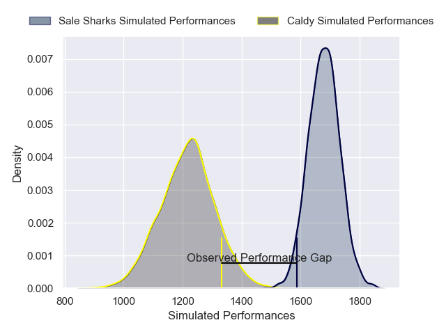
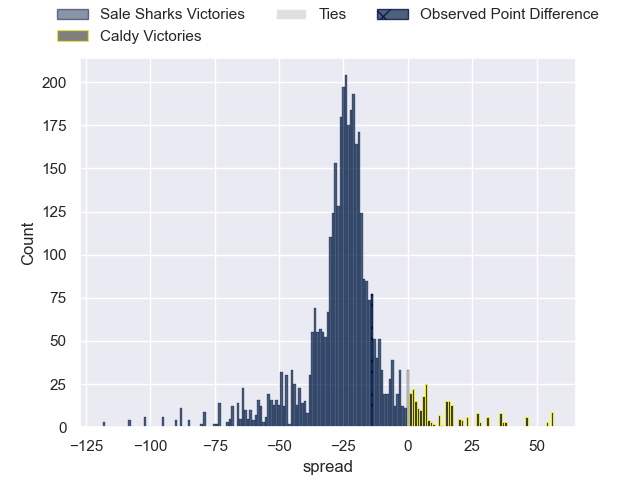
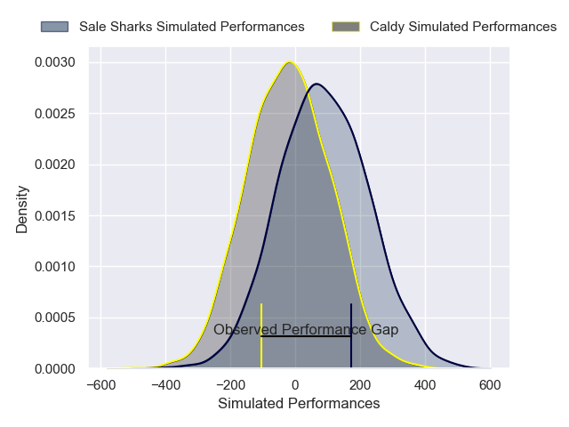
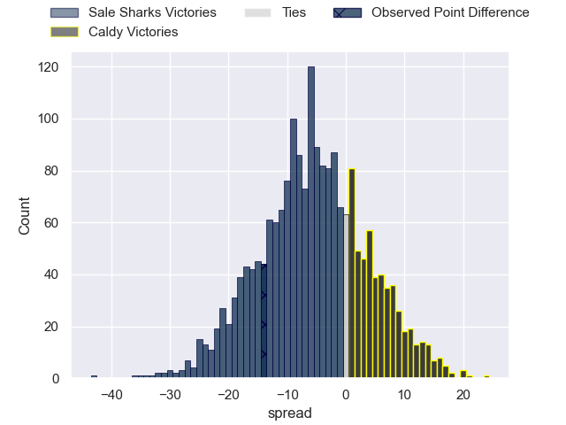

---  
layout: page  
title: Sale Sharks at Caldy; 28-14  
date: 2025-02-01 18:00:00 -0500  
categories: "Premiership Rugby Cup 24/25" match review  
---
# Sale Sharks at Caldy; 28-14

# Club Level Predictions

The first set of predictions treats a club as the smallest object, as the club develops its members, organizes a gameplan, and deploys its players as needed for each match. This club model has a prediction of 0.066, which translates to predicting Sale Sharks to win by 23.3.

Our Over/Under is 54.5 - and combined with the spread above, we have a predicted scoreline of 39 to 16

Each club has a rating and a rating deviation (similar to a Glicko rating), and expected performances can be generated. This allows for simulated matches and spreads like the ones below.
## Projected Performances - Club Model

## Projected Spreads - Club Model

## Projected Results - Club Model

# Player Level Predictions

Treating teams instead as an entity made up of the currently active players, I have ratings for each player in an altogether different system. These can be combined to form team ratings once teamsheets are announced, weighting starters a bit higher than the reserves. After the match is played, players can be weighted by their minutes on the field, allowing for an accurate measure of the team's composition. With these compiled team ratings, we can make predictions, measure inaccuracy, and update the individual player ratings.
## Prediction without Player Minutes: Sale Sharks by 5.6

Sale Sharks by 8.2 on a neutral pitch

## Projected Performances - Player Model

## Projected Spreads - Player Model

## Projected Results - Player Model

|   Away Minutes | Away Player         |   Away Percentile |   Number |   Home Percentile | Home Player       |   Home Minutes |
|---------------:|:--------------------|------------------:|---------:|------------------:|:------------------|---------------:|
|             80 | Simon McIntyre      |             91.28 |        1 |             18.85 | Monty Weatherby   |             80 |
|             80 | Tadgh McElroy       |             29.53 |        2 |             18.79 | Matt Gallagher    |             80 |
|             80 | Jake Bridges        |             11.13 |        3 |              7.64 | Nathan Rushton    |             80 |
|             80 | Ben Bamber          |             27.61 |        4 |             16.59 | Freddie Stevenson |             80 |
|             80 | Jonny Hill          |              9.78 |        5 |             16.78 | Thomas Sanders    |             80 |
|             80 | Sam Dugdale         |             25.27 |        6 |              2.6  | Sam Olyott        |             80 |
|             80 | Tristan Woodman     |             48.7  |        7 |             18.51 | Thomas Parry      |             80 |
|             80 | Rouban Birch        |             31.3  |        8 |              2.94 | Josiah Dickinson  |             80 |
|             80 | Anerin (Nye) Thomas |             26.6  |        9 |             11.52 | Ollie Wynn        |             80 |
|             80 | Tom Curtis          |             38.03 |       10 |              2.56 | Lewis Barker      |             80 |
|             80 | Alex Wills          |             57.78 |       11 |             27.51 | Jacob Mitchell    |             80 |
|             80 | Sam Bedlow          |             85.35 |       12 |              7.33 | Michael Barlow    |             80 |
|             52 | Sam Bedlow          |             85.35 |       13 |              4.33 | Connor Wilkinson  |             80 |
|             28 | Obi Ene             |             52.66 |       14 |              9.01 | Nick Royle        |             80 |
|             28 | Ollie Davies        |             46.72 |       15 |             25    | Matt Kilcourse    |             80 |

