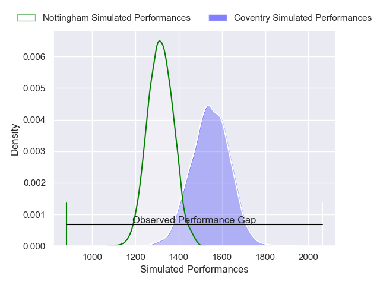
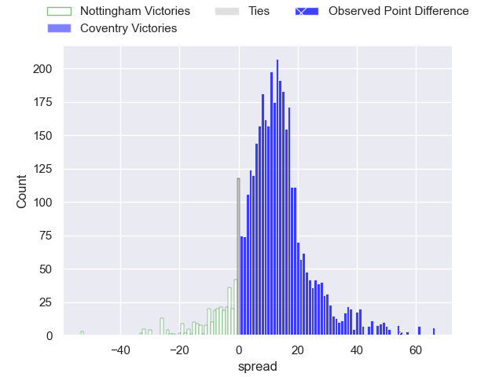
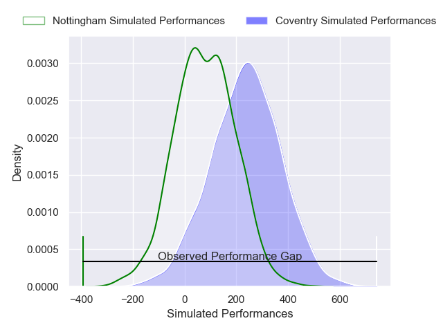
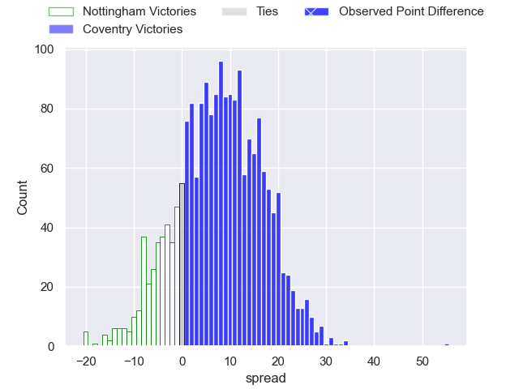

---  
layout: page  
title: Nottingham at Coventry; 21-76  
date: 2025-02-01 18:00:00 -0500  
categories: "Premiership Rugby Cup 24/25" match review  
---
# Nottingham at Coventry; 21-76

# Club Level Predictions

The first set of predictions treats a club as the smallest object, as the club develops its members, organizes a gameplan, and deploys its players as needed for each match. This club model has a prediction of 0.784, which translates to predicting Coventry to win by 11.4.

Our Over/Under is 62.5 - and combined with the spread above, we have a predicted scoreline of 25 to 37

Each club has a rating and a rating deviation (similar to a Glicko rating), and expected performances can be generated. This allows for simulated matches and spreads like the ones below.
## Projected Performances - Club Model

## Projected Spreads - Club Model

## Projected Results - Club Model

# Player Level Predictions

Treating teams instead as an entity made up of the currently active players, I have ratings for each player in an altogether different system. These can be combined to form team ratings once teamsheets are announced, weighting starters a bit higher than the reserves. After the match is played, players can be weighted by their minutes on the field, allowing for an accurate measure of the team's composition. With these compiled team ratings, we can make predictions, measure inaccuracy, and update the individual player ratings.
## Prediction without Player Minutes: Coventry by 8.0

Coventry by 4.4 on a neutral pitch

## Projected Performances - Player Model

## Projected Spreads - Player Model

## Projected Results - Player Model

|   Away Minutes | Away Player        |   Away Percentile |   Number |   Home Percentile | Home Player          |   Home Minutes |
|---------------:|:-------------------|------------------:|---------:|------------------:|:---------------------|---------------:|
|             80 | Aniseko Sio        |             36.71 |        1 |             90.37 | Toby Trinder         |             80 |
|             52 | Jack Dickinson     |             68.96 |        2 |             92.79 | Jordon Poole         |             80 |
|             80 | Xavier Valentine   |             20.68 |        3 |             16.45 | Eliot Salt           |             80 |
|             80 | Jay Ecclesfield    |             24.54 |        4 |             54.07 | James Tyas           |             80 |
|             80 | Sebastien Ferreira |              4.41 |        5 |             41.13 | Obinna Nkwocha       |             80 |
|             80 | Kody Vereti        |             46.67 |        6 |             89.59 | Tom Ball             |             80 |
|             80 | Nathan Tweedy      |             24.88 |        7 |             16.88 | Aaron Hinkley        |             80 |
|             80 | Jacob Wright       |             10.29 |        8 |             98.32 | Senitiki Nayalo      |             80 |
|             80 | Toby Venner        |             69.15 |        9 |             35.46 | Sam Maunder          |             80 |
|             80 | Gwyn Parks         |             11.32 |       10 |             62.39 | Tommy Mathews        |             80 |
|             80 | Ryan Olowofela     |             84.16 |       11 |             88.99 | James Martin         |             80 |
|             28 | Levi Roper         |             54.59 |       12 |             16.62 | Dafydd-Rhys Tiueti   |             80 |
|             23 | Aman Johal         |             53.25 |       13 |             72.03 | Thomas Hitchcock     |             80 |
|             28 | Harry Graham       |             76.85 |       14 |              9.11 | David Opoku-Fordjour |             80 |
|             28 | Jack Stapley       |              1.64 |       15 |             64.55 | Ryan Hutler          |             80 |

