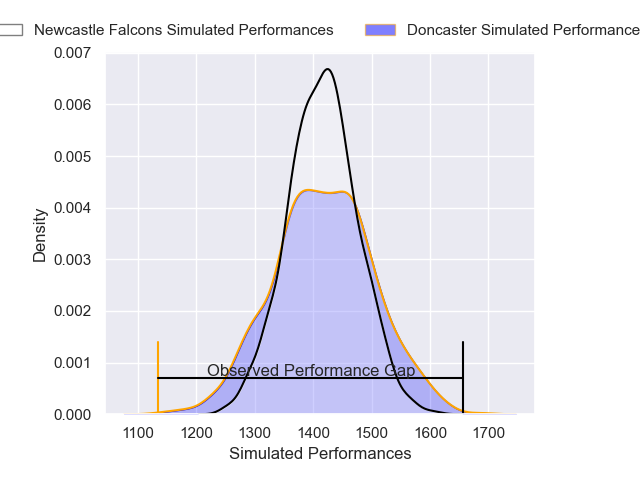
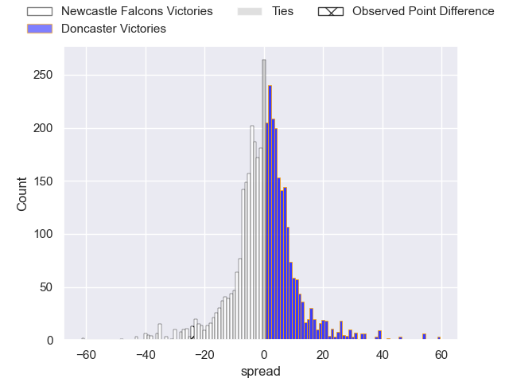
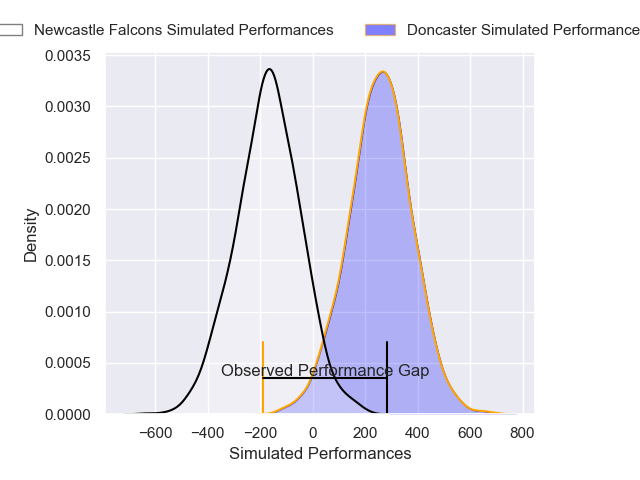
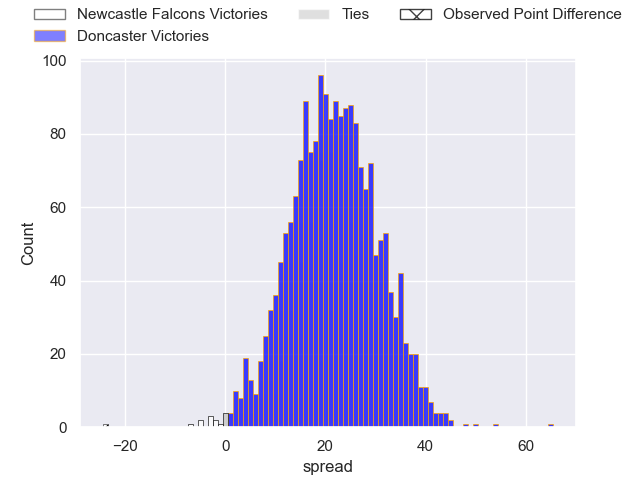
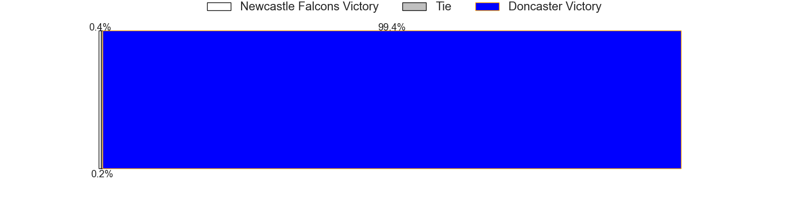

---  
layout: page  
title: Newcastle Falcons at Doncaster; 42-18  
date: 2025-02-01 18:00:00 -0500  
categories: "Premiership Rugby Cup 24/25" match review  
---
# Newcastle Falcons at Doncaster; 42-18

# Club Level Predictions

The first set of predictions treats a club as the smallest object, as the club develops its members, organizes a gameplan, and deploys its players as needed for each match. This club model has a prediction of 0.502, which translates to predicting Doncaster to win by 0.1.

Our Over/Under is 50.5 - and combined with the spread above, we have a predicted scoreline of 25 to 26

Each club has a rating and a rating deviation (similar to a Glicko rating), and expected performances can be generated. This allows for simulated matches and spreads like the ones below.
## Projected Performances - Club Model

## Projected Spreads - Club Model

## Projected Results - Club Model

# Player Level Predictions

Treating teams instead as an entity made up of the currently active players, I have ratings for each player in an altogether different system. These can be combined to form team ratings once teamsheets are announced, weighting starters a bit higher than the reserves. After the match is played, players can be weighted by their minutes on the field, allowing for an accurate measure of the team's composition. With these compiled team ratings, we can make predictions, measure inaccuracy, and update the individual player ratings.
## Prediction without Player Minutes: Doncaster by 24.1

Doncaster by 19.3 on a neutral pitch

## Projected Performances - Player Model

## Projected Spreads - Player Model

## Projected Results - Player Model

|   Away Minutes | Away Player         |   Away Percentile |   Number |   Home Percentile | Home Player              |   Home Minutes |
|---------------:|:--------------------|------------------:|---------:|------------------:|:-------------------------|---------------:|
|             80 | Adam Brocklebank    |              2.66 |        1 |             13.95 | Conor Davidson           |             80 |
|             80 | Jamie Blamire       |              2.01 |        2 |              6.38 | George Roberts           |             80 |
|             52 | Luan de Bruin       |             75.25 |        3 |              4.9  | Joe Jones                |             80 |
|             80 | Sebastian de Chaves |              6.9  |        4 |             16.3  | Ben Murphy               |             80 |
|             52 | Kiran McDonald      |             22.72 |        5 |             46.6  | Josh Williams            |             80 |
|             80 | Philip van der Walt |              5.5  |        6 |             17.55 | Adam Hopkinson           |             80 |
|             18 | Freddie Lockwood    |             20.64 |        7 |             41.95 | Rhys Tait                |             62 |
|             80 | Callum Chick        |              3.57 |        8 |             68.28 | Morgan Strong            |             31 |
|             80 | Sam Stuart          |              0.53 |        9 |             45.57 | Alex Dolly               |             52 |
|             80 | Brett Connon        |              9.4  |       10 |              3.63 | Morgan Bunting           |             80 |
|             57 | Ben Stevenson       |             64.99 |       11 |              6.45 | Westleigh Alleyne Holden |             80 |
|             80 | Max Clark           |             92.88 |       12 |              9.91 | Zach Kerr                |             80 |
|             80 | Alex Hearle         |             71.31 |       13 |             11.04 | Jordan Olowofela         |             80 |
|             80 | Max Pepper          |             64.52 |       14 |             89.56 | Semesa Rokoduguni        |             48 |
|             32 | Louis Brown         |             81.56 |       15 |             98.16 | Telusa Veainu            |             68 |

