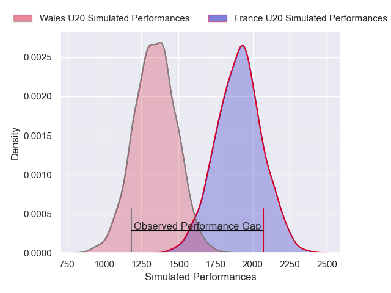
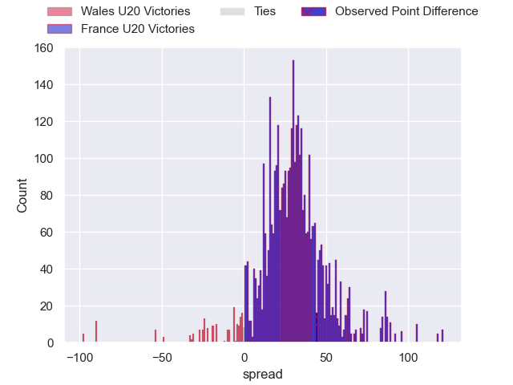
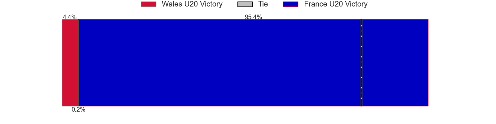
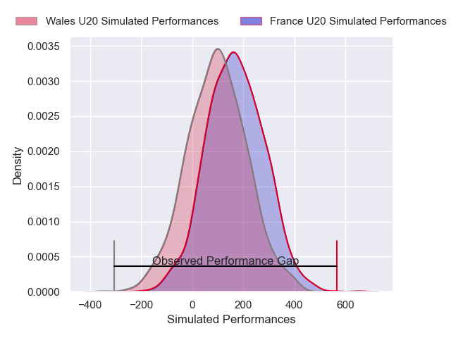
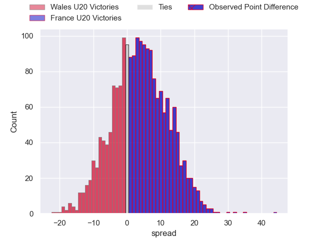

---  
layout: page  
title: Wales U20 at France U20; 19-63  
date: 2025-02-01 18:00:00 -0500  
categories: "U20 Six Nations Championship 2025" match review  
---
# Wales U20 at France U20; 19-63

# Club Level Predictions

The first set of predictions treats a club as the smallest object, as the club develops its members, organizes a gameplan, and deploys its players as needed for each match. This club model has a prediction of 0.951, which translates to predicting France U20 to win by 28.2.

Our Over/Under is 60.5 - and combined with the spread above, we have a predicted scoreline of 16 to 44

Each club has a rating and a rating deviation (similar to a Glicko rating), and expected performances can be generated. This allows for simulated matches and spreads like the ones below.
## Projected Performances - Club Model

## Projected Spreads - Club Model

## Projected Results - Club Model

# Player Level Predictions

Treating teams instead as an entity made up of the currently active players, I have ratings for each player in an altogether different system. These can be combined to form team ratings once teamsheets are announced, weighting starters a bit higher than the reserves. After the match is played, players can be weighted by their minutes on the field, allowing for an accurate measure of the team's composition. With these compiled team ratings, we can make predictions, measure inaccuracy, and update the individual player ratings.
## Prediction without Player Minutes: France U20 by 5.1

France U20 by 2.8 on a neutral pitch

## Projected Performances - Player Model

## Projected Spreads - Player Model

## Projected Results - Player Model

|   Away Minutes | Away Player       |   Away Percentile |   Number |   Home Percentile | Home Player                 |   Home Minutes |
|---------------:|:------------------|------------------:|---------:|------------------:|:----------------------------|---------------:|
|           40   | Ioan Emanuel      |             34.41 |        1 |             50.29 | Samuel Jean-Christophe      |           12   |
|           19   | Harry Thomas      |             38.63 |        2 |             71.4  | Lyam Akrab                  |           25   |
|           22   | Harry Thomas      |             38.63 |        2 |             71.4  | Lyam Akrab                  |           25   |
|           27   | Sam Scott         |             37.91 |        3 |             56.11 | Owen Sorhaindo              |           31   |
|           18   | Kenzie Jenkins    |             41.63 |        4 |             60.19 | Bartholomé Sanson           |           49   |
|           31   | Nick Thomas       |             37.69 |        5 |             78.08 | Corentin Mezou              |           49   |
|           11   | Nick Thomas       |             37.69 |        5 |             78.08 | Corentin Mezou              |           49   |
|           15.5 | Deian Gwynne      |             41.49 |        6 |             59.77 | Antoine Déliance            |           49   |
|           31   | Harry Beddall     |             36.27 |        7 |             64.51 | Marceau Marzullo            |           69   |
|           31   | Evan Minto        |             32.42 |        8 |             60.59 | Elyjah Ibsaiene             |           80   |
|           80   | Logan Franklin    |             28.55 |        9 |             65.43 | Baptiste Tilloles           |           80   |
|           80   | Harri Wilde       |             24.26 |       10 |             55.96 | Diego Jurd                  |           49   |
|           58   | Aidan Boshoff     |             23.41 |       11 |             95.91 | Xan Mousques                |           19.5 |
|           80   | Steffan Emanuel   |             30.25 |       12 |             52.18 | Lucas Vigneres              |           30.5 |
|           15.5 | Elijah Evans      |             39.29 |       13 |             82.64 | Robin Taccola               |           37   |
|           49   | Harry Rees-Weldon |             34.16 |       14 |             38.06 | Mathis Ibo                  |           13   |
|           61   | Scott Delnevo     |             28.72 |       15 |             57.44 | Ugo Pacome                  |           55   |
|           30.5 | Saul Hurley       |            nan    |       16 |            nan    | Quentin Algay               |           59   |
|           40   | Louie Trevett     |            nan    |       17 |            nan    | Édouard-Junior Jabea Njocke |           43   |
|           68   | Jac Pritchard     |            nan    |       18 |            nan    | Mohamed Megherbi            |           80   |
|           19.5 | Tom Cottle        |            nan    |       19 |            nan    | Raphaël Darquier            |           80   |
|           30.5 | Dan Gemine        |            nan    |       20 |            nan    | Sialevailea Tolofua         |           80   |
|           80   | Carwyn Edwards    |            nan    |       21 |            nan    | Nathan Llaveria             |           53   |
|           80   | Harri Ford        |            nan    |       22 |            nan    | Luka Keletaona              |           41   |
|           80   | Tom Bowen         |             19.31 |       23 |             76.09 | Fabien Brau Boirie          |           12   |

