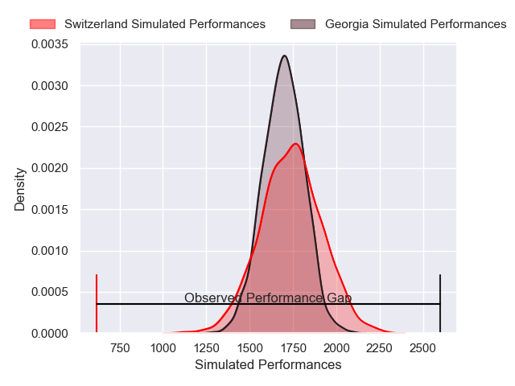
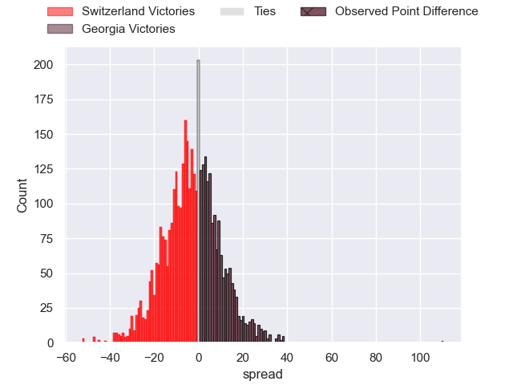
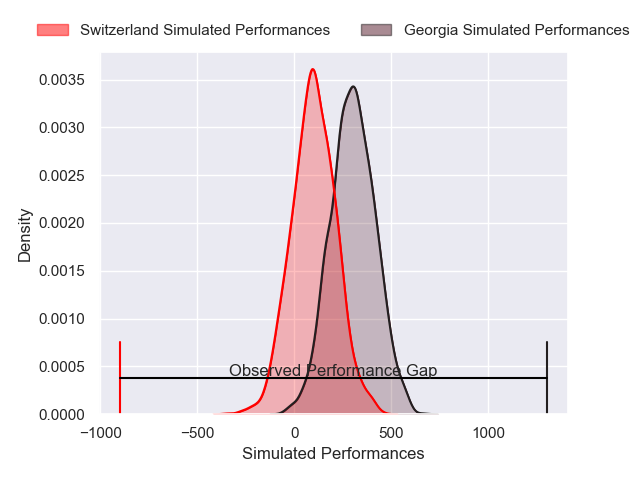
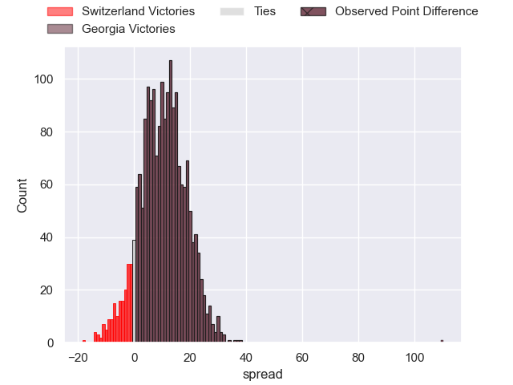
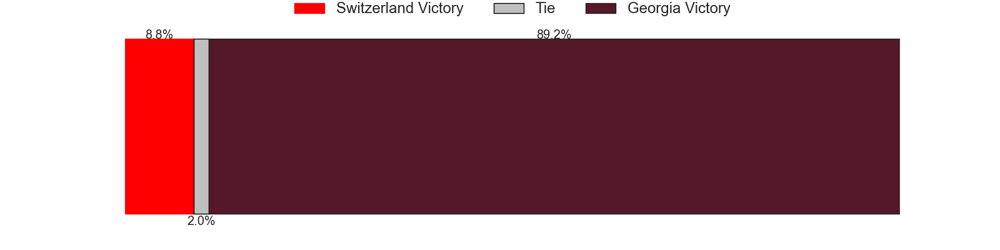

---  
layout: page  
title: Switzerland at Georgia; 0-110  
date: 2025-02-01 18:00:00 -0500  
categories: "Rugby Europe Championship 2025" match review  
---
# Switzerland at Georgia; 0-110

# Club Level Predictions

The first set of predictions treats a club as the smallest object, as the club develops its members, organizes a gameplan, and deploys its players as needed for each match. This club model has a prediction of 0.438, which translates to predicting Switzerland to win by 2.5.

Our Over/Under is 58.5 - and combined with the spread above, we have a predicted scoreline of 30 to 28

Each club has a rating and a rating deviation (similar to a Glicko rating), and expected performances can be generated. This allows for simulated matches and spreads like the ones below.
## Projected Performances - Club Model

## Projected Spreads - Club Model

## Projected Results - Club Model

# Player Level Predictions

Treating teams instead as an entity made up of the currently active players, I have ratings for each player in an altogether different system. These can be combined to form team ratings once teamsheets are announced, weighting starters a bit higher than the reserves. After the match is played, players can be weighted by their minutes on the field, allowing for an accurate measure of the team's composition. With these compiled team ratings, we can make predictions, measure inaccuracy, and update the individual player ratings.
## Prediction without Player Minutes: Georgia by 11.7

Georgia by 7.7 on a neutral pitch

## Projected Performances - Player Model

## Projected Spreads - Player Model

## Projected Results - Player Model

|   Away Minutes | Away Player              |   Away Percentile |   Number |   Home Percentile | Home Player          |   Home Minutes |
|---------------:|:-------------------------|------------------:|---------:|------------------:|:---------------------|---------------:|
|           80   | Cameron Holenstein       |             31.31 |        1 |             92.61 | Nika Abuladze        |           80   |
|           22   | Maxime Luçon             |             39.77 |        2 |             20.13 | Irakli Kvatadze      |           31   |
|           34   | Vincent Vial             |             39.87 |        3 |             88.46 | Luka Japaridze       |           31   |
|           28   | Lazlo Pschorn            |             42.28 |        4 |             81.4  | Mikheil Babunashvili |           15.5 |
|           30   | Tim Voegtli              |             41.71 |        5 |             33.94 | Lado Chachanidze     |           11   |
|           24   | Jessy Jegerlehner        |             41.76 |        6 |             32.3  | Beka Shvangiradze    |           31   |
|           36   | Nicolas Mousties         |             39.54 |        7 |             87.27 | Beka Saghinadze      |           18   |
|            0   | Cyril Lin                |             40.55 |        8 |             71.85 | Luka Ivanishvili     |           59   |
|           40   | Simon Perrod             |             38.65 |        9 |             71.28 | Gela Aprasidze       |           47   |
|           47   | Jules Porcher            |             32.26 |       10 |             70.73 | Luka Matkava         |           40   |
|           80   | Cyril Fluckiger          |             34.25 |       11 |             59.58 | Shalva Aptsiauri     |           80   |
|           61   | Jeremy To'A              |             34.26 |       12 |             62.64 | Tornike Kakhoidze    |           59   |
|           27   | Arthur Donzé             |             39.32 |       13 |             98.25 | Giorgi Kveseladze    |           80   |
|           15.5 | Lucas Heinrich           |             43.55 |       14 |             92.6  | Aka Tabutsadze       |           59   |
|           49   | Jolan Vincent            |             35.86 |       15 |             55.74 | Dachi Papunashvili   |           76   |
|           49   | Mehdi Ouaziz             |            nan    |       16 |             55.2  | Vano Karkadze        |           80   |
|           49   | Maxence Gisclard         |            nan    |       17 |            nan    | Luka Goginava        |            4   |
|           69   | Antoine Cramont          |            nan    |       18 |             63.12 | Irakli Aptsiauri     |            0   |
|           80   | Thomas Mccarthy          |            nan    |       19 |             85.81 | Giorgi Javakhia      |           23   |
|           80   | Campbell Swanson         |            nan    |       20 |             11.09 | Ilia Spanderashvili  |           16   |
|           49   | Louis Pharaony           |            nan    |       21 |             25.71 | Mikheil Alania       |           80   |
|           80   | Harry Stevens            |            nan    |       22 |             87.95 | Davit Niniashvili    |           80   |
|           62   | Louis-Alexandre Chavanon |            nan    |       23 |            nan    | Giorgi Khaindrava    |           58   |

