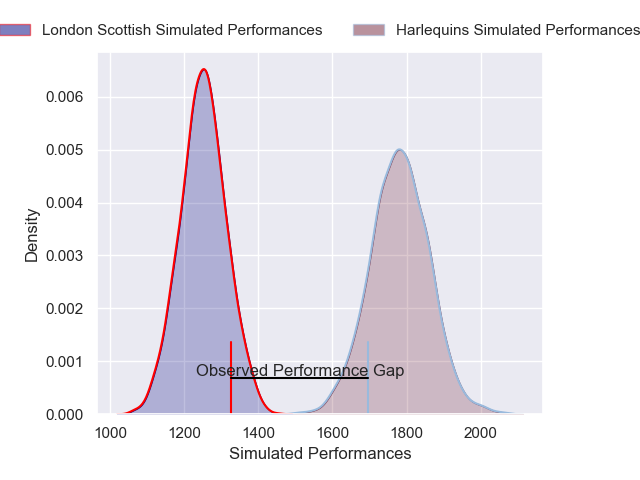
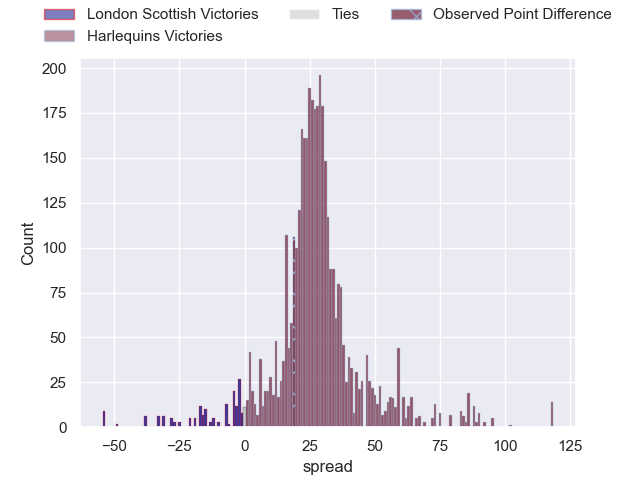
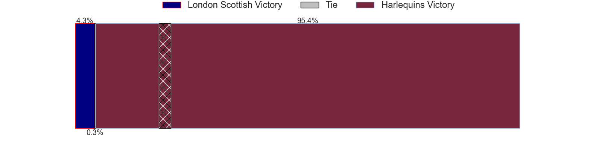
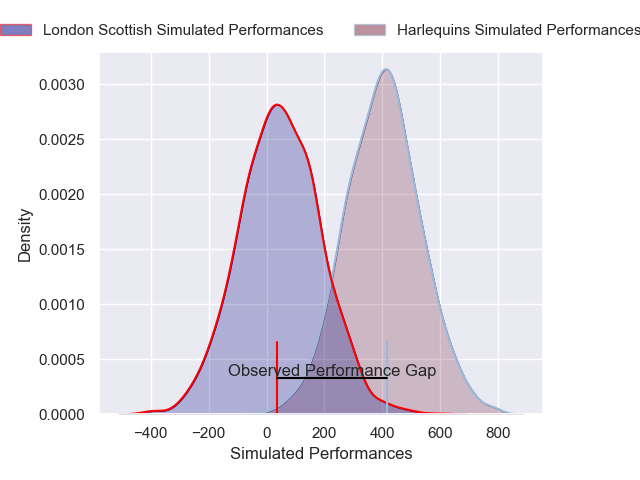
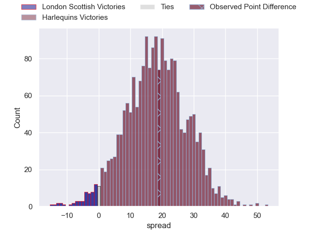
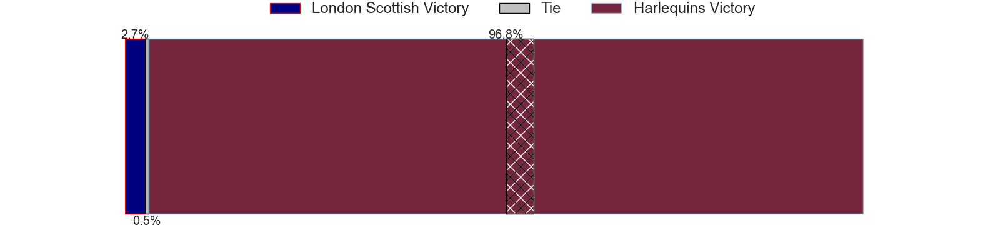

---  
layout: page  
title: London Scottish at Harlequins; 14-33  
date: 2025-02-01 18:00:00 -0500  
categories: "Premiership Rugby Cup 24/25" match review  
---
# London Scottish at Harlequins; 14-33

# Club Level Predictions

The first set of predictions treats a club as the smallest object, as the club develops its members, organizes a gameplan, and deploys its players as needed for each match. This club model has a prediction of 0.952, which translates to predicting Harlequins to win by 26.5.

Our Over/Under is 56.5 - and combined with the spread above, we have a predicted scoreline of 15 to 42

Each club has a rating and a rating deviation (similar to a Glicko rating), and expected performances can be generated. This allows for simulated matches and spreads like the ones below.
## Projected Performances - Club Model

## Projected Spreads - Club Model

## Projected Results - Club Model

# Player Level Predictions

Treating teams instead as an entity made up of the currently active players, I have ratings for each player in an altogether different system. These can be combined to form team ratings once teamsheets are announced, weighting starters a bit higher than the reserves. After the match is played, players can be weighted by their minutes on the field, allowing for an accurate measure of the team's composition. With these compiled team ratings, we can make predictions, measure inaccuracy, and update the individual player ratings.
## Prediction without Player Minutes: Harlequins by 18.9

Harlequins by 5.1 on a neutral pitch

## Projected Performances - Player Model

## Projected Spreads - Player Model

## Projected Results - Player Model

|   Away Minutes | Away Player       |   Away Percentile |   Number |   Home Percentile | Home Player      |   Home Minutes |
|---------------:|:------------------|------------------:|---------:|------------------:|:-----------------|---------------:|
|             80 | Will Prior        |             78.49 |        1 |             52.66 | Ethan Clarke     |             80 |
|             80 | Austin Wallis     |             10.23 |        2 |             34.23 | Jack Musk        |             80 |
|             80 | Ashley Challenger |              3.65 |        3 |             79.98 | William Hobson   |             80 |
|             80 | Matt Wilkinson    |             26.85 |        4 |              9.49 | Jonny Green      |             80 |
|             80 | Alex Wardell      |             21.67 |        5 |             32.6  | George Hammond   |             80 |
|             80 | Jake Spurway      |             34.43 |        6 |             63.26 | Zach Carr        |             80 |
|             80 | Jack Ingall       |              7.91 |        7 |             53.13 | Archie White     |             80 |
|             80 | Ioan Rhys Davies  |              7.35 |        8 |             45.17 | Lucas Schmid     |             80 |
|             80 | Jonny Law         |             26.42 |        9 |             40.6  | Lewis Gjaltema   |             80 |
|             80 | Tom Wilstead      |             13.03 |       10 |             20.09 | Jamie Benson     |             80 |
|             80 | Noah Ferdinand    |              2.28 |       11 |             65.09 | Cassius Cleaves  |             52 |
|             80 | Bryn Bradley      |             81.73 |       12 |             81.73 | Bryn Bradley     |             80 |
|             80 | Sean Kerr         |             84.31 |       13 |             84.31 | Sean Kerr        |             80 |
|             80 | Matthew Gribbon   |             45.07 |       14 |             67.74 | Cameron Anderson |             80 |
|             80 | Jonah Holmes      |             77.25 |       15 |             60.04 | Leigh Halfpenny  |             80 |

