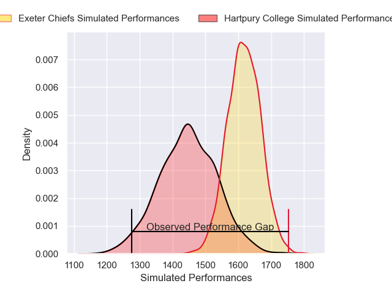
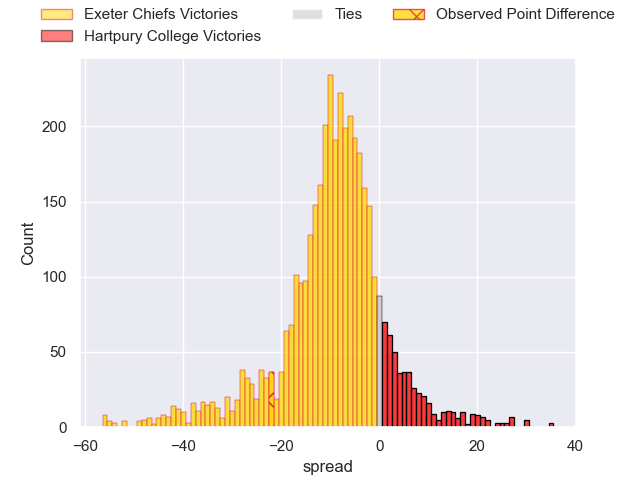
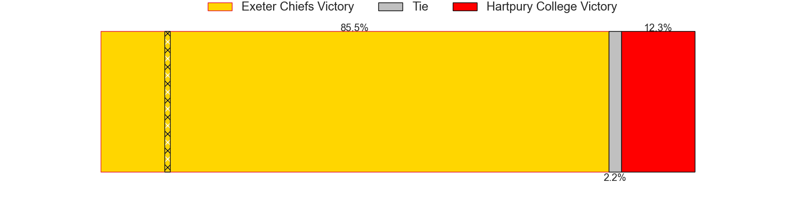
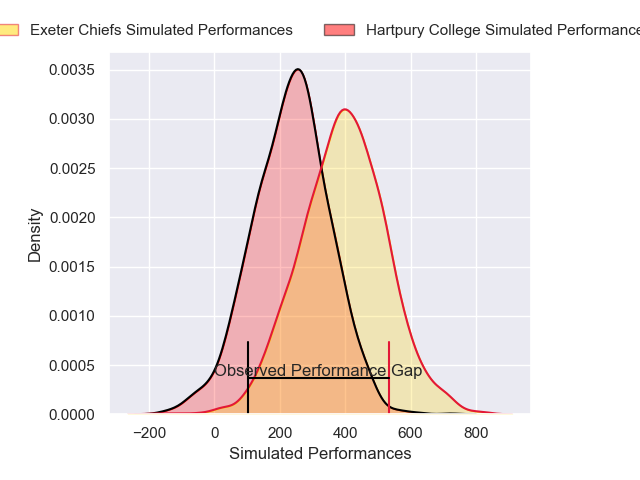
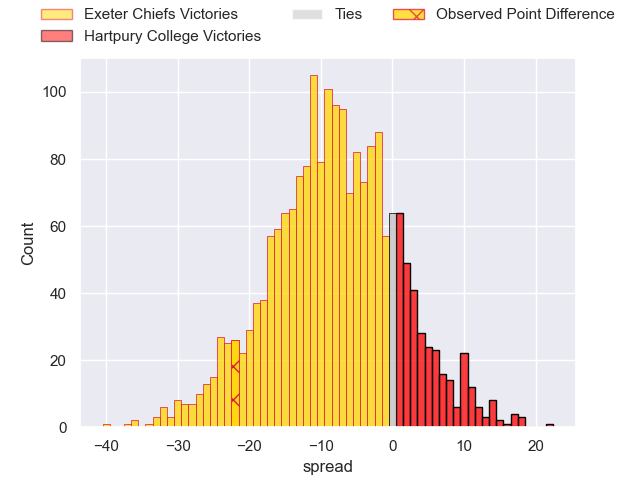
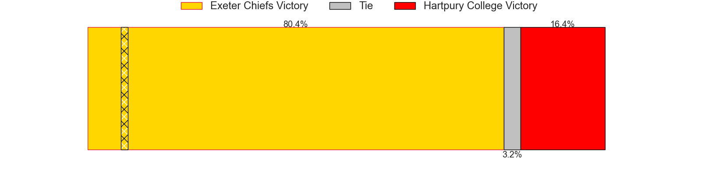

---  
layout: page  
title: Exeter Chiefs at Hartpury College; 36-14  
date: 2025-02-01 18:00:00 -0500  
categories: "Premiership Rugby Cup 24/25" match review  
---
# Exeter Chiefs at Hartpury College; 36-14

# Club Level Predictions

The first set of predictions treats a club as the smallest object, as the club develops its members, organizes a gameplan, and deploys its players as needed for each match. This club model has a prediction of 0.275, which translates to predicting Exeter Chiefs to win by 8.5.

Our Over/Under is 65.5 - and combined with the spread above, we have a predicted scoreline of 37 to 28

Each club has a rating and a rating deviation (similar to a Glicko rating), and expected performances can be generated. This allows for simulated matches and spreads like the ones below.
## Projected Performances - Club Model

## Projected Spreads - Club Model

## Projected Results - Club Model

# Player Level Predictions

Treating teams instead as an entity made up of the currently active players, I have ratings for each player in an altogether different system. These can be combined to form team ratings once teamsheets are announced, weighting starters a bit higher than the reserves. After the match is played, players can be weighted by their minutes on the field, allowing for an accurate measure of the team's composition. With these compiled team ratings, we can make predictions, measure inaccuracy, and update the individual player ratings.
## Prediction without Player Minutes: Exeter Chiefs by 9.1

Exeter Chiefs by 13.4 on a neutral pitch

## Projected Performances - Player Model

## Projected Spreads - Player Model

## Projected Results - Player Model

|   Away Minutes | Away Player       |   Away Percentile |   Number |   Home Percentile | Home Player          |   Home Minutes |
|---------------:|:------------------|------------------:|---------:|------------------:|:---------------------|---------------:|
|             23 | Scott Sio         |             98.14 |        1 |             41.83 | James Gibbons        |             80 |
|             80 | Dan Frost         |             91.65 |        2 |             46    | William Crane        |             28 |
|             80 | Josh Iosefa-Scott |             97.04 |        3 |              8.04 | Alex Gibson          |             52 |
|             20 | Rusiate Tuima     |             33.5  |        4 |             55.4  | Dale Lemon           |             80 |
|             80 | Franco Molina     |             99.02 |        5 |             34.77 | Jack Rees Davies     |             80 |
|             80 | Ethan Roots       |             92.79 |        6 |             21.32 | Cameron Cobbett      |             28 |
|             80 | Lewis Pearson     |             80.36 |        7 |             82.63 | Harry Short          |             80 |
|             80 | Greg Fisilau      |             87.34 |        8 |             56.22 | Samuel Lewis         |             80 |
|             80 | Tom Cairns        |             89.37 |        9 |             56.76 | Michael Austin       |             80 |
|             80 | Harvey Skinner    |             74.68 |       10 |             45.02 | Nathan Chamberlain   |             80 |
|             80 | Paul Brown-Bampoe |             67.12 |       11 |             40.45 | Stan Folks-Underhill |             28 |
|             80 | Will Rigg         |             92.06 |       12 |              5.61 | Robbie Smith         |             80 |
|             80 | Joe Hawkins       |             75.03 |       13 |             63.92 | Jack Johnson         |             80 |
|             80 | Zack Wimbush      |             38.99 |       14 |             33.56 | Dylan Coetzee        |             80 |
|             80 | Tom Wyatt         |             90.11 |       15 |             85.26 | Matt Protheroe       |             80 |

