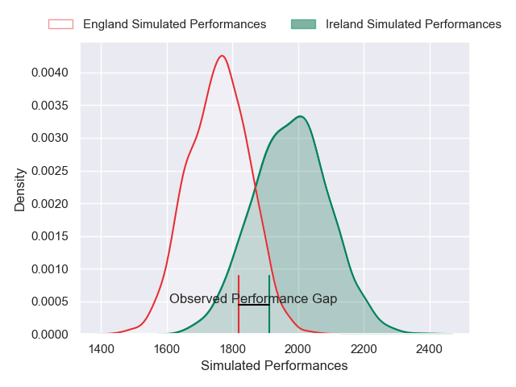
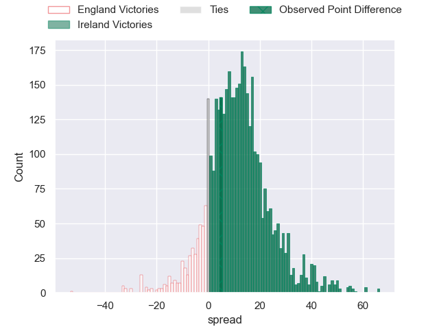
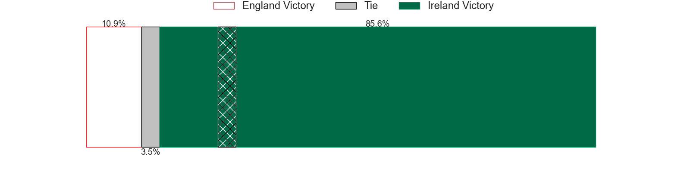
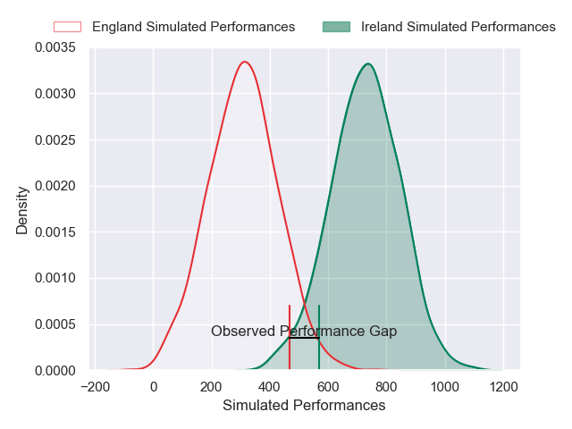
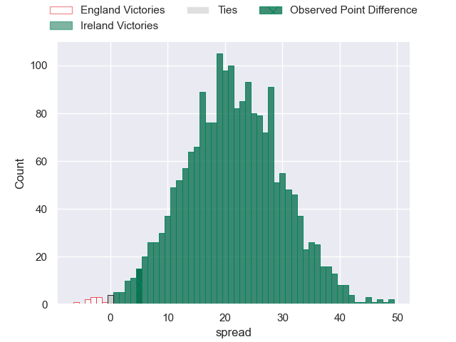

---  
layout: page  
title: England at Ireland; 22-27  
date: 2025-02-01 18:00:00 -0500  
categories: "Six Nations Championship 2025" match review  
---
# England at Ireland; 22-27

# Club Level Predictions

The first set of predictions treats a club as the smallest object, as the club develops its members, organizes a gameplan, and deploys its players as needed for each match. This club model has a prediction of 0.772, which translates to predicting Ireland to win by 11.0.

Our Over/Under is 40.5 - and combined with the spread above, we have a predicted scoreline of 15 to 26

Each club has a rating and a rating deviation (similar to a Glicko rating), and expected performances can be generated. This allows for simulated matches and spreads like the ones below.
## Projected Performances - Club Model

## Projected Spreads - Club Model

## Projected Results - Club Model

# Player Level Predictions

Treating teams instead as an entity made up of the currently active players, I have ratings for each player in an altogether different system. These can be combined to form team ratings once teamsheets are announced, weighting starters a bit higher than the reserves. After the match is played, players can be weighted by their minutes on the field, allowing for an accurate measure of the team's composition. With these compiled team ratings, we can make predictions, measure inaccuracy, and update the individual player ratings.
## Prediction without Player Minutes: Ireland by 27.6

Ireland by 22.1 on a neutral pitch

## Projected Performances - Player Model

## Projected Spreads - Player Model

## Projected Results - Player Model

|   Away Minutes | Away Player               |   Away Percentile |   Number |   Home Percentile | Home Player         |   Home Minutes |
|---------------:|:--------------------------|------------------:|---------:|------------------:|:--------------------|---------------:|
|             26 | Ellis Genge               |             86.54 |        1 |             88.48 | Andrew Porter       |             17 |
|             22 | Luke Cowan-Dickie         |              0.17 |        2 |             94.72 | Ronan Kelleher      |             82 |
|             37 | Will Stuart               |             62.24 |        3 |             94.41 | Finlay Bealham      |             82 |
|             57 | Maro Itoje                |             98.82 |        4 |             94.99 | James Ryan          |              7 |
|             29 | George Martin             |             92.34 |        5 |             98.92 | Tadhg Beirne        |             82 |
|             80 | Tom Curry                 |             85.19 |        6 |             79.76 | Ryan Baird          |             82 |
|             29 | Ben Curry                 |             68.21 |        7 |             97.43 | Josh van der Flier  |             82 |
|             29 | Ben Earl                  |            100    |        8 |             94.42 | Caelan Doris        |             65 |
|             11 | Alex Mitchell             |             97.3  |        9 |             94.77 | Jamison Gibson-Park |             82 |
|             29 | Marcus Smith              |             80.74 |       10 |             16.67 | Sam Prendergast     |             59 |
|             24 | Cadan Murley              |             24.05 |       11 |            100    | James Lowe          |             32 |
|             65 | Henry Slade               |             97.99 |       12 |             99.58 | Bundee Aki          |             20 |
|             82 | Ollie Lawrence            |             71.64 |       13 |             98.84 | Garry Ringrose      |              8 |
|             71 | Tommy Freeman             |             92.92 |       14 |             84.77 | Mack Hansen         |             32 |
|             80 | Freddie Steward           |              1.05 |       15 |             99.58 | Hugo Keenan         |             82 |
|             80 | Theo Dan                  |             85.35 |       16 |             55.88 | Dan Sheehan         |             56 |
|             61 | Fin Baxter                |              2.62 |       17 |             92.72 | Cian Healy          |             58 |
|             80 | Joe Heyes                 |             91.36 |       18 |             83.83 | Thomas Clarkson     |             60 |
|             52 | Ollie Chessum             |             63.87 |       19 |             89.69 | Iain Henderson      |             26 |
|             80 | Chandler Cunningham-South |             68.11 |       20 |             97.85 | Jack Conan          |             60 |
|             23 | Tom Willis                |             83.05 |       21 |             99.28 | Conor Murray        |             22 |
|             56 | Harry Randall             |             95.14 |       22 |             40.91 | Jack Crowley        |             23 |
|             82 | Fin Smith                 |             73.16 |       23 |             93.23 | Robbie Henshaw      |             80 |

