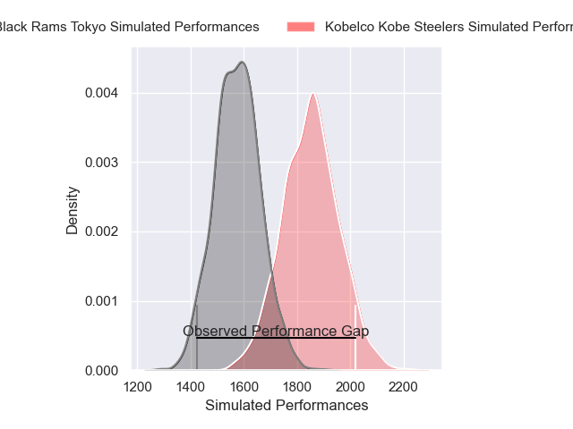
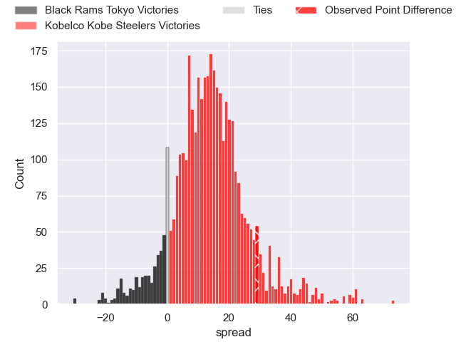
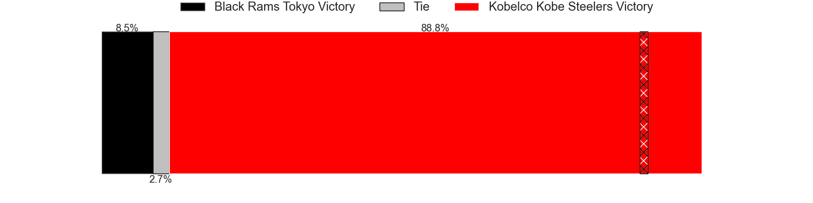
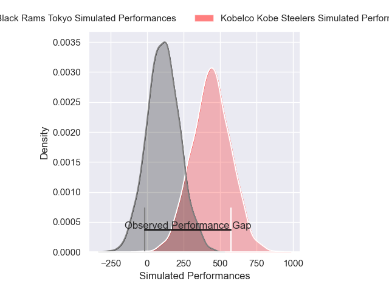
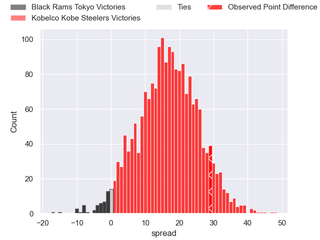
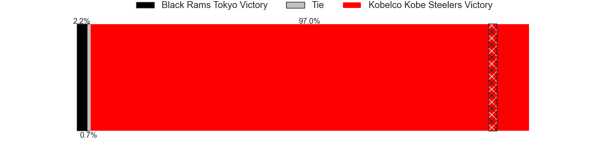

---  
layout: page  
title: Black Rams Tokyo at Kobelco Kobe Steelers; 15-44  
date: 2025-02-01 18:00:00 -0500  
categories: "Japan Rugby League One 24/25" match review  
---
# Black Rams Tokyo at Kobelco Kobe Steelers; 15-44

# Club Level Predictions

The first set of predictions treats a club as the smallest object, as the club develops its members, organizes a gameplan, and deploys its players as needed for each match. This club model has a prediction of 0.823, which translates to predicting Kobelco Kobe Steelers to win by 13.8.

Our Over/Under is 58.5 - and combined with the spread above, we have a predicted scoreline of 23 to 36

Each club has a rating and a rating deviation (similar to a Glicko rating), and expected performances can be generated. This allows for simulated matches and spreads like the ones below.
## Projected Performances - Club Model

## Projected Spreads - Club Model

## Projected Results - Club Model

# Player Level Predictions

Treating teams instead as an entity made up of the currently active players, I have ratings for each player in an altogether different system. These can be combined to form team ratings once teamsheets are announced, weighting starters a bit higher than the reserves. After the match is played, players can be weighted by their minutes on the field, allowing for an accurate measure of the team's composition. With these compiled team ratings, we can make predictions, measure inaccuracy, and update the individual player ratings.
## Prediction without Player Minutes: Kobelco Kobe Steelers by 16.5

Kobelco Kobe Steelers by 11.7 on a neutral pitch

## Projected Performances - Player Model

## Projected Spreads - Player Model

## Projected Results - Player Model

|   Away Minutes | Away Player       |   Away Percentile |   Number |   Home Percentile | Home Player          |   Home Minutes |
|---------------:|:------------------|------------------:|---------:|------------------:|:---------------------|---------------:|
|             21 | Taishi Tsumura    |             26.67 |        1 |             69.26 | Shigure Takao        |             22 |
|             13 | Ko Sato           |             72.91 |        2 |             67.12 | Kenta Matsuoka       |              7 |
|             80 | Shohei Oyama      |             12.02 |        3 |             38.7  | Sho Maeda            |              7 |
|             29 | Harrison Fox      |             34.87 |        4 |             86.84 | Gerard Cowley-Tuioti |             67 |
|             24 | Pohiva Lotoahea   |             82.81 |        5 |            100    | Brodie Retallick     |             10 |
|             40 | Mike Stolberg     |              1.38 |        6 |             80.16 | Tiennan Costley      |             80 |
|             48 | Shuhei Matsuhashi |             68.02 |        7 |             38.6  | Willie Potgieter     |             54 |
|             73 | Liam Gill         |             75.54 |        8 |             66.09 | Amanaki Saumaki      |             40 |
|             80 | TJ Perenara       |             96.94 |        9 |             92.61 | Atsushi Hiwasa       |             67 |
|             80 | Ichigo Nakakusu   |             32.25 |       10 |             92.86 | Bryn Gatland         |             61 |
|             80 | Viliami Lolohea   |              8.05 |       11 |             56.06 | Kenta Matsunaga      |             80 |
|             67 | Yuki Ikeda        |             50.58 |       12 |             56.72 | Timothy Lafaele      |             56 |
|              1 | Larzlow Sword     |             41.9  |       13 |             64.87 | Michael Little       |             80 |
|             13 | Taira Main        |             45.2  |       14 |             20.37 | Ataata Moeakiola     |             80 |
|             26 | Kotaro Ito        |             40.42 |       15 |             93.05 | Rakuhei Yamashita    |             62 |
|             32 | Semisi Tupou      |             31.79 |       16 |             99.66 | George Turner        |             76 |
|             24 | Shin Ouchi        |            nan    |       17 |             72.1  | Waisake Raratubua    |             20 |
|             25 | Samuel Waqabaca   |             50.43 |       18 |             94.16 | Hiroshi Yamashita    |             80 |
|             80 | Josh Goodhue      |             26.62 |       19 |             84.66 | Ngani Laumape        |             80 |
|             56 | Kazuma Nishi      |             45.22 |       20 |             79.07 | Hikaru Hashimoto     |             40 |
|             18 | Daigo Sasagawa    |            nan    |       21 |            nan    | Hikaru Moriwaki      |             80 |
|             80 | Tomoya Yamamura   |             31.62 |       22 |             54.32 | Ryota Funabiki       |             80 |
|            nan | nan               |            nan    |       23 |             45.95 | Daiki Nakajima       |             80 |

