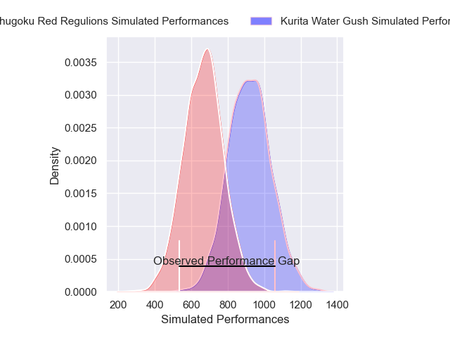
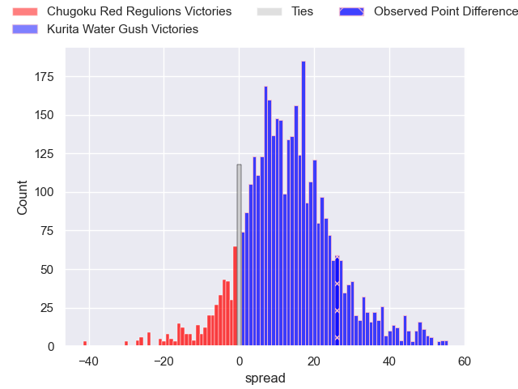
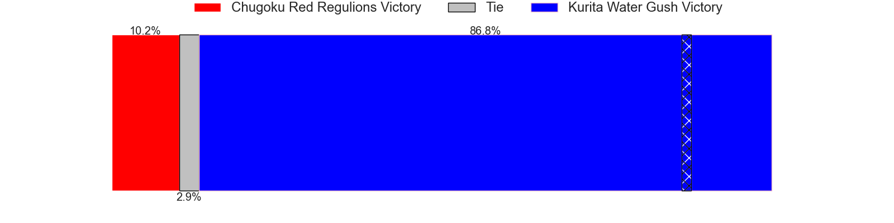
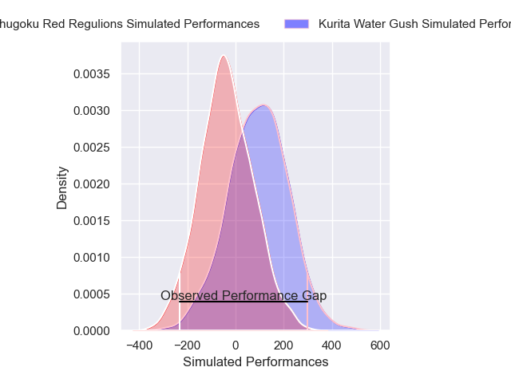
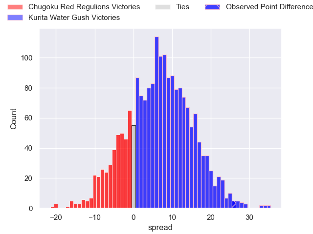
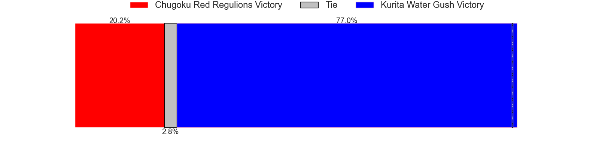

---  
layout: page  
title: Chugoku Red Regulions at Kurita Water Gush; 19-45  
date: 2025-02-01 18:00:00 -0500  
categories: "Japan Rugby League One D3 24/25" match review  
---
# Chugoku Red Regulions at Kurita Water Gush; 19-45

# Club Level Predictions

The first set of predictions treats a club as the smallest object, as the club develops its members, organizes a gameplan, and deploys its players as needed for each match. This club model has a prediction of 0.798, which translates to predicting Kurita Water Gush to win by 12.6.

Our Over/Under is 72.5 - and combined with the spread above, we have a predicted scoreline of 30 to 43

Each club has a rating and a rating deviation (similar to a Glicko rating), and expected performances can be generated. This allows for simulated matches and spreads like the ones below.
## Projected Performances - Club Model

## Projected Spreads - Club Model

## Projected Results - Club Model

# Player Level Predictions

Treating teams instead as an entity made up of the currently active players, I have ratings for each player in an altogether different system. These can be combined to form team ratings once teamsheets are announced, weighting starters a bit higher than the reserves. After the match is played, players can be weighted by their minutes on the field, allowing for an accurate measure of the team's composition. With these compiled team ratings, we can make predictions, measure inaccuracy, and update the individual player ratings.
## Prediction without Player Minutes: Kurita Water Gush by 8.0

Kurita Water Gush by 5.3 on a neutral pitch

## Projected Performances - Player Model

## Projected Spreads - Player Model

## Projected Results - Player Model

|   Away Minutes | Away Player       |   Away Percentile |   Number |   Home Percentile | Home Player      |   Home Minutes |
|---------------:|:------------------|------------------:|---------:|------------------:|:-----------------|---------------:|
|             40 | Kojiro Arito      |              7.45 |        1 |             27.52 | Kei Shibuya      |             80 |
|             40 | Kentaro Iwanaga   |             11.24 |        2 |             57.58 | Kota Hojo        |             59 |
|             18 | Haruki Miyata     |             31.92 |        3 |             68.92 | Issa Hosoya      |             80 |
|             74 | Taro Nishikawa    |              0.1  |        4 |              1.87 | Kota Nakamura    |             70 |
|             19 | Tomonari Aoki     |             38.02 |        5 |             91.75 | Harrison Brewer  |             59 |
|              5 | Shintaro Matsuda  |              8.79 |        6 |              4.94 | Kengo Nakamura   |             10 |
|             80 | Kota Moriyama     |             26.95 |        7 |             54.59 | Taisei Nakao     |             62 |
|             73 | Ed Quirk          |              1.07 |        8 |             60.09 | Tevita Oto       |             80 |
|             31 | Atsushi Mizofuchi |             24.68 |        9 |             42.88 | Ren Shinwada     |             40 |
|             80 | Hayato Miyazaki   |             64.29 |       10 |             44.16 | Hiroki Handa     |             67 |
|             40 | Keigo Hatanaka    |              6.98 |       11 |             12.22 | Keigo Hamazoe    |             70 |
|             60 | Hashizo Yoshida   |              8.25 |       12 |             59.89 | Leo Gordon       |             19 |
|             16 | Syougo Azuma      |             24.76 |       13 |             20.63 | So Matsushima    |             40 |
|             21 | Kentaro Fujii     |             13    |       14 |             42.48 | Ryo Hosomoto     |              6 |
|             13 | Kennta Kitayama   |             35.79 |       15 |             58.95 | Yuta Sugiyama    |             34 |
|             80 | Sebastian Sialau  |             34.53 |       16 |            nan    | Kei Takusagawa   |             61 |
|             58 | Hayato Moriyama   |             65.55 |       17 |             37.17 | Rui Kuriyama     |             19 |
|             80 | Ishiwatari Kengo  |            nan    |       18 |             35.24 | Ryutaro Iguchi   |             56 |
|             40 | Yuta Nishihama    |             78.36 |       19 |             27.39 | Kakeru Sugihara  |             80 |
|             40 | Riku Iwai         |            nan    |       20 |             42.15 | Yoji Shiina      |             80 |
|             24 | Shohei Tsukamoto  |              4.86 |       21 |            nan    | Takuro Hayashida |             61 |
|             80 | Toshiyuki Ohki    |            nan    |       22 |             13.54 | Jamie Vakalahi   |             80 |
|             46 | Shinya Hirayama   |             20.11 |       23 |             40.63 | Katsuki Ishizuka |             24 |

