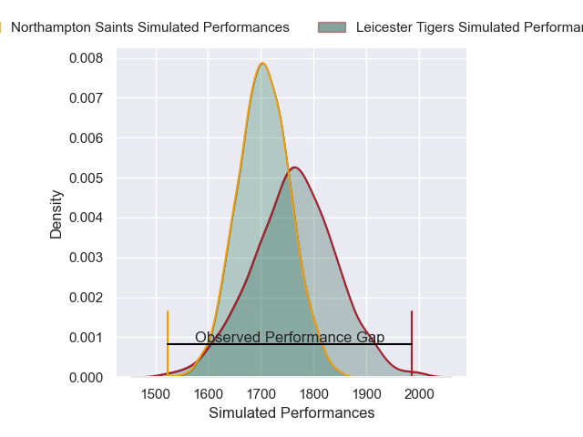
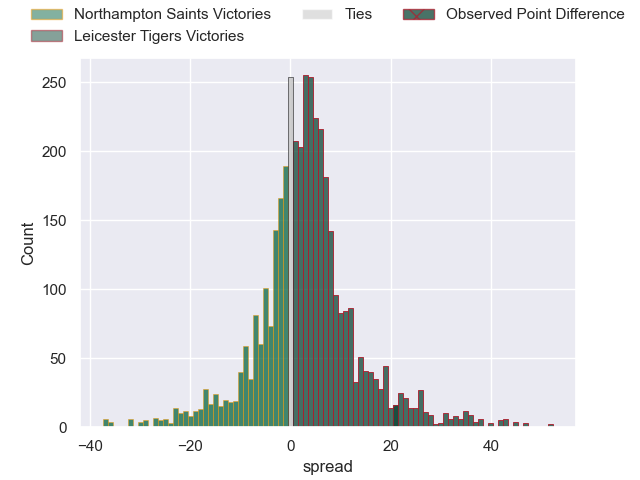
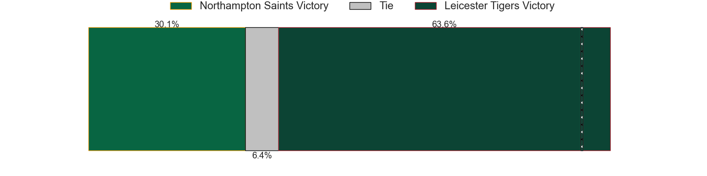
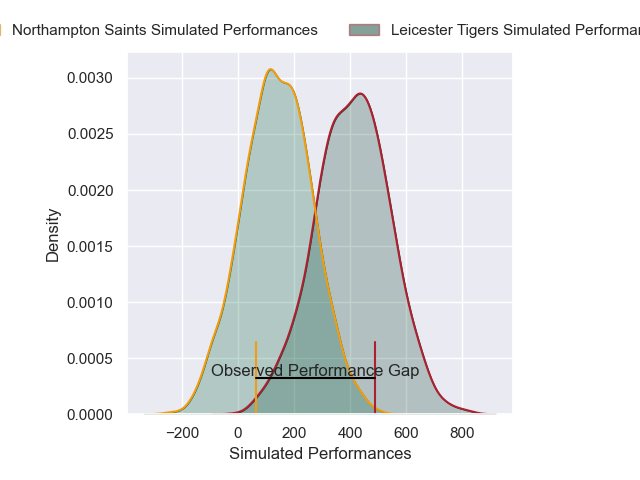
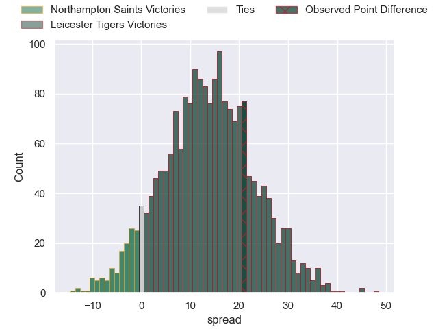
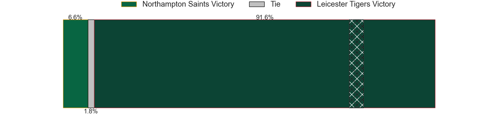

---  
layout: page  
title: Northampton Saints at Leicester Tigers; 33-54  
date: 2025-02-01 18:00:00 -0500  
categories: "Premiership Rugby Cup 24/25" match review  
---
# Northampton Saints at Leicester Tigers; 33-54

# Club Level Predictions

The first set of predictions treats a club as the smallest object, as the club develops its members, organizes a gameplan, and deploys its players as needed for each match. This club model has a prediction of 0.582, which translates to predicting Leicester Tigers to win by 2.9.

Our Over/Under is 41.5 - and combined with the spread above, we have a predicted scoreline of 19 to 22

Each club has a rating and a rating deviation (similar to a Glicko rating), and expected performances can be generated. This allows for simulated matches and spreads like the ones below.
## Projected Performances - Club Model

## Projected Spreads - Club Model

## Projected Results - Club Model

# Player Level Predictions

Treating teams instead as an entity made up of the currently active players, I have ratings for each player in an altogether different system. These can be combined to form team ratings once teamsheets are announced, weighting starters a bit higher than the reserves. After the match is played, players can be weighted by their minutes on the field, allowing for an accurate measure of the team's composition. With these compiled team ratings, we can make predictions, measure inaccuracy, and update the individual player ratings.
## Prediction without Player Minutes: Leicester Tigers by 14.1

Northampton Saints by 1.2 on a neutral pitch

## Projected Performances - Player Model

## Projected Spreads - Player Model

## Projected Results - Player Model

|   Away Minutes | Away Player             |   Away Percentile |   Number |   Home Percentile | Home Player           |   Home Minutes |
|---------------:|:------------------------|------------------:|---------:|------------------:|:----------------------|---------------:|
|             80 | Tarek Haffar            |             82.96 |        1 |             17.04 | James Whitcombe       |             80 |
|             80 | Henry Walker            |             37.63 |        2 |             27.26 | Charlie Clare         |             80 |
|             80 | Luke Green              |             70.24 |        3 |             13.97 | Dan Cole              |             80 |
|             67 | Ed Prowse               |             59.04 |        4 |             72.4  | Tom Manz              |             80 |
|             80 | Callum Hunter-Hill      |             53.65 |        5 |             23.17 | Come Clayver Joussain |             80 |
|             80 | Angus Scott-Young       |             52.8  |        6 |             92.75 | Hanro Liebenberg      |             80 |
|             80 | Fyn Brown               |             13.35 |        7 |             81.04 | Emeka Ilione          |             80 |
|             80 | Juarno Augustus         |             68.64 |        8 |              1.69 | Kyle Hatherell        |             80 |
|             80 | Tom James               |             35.82 |        9 |             57.62 | Ben Youngs            |             80 |
|             80 | George Makepeace-Cubitt |             71.7  |       10 |             37.87 | Ben Volavola          |             80 |
|              8 | Tom Seabrook            |              3.62 |       11 |             77.64 | Will Wand             |             80 |
|             33 | Charlie Savala          |             52.39 |       12 |             41.06 | Joseph Woodward       |             80 |
|             33 | Billy Pasco             |             36.49 |       13 |             96.05 | Dan Kelly             |             80 |
|             42 | William Glister         |             17.79 |       14 |             28.73 | Adam Radwan           |             80 |
|             80 | James Ramm              |             71.49 |       15 |             16.35 | James Shillcock       |             80 |

