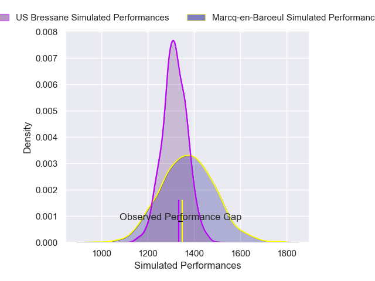
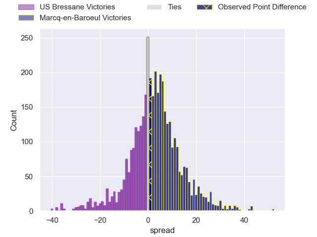
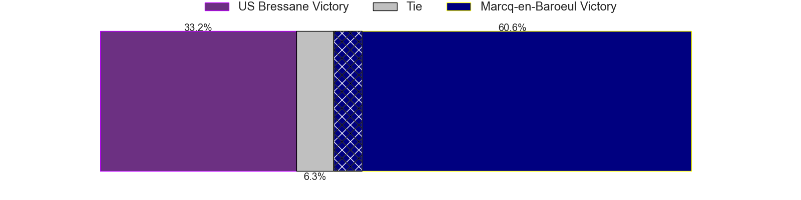
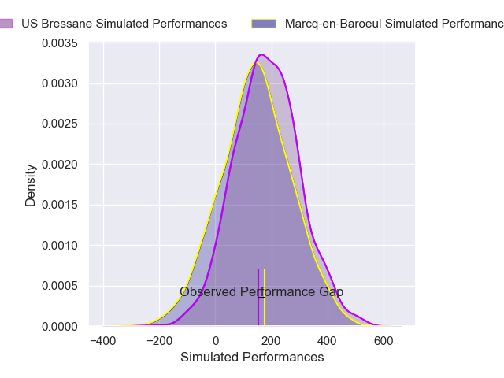
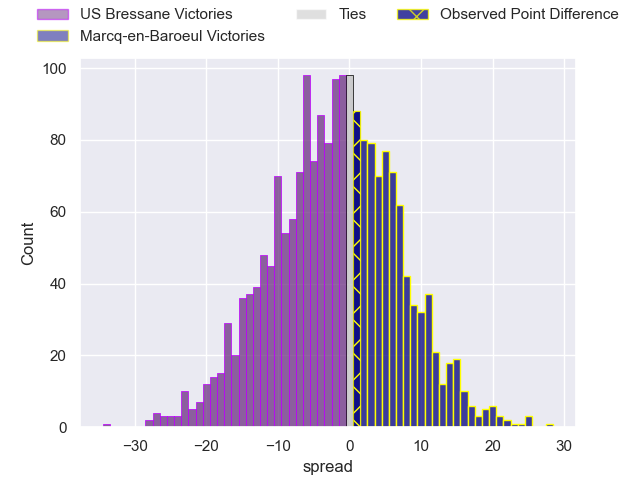

---  
layout: page  
title: US Bressane at Marcq-en-Baroeul; 25-26  
date: 2025-02-01 18:00:00 -0500  
categories: "Nationale 24/25" match review  
---
# US Bressane at Marcq-en-Baroeul; 25-26

# Club Level Predictions

The first set of predictions treats a club as the smallest object, as the club develops its members, organizes a gameplan, and deploys its players as needed for each match. This club model has a prediction of 0.577, which translates to predicting Marcq-en-Baroeul to win by 2.7.

Our Over/Under is 43.5 - and combined with the spread above, we have a predicted scoreline of 20 to 23

Each club has a rating and a rating deviation (similar to a Glicko rating), and expected performances can be generated. This allows for simulated matches and spreads like the ones below.
## Projected Performances - Club Model

## Projected Spreads - Club Model

## Projected Results - Club Model

# Player Level Predictions

Treating teams instead as an entity made up of the currently active players, I have ratings for each player in an altogether different system. These can be combined to form team ratings once teamsheets are announced, weighting starters a bit higher than the reserves. After the match is played, players can be weighted by their minutes on the field, allowing for an accurate measure of the team's composition. With these compiled team ratings, we can make predictions, measure inaccuracy, and update the individual player ratings.
## Prediction without Player Minutes: US Bressane by 3.0

US Bressane by 5.2 on a neutral pitch

## Projected Performances - Player Model

## Projected Spreads - Player Model

## Projected Results - Player Model

|   Away Minutes | Away Player       |   Away Percentile |   Number |   Home Percentile | Home Player              |   Home Minutes |
|---------------:|:------------------|------------------:|---------:|------------------:|:-------------------------|---------------:|
|             80 | Florian Burlet    |             41.49 |        1 |             40.98 | Eli Serra-Miglietti      |             16 |
|             23 | Arnaud Feltrin    |              8.01 |        2 |             27.6  | Santiago Iglesias Valdez |             16 |
|             67 | Erich de Jager    |             63.67 |        3 |             61.56 | Victor-Fy Balas Burel    |             80 |
|             80 | Thomas Déliance   |             39    |        4 |             69.65 | Antoine Delaporte        |             80 |
|             62 | Pierre Reynaud    |             71.81 |        5 |             47.05 | Lucio Anconetani         |             80 |
|             80 | Nicolas Tachat    |             43.53 |        6 |             69.6  | Arthur Bruges            |             72 |
|             80 | Nail Ait Naceur   |             69    |        7 |             54.69 | Joachim Beaumont         |             80 |
|             64 | Wael May          |             76.18 |        8 |             73.18 | Maxime Danton            |             80 |
|             57 | Jeremy Valencot   |             73.87 |        9 |             66.13 | Geoffrey Cazanave        |             80 |
|             51 | Fred Zeilinga     |             90.69 |       10 |             55.41 | Paul Decavel             |             64 |
|              8 | Jules Margarit    |             55.67 |       11 |             68.96 | Mathias Ortiz            |             55 |
|              8 | Benjamin Doy      |             56.4  |       12 |             52.38 | Mark Erasmus             |             72 |
|             28 | Dimitri Doucet    |             60.53 |       13 |              8.99 | Hugo Detre               |             80 |
|             51 | Thibaut Perrette  |             39.28 |       14 |             10.96 | Dany Antunes             |             80 |
|             47 | Florent Massip    |             82.53 |       15 |             54.11 | Patrick Fleming Dewhirst |             11 |
|             25 | Vazha Kapanadze   |             50.97 |       16 |             30.31 | Bruno Vliegen            |             33 |
|             58 | Teo Bordenave     |             55.38 |       17 |              8.58 | Otilo Kafotamaki         |             80 |
|             62 | Clement Jullien   |             89.27 |       18 |             57.66 | Lewys Jones              |             80 |
|             42 | Loic Baradel      |             89.48 |       19 |             58.24 | Cedric Yonkeu            |             22 |
|             64 | Nicolas Faure     |              3.96 |       20 |             44.29 | Joseph Reynaud           |             80 |
|             22 | Aaron Stafford    |             36.19 |       21 |             33.07 | Thomas Simonet           |             52 |
|             16 | Grégoire Demangel |             60.61 |       22 |             41.8  | Hugues Crespo            |             25 |
|             30 | Tom Ivanjine      |            nan    |       23 |             65.23 | Dylan Nocete             |             29 |

