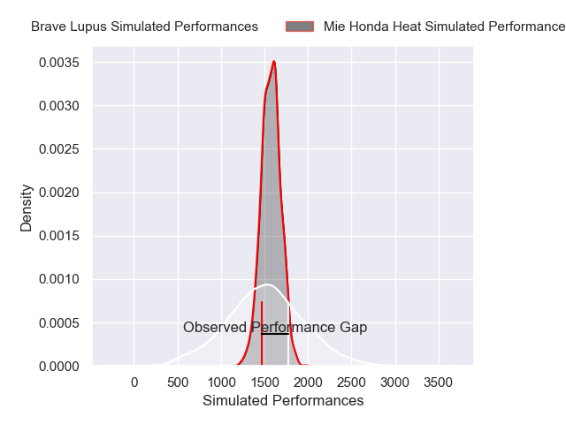
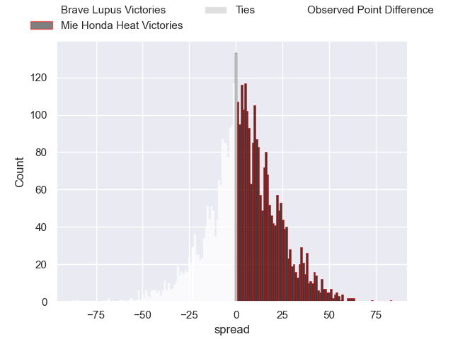
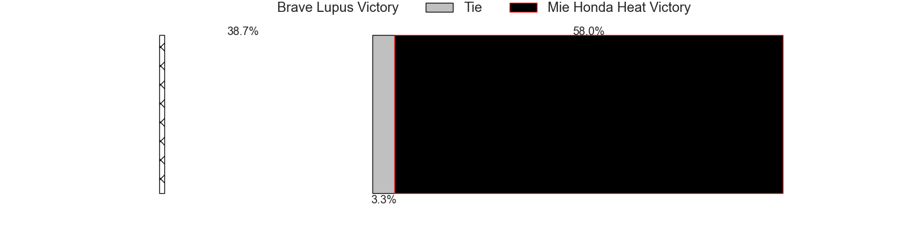
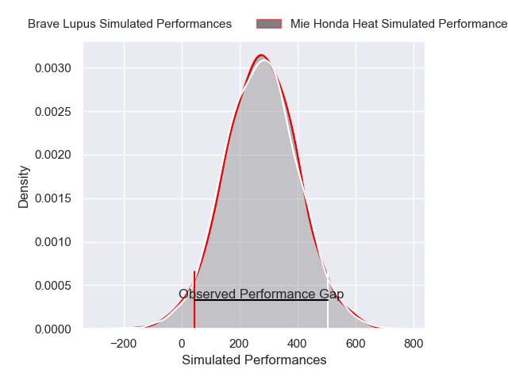
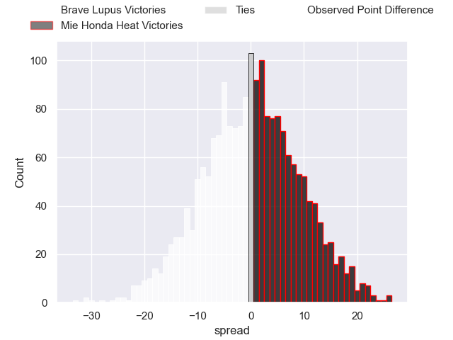

---  
layout: page  
title: Brave Lupus at Mie Honda Heat; 35-12  
date: 2025-02-01 18:00:00 -0500  
categories: "Japan Rugby League One - Division 1 2025" match review  
---
# Brave Lupus at Mie Honda Heat; 35-12

# Club Level Predictions

The first set of predictions treats a club as the smallest object, as the club develops its members, organizes a gameplan, and deploys its players as needed for each match. This club model has a prediction of 0.559, which translates to predicting Mie Honda Heat to win by 3.6.

Our Over/Under is 43.5 - and combined with the spread above, we have a predicted scoreline of 20 to 23

Each club has a rating and a rating deviation (similar to a Glicko rating), and expected performances can be generated. This allows for simulated matches and spreads like the ones below.
## Projected Performances - Club Model

## Projected Spreads - Club Model

## Projected Results - Club Model

# Player Level Predictions

Treating teams instead as an entity made up of the currently active players, I have ratings for each player in an altogether different system. These can be combined to form team ratings once teamsheets are announced, weighting starters a bit higher than the reserves. After the match is played, players can be weighted by their minutes on the field, allowing for an accurate measure of the team's composition. With these compiled team ratings, we can make predictions, measure inaccuracy, and update the individual player ratings.
## Prediction without Player Minutes: Mie Honda Heat by 1.8

Brave Lupus by 1.8 on a neutral pitch

## Projected Performances - Player Model

## Projected Spreads - Player Model

## Projected Results - Player Model

|   Away Minutes | Away Player        |   Away Percentile |   Number |   Home Percentile | Home Player          |   Home Minutes |
|---------------:|:-------------------|------------------:|---------:|------------------:|:---------------------|---------------:|
|           80   | Sena Kimura        |             71.3  |        1 |             30.73 | Tatsuhiko Tsurukawa  |             43 |
|           49   | Mamoru Harada      |             90.6  |        2 |             22.65 | Koki Hida            |             80 |
|           80   | Yuta Kokaji        |             71.3  |        3 |             22.09 | Katsuyuki Hoshino    |             80 |
|           80   | Shohei Ito         |             67.26 |        4 |             27.23 | Mark Abbott          |             80 |
|           80   | Jacob Pierce       |             67.26 |        5 |             92.23 | Franco Mostert       |             80 |
|           80   | Shannon Frizell    |             96.34 |        6 |             99.23 | Pablo Matera         |             55 |
|           22   | Takeshi Sasaki     |             54.58 |        7 |             22.08 | Tony Hunt            |             80 |
|           58   | Michael Leitch     |             95.8  |        8 |             22.27 | Talifolofola Tangipa |             80 |
|           11   | Yuhei Sugiyama     |             50    |        9 |             25    | Azuma Doei           |             80 |
|           80   | Richie Mo'unga     |            100    |       10 |             22.01 | Hayata Nakao         |             80 |
|           80   | Masaki Hamada      |             68.31 |       11 |             82.16 | Lomano Lemeki        |             26 |
|           80   | Taichi Mano        |             64.34 |       12 |             39.22 | Fraser Quirk         |             14 |
|           80   | Seta Tamanivalu    |             64.34 |       13 |             36.33 | Johnny Fa'Auli       |             26 |
|           30.5 | Jone Naikabula     |             63.66 |       14 |             37.57 | Fc Du Plessis        |             26 |
|           19.5 | Takuro Matsunaga   |             47.75 |       15 |             38.93 | Tom Banks            |             14 |
|           68   | Daigo Hashimoto    |            nan    |       16 |            nan    | Ikuma Yamada         |             22 |
|           40   | Teruo Makabe       |            nan    |       17 |            nan    | Takumi Fujii         |             64 |
|           30.5 | Taufa Latu         |            nan    |       18 |            nan    | Feinga Fakai         |             80 |
|           19.5 | Samuela Anise      |            nan    |       19 |            nan    | Ryoma Nishimura      |             69 |
|           30.5 | Yoshitaka Tokunaga |            nan    |       20 |             86.58 | Janko Swanepoel      |             16 |
|           37   | Kohei Takahashi    |            nan    |       21 |            nan    | Taichi Takenaka      |             80 |
|           13   | Gentaro Ikenaga    |            nan    |       22 |            nan    | Kyogo Okano          |             31 |
|           58   | Yuto Mori          |            nan    |       23 |            nan    | Ryo Furuta           |             58 |

