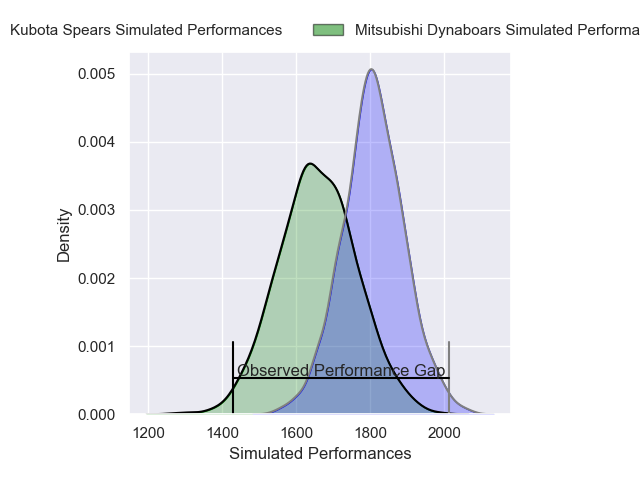
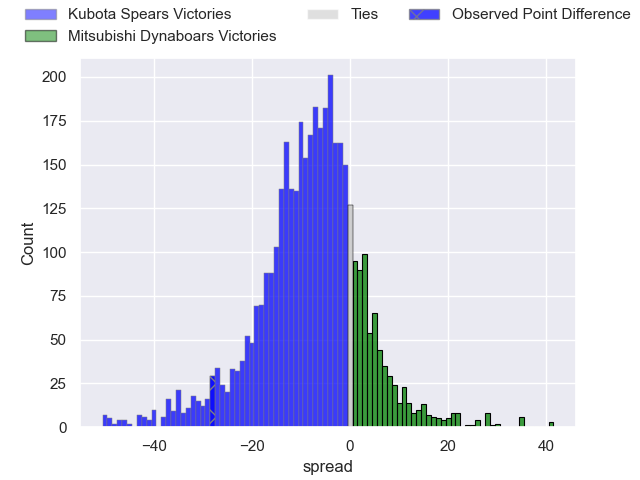
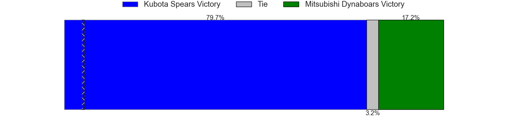
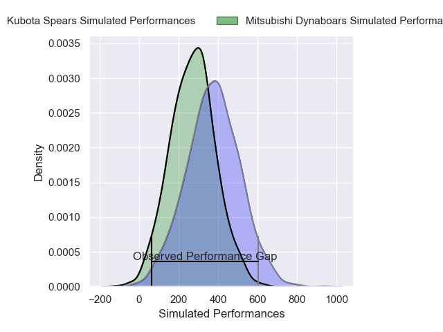
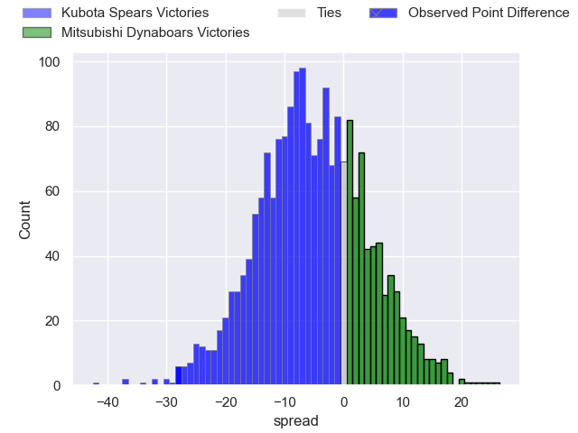
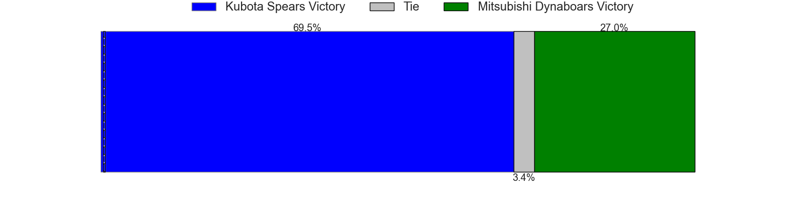

---  
layout: page  
title: Kubota Spears at Mitsubishi Dynaboars; 40-12  
date: 2025-02-01 18:00:00 -0500  
categories: "Japan Rugby League One 24/25" match review  
---
# Kubota Spears at Mitsubishi Dynaboars; 40-12

# Club Level Predictions

The first set of predictions treats a club as the smallest object, as the club develops its members, organizes a gameplan, and deploys its players as needed for each match. This club model has a prediction of 0.301, which translates to predicting Kubota Spears to win by 7.6.

Our Over/Under is 69.5 - and combined with the spread above, we have a predicted scoreline of 38 to 31

Each club has a rating and a rating deviation (similar to a Glicko rating), and expected performances can be generated. This allows for simulated matches and spreads like the ones below.
## Projected Performances - Club Model

## Projected Spreads - Club Model

## Projected Results - Club Model

# Player Level Predictions

Treating teams instead as an entity made up of the currently active players, I have ratings for each player in an altogether different system. These can be combined to form team ratings once teamsheets are announced, weighting starters a bit higher than the reserves. After the match is played, players can be weighted by their minutes on the field, allowing for an accurate measure of the team's composition. With these compiled team ratings, we can make predictions, measure inaccuracy, and update the individual player ratings.
## Prediction without Player Minutes: Mitsubishi Dynaboars by 0.5

Kubota Spears by 2.8 on a neutral pitch

## Projected Performances - Player Model

## Projected Spreads - Player Model

## Projected Results - Player Model

|   Away Minutes | Away Player            |   Away Percentile |   Number |   Home Percentile | Home Player         |   Home Minutes |
|---------------:|:-----------------------|------------------:|---------:|------------------:|:--------------------|---------------:|
|             26 | Yota Kamimori          |             60.22 |        1 |              6.06 | Hayato Hosoda       |             12 |
|             80 | Hayate Era             |             72.99 |        2 |              6.54 | Lee Seung Hyok      |             40 |
|             68 | Keijiro Tamefusa       |             76.74 |        3 |             95.02 | Tomoaki Ishii       |             54 |
|             51 | David Van Zeeland      |             61.74 |        4 |             65.1  | Walt Steenkamp      |             63 |
|             80 | David Bulbring         |             87.06 |        5 |             26.27 | Daniel Linde        |             16 |
|             80 | Merwe Olivier          |             81.29 |        6 |             60.08 | Kyo Yoshida         |             68 |
|             55 | Takeo Suenaga          |             92.29 |        7 |             92.96 | Masataka Tsuruya    |             30 |
|             80 | Faulua Makisi          |             92.65 |        8 |             37.39 | Jackson Hemopo      |             80 |
|             80 | Shinobu Fujiwara       |             70.57 |        9 |             90.6  | Jack Stratton       |             80 |
|             80 | Atsushi Oshikawa       |             69.44 |       10 |             42.31 | James Grayson       |             14 |
|             80 | Haruto Kida            |             84.06 |       11 |             66.79 | Satoshi Koizumi     |             47 |
|             33 | Yuya Hirose            |             54.18 |       12 |             89.68 | Charlie Lawrence    |             50 |
|             12 | Rikus Pretorius        |             40.66 |       13 |             19.71 | Matt Vaega          |             50 |
|             80 | Halatoa Vailea         |             86.53 |       14 |             24.48 | Ben Paltridge       |             80 |
|             21 | Shaun Stevenson        |             82.79 |       15 |             96.72 | Kurt-Lee Arendse    |             80 |
|             80 | Lappies Labuschagne    |             92    |       16 |             26.83 | Kanzo Schinckel     |             50 |
|             80 | Kota Kaishi            |             89.29 |       17 |             68.97 | Kota Iwamura        |             30 |
|             30 | Malcolm Marx           |            100    |       18 |             11.97 | Marino Mikaele-Tu'u |             30 |
|             30 | Opeti Helu             |             84.55 |       19 |             30.7  | Yuki Miyazato       |             80 |
|             19 | Ruan Botha             |             99.52 |       20 |             10.04 | Kazuki Ishida       |             68 |
|             19 | Shunta Koga            |            nan    |       21 |             39.79 | Lewis Chessum       |             80 |
|             14 | Harumichi Tatekawa     |             88.03 |       22 |            nan    | nan                 |            nan |
|             66 | Gerhard van den Heever |             92.21 |       23 |            nan    | nan                 |            nan |

