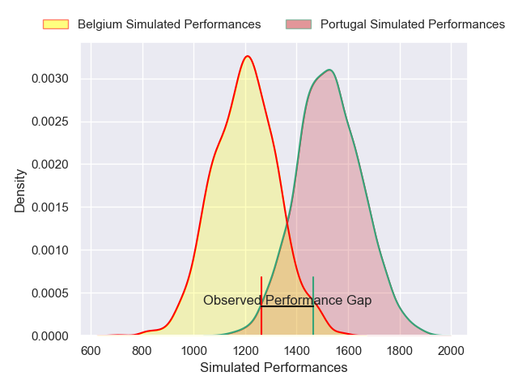
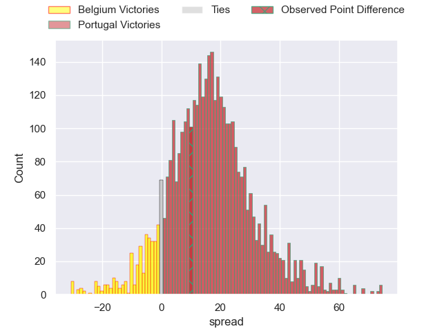
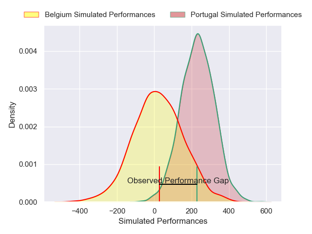
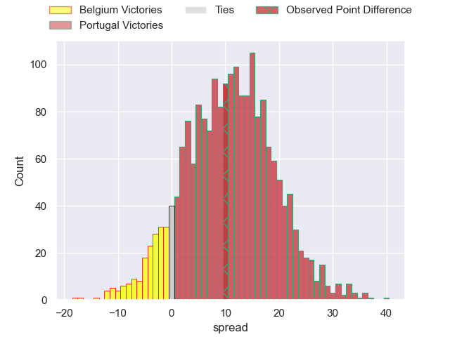

---  
layout: page  
title: Belgium at Portugal; 30-40  
date: 2025-02-01 18:00:00 -0500  
categories: "Rugby Europe Championship 2025" match review  
---
# Belgium at Portugal; 30-40

# Club Level Predictions

The first set of predictions treats a club as the smallest object, as the club develops its members, organizes a gameplan, and deploys its players as needed for each match. This club model has a prediction of 0.849, which translates to predicting Portugal to win by 16.2.

Our Over/Under is 46.5 - and combined with the spread above, we have a predicted scoreline of 15 to 31

Each club has a rating and a rating deviation (similar to a Glicko rating), and expected performances can be generated. This allows for simulated matches and spreads like the ones below.
## Projected Performances - Club Model

## Projected Spreads - Club Model

## Projected Results - Club Model

# Player Level Predictions

Treating teams instead as an entity made up of the currently active players, I have ratings for each player in an altogether different system. These can be combined to form team ratings once teamsheets are announced, weighting starters a bit higher than the reserves. After the match is played, players can be weighted by their minutes on the field, allowing for an accurate measure of the team's composition. With these compiled team ratings, we can make predictions, measure inaccuracy, and update the individual player ratings.
## Prediction without Player Minutes: Portugal by 15.1

Portugal by 11.4 on a neutral pitch

## Projected Performances - Player Model

## Projected Spreads - Player Model

## Projected Results - Player Model

|   Away Minutes | Away Player             |   Away Percentile |   Number |   Home Percentile | Home Player            |   Home Minutes |
|---------------:|:------------------------|------------------:|---------:|------------------:|:-----------------------|---------------:|
|             67 | Charlesty Berguet       |             47.46 |        1 |             27.93 | David Costa            |             80 |
|             43 | Alexandre Raynier       |             57.02 |        2 |             31.44 | Luka Begic             |             33 |
|             80 | Maxime Jadot            |             64.92 |        3 |              9.23 | Diogo Hasse Ferreira   |             21 |
|             80 | Gillian Benoy           |             13.08 |        4 |             92.98 | Jose Madeira           |             33 |
|             80 | Maximilien Hendrickx    |              6.73 |        5 |             47.12 | José Rebelo De Andrade |             40 |
|             72 | Jean-Maurice Decubber   |              6.67 |        6 |             87.52 | Joao Granate           |             21 |
|             72 | Jeremie Brasseur        |             46.42 |        7 |             87.43 | Nicolas Martins        |              8 |
|             21 | William Van Bost        |             49.79 |        8 |             41.74 | Vasco Baptista         |              8 |
|             21 | Isaac Montoisy          |             46.63 |        9 |             85.99 | Samuel Marques         |             20 |
|             57 | Hugo de Francq          |              6.81 |       10 |             84.68 | Joris De Moura         |             80 |
|             80 | Dazzy Cornez            |             50.52 |       11 |             94.01 | Rodrigo Marta          |             80 |
|             80 | Jens Torfs              |              6.34 |       12 |             82.12 | Tomas Appleton         |             57 |
|             36 | Florian Remue           |              5.82 |       13 |             73.91 | Jose Lima              |             64 |
|              0 | Thomas Wallraf          |             68.51 |       14 |             63.56 | Vincent Pinto          |             24 |
|             40 | Siméon Soenen           |             35.64 |       15 |             12.16 | Simao Bento            |             30 |
|             47 | Seppe Verelst           |            nan    |       16 |             65.75 | Cody Thomas            |             28 |
|             59 | Alexis Cuffolo          |             35.62 |       17 |            nan    | Pedro Vicente          |             34 |
|             47 | Jean-Baptiste De Clercq |            nan    |       18 |             31.09 | Anthony Alves          |             31 |
|             80 | Maurice Fromont         |            nan    |       19 |            nan    | Antonio Rebelo Andrade |             27 |
|             40 | Hugues Bastin           |             32.88 |       20 |             57.06 | Diego Pinheiro Ruiz    |             21 |
|             80 | Curtis Moucheron        |            nan    |       21 |            nan    | Francisco Magalhães    |             37 |
|             59 | Maxime Vacquier         |            nan    |       22 |            nan    | Manuel Vareiro         |             25 |
|             80 | Ervin Muric             |             34.73 |       23 |             21.31 | Manuel Cardoso Pinto   |             21 |

