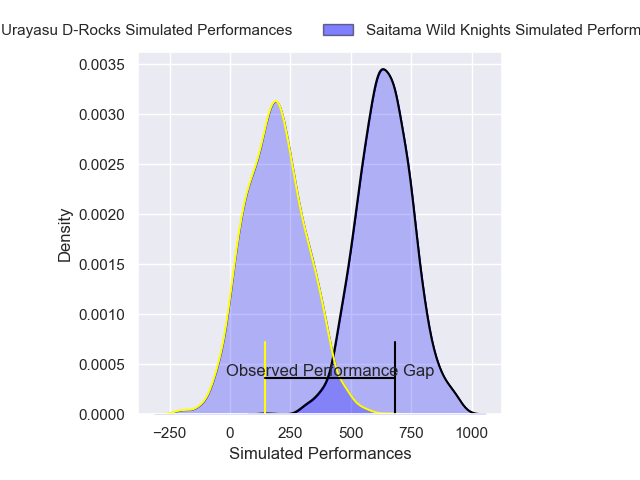
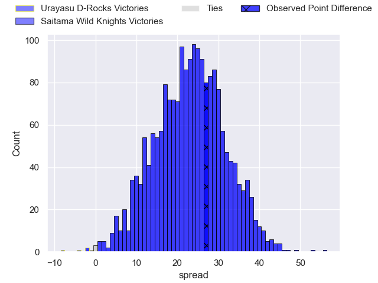
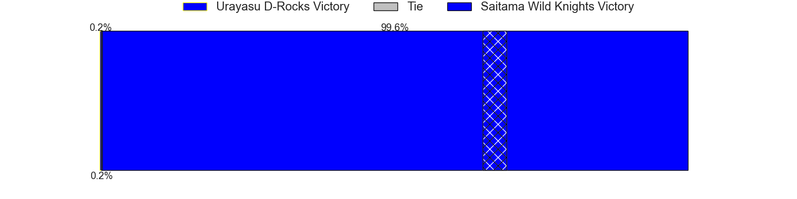

---  
layout: page  
title: Urayasu D-Rocks at Saitama Wild Knights; 26-53  
date: 2025-02-01 18:00:00 -0500  
categories: "Japan Rugby League One 24/25" match review  
---
# Urayasu D-Rocks at Saitama Wild Knights; 26-53

# Club Level Predictions

The first set of predictions treats a club as the smallest object, as the club develops its members, organizes a gameplan, and deploys its players as needed for each match. This club model has a prediction of 0.982, which translates to predicting Saitama Wild Knights to win by 36.2.

Our Over/Under is 59.5 - and combined with the spread above, we have a predicted scoreline of 12 to 48

Each club has a rating and a rating deviation (similar to a Glicko rating), and expected performances can be generated. This allows for simulated matches and spreads like the ones below.
## Projected Performances - Club Model

## Projected Spreads - Club Model

## Projected Results - Club Model

# Player Level Predictions

Treating teams instead as an entity made up of the currently active players, I have ratings for each player in an altogether different system. These can be combined to form team ratings once teamsheets are announced, weighting starters a bit higher than the reserves. After the match is played, players can be weighted by their minutes on the field, allowing for an accurate measure of the team's composition. With these compiled team ratings, we can make predictions, measure inaccuracy, and update the individual player ratings.
## Prediction without Player Minutes: Saitama Wild Knights by 31.2

Saitama Wild Knights by 26.6 on a neutral pitch

## Projected Performances - Player Model

## Projected Spreads - Player Model

## Projected Results - Player Model

|   Away Minutes | Away Player          |   Away Percentile |   Number |   Home Percentile | Home Player       |   Home Minutes |
|---------------:|:---------------------|------------------:|---------:|------------------:|:------------------|---------------:|
|             54 | Hidetomo Nabeshima   |              6.82 |        1 |             97.42 | Keita Inagaki     |              8 |
|             30 | Junichiro Matsushita |              8.03 |        2 |             86.79 | Kazuma Shimane    |             18 |
|             30 | Ryom Kim             |             44.39 |        3 |             98.42 | Asaeli Ai Valu    |             19 |
|             12 | Uwe Helu             |             64.33 |        4 |             88.56 | Esei Ha'angana    |             19 |
|             66 | Lourens Erasmus      |             74.23 |        5 |             98.27 | Lood de Jager     |             30 |
|             80 | Zephania Tuinona     |             31.24 |        6 |             96.62 | Ben Gunter        |             30 |
|             50 | Daishi Kojima        |             44.49 |        7 |             96.03 | Itsuki Onishi     |             30 |
|             30 | Jasper Wiese         |             77.33 |        8 |             97.46 | Jack Cornelsen    |             52 |
|             80 | Ren Iinuma           |             74.65 |        9 |             96.81 | Taiki Koyama      |             50 |
|             16 | Yu Tamura            |             88.51 |       10 |             88.09 | Kyohei Yamasawa   |             80 |
|             26 | Caleb Cavubati       |             24.26 |       11 |             84.3  | Vince Aso         |             52 |
|             79 | Samu Kerevi          |             93.04 |       12 |            100    | Damian de Allende |             57 |
|             19 | Tana Tuhakaraina     |             64.76 |       13 |             49.27 | Tomoki Osada      |             80 |
|              8 | Kai Ishii            |             14.94 |       14 |             98.57 | Koki Takeyama     |             30 |
|             80 | Takuhei Yasuda       |             83.65 |       15 |             91.19 | Tom Parton        |             68 |
|             12 | Kianu Kereru-Symes   |             76.92 |       16 |             57.86 | Craig Millar      |             64 |
|             80 | Tone Tukufuka        |             94.7  |       17 |             99.03 | Ryota Hasegawa    |             64 |
|             80 | Hendrik Tui          |             30.56 |       18 |             92.02 | Taiki Fujii       |             80 |
|             80 | Shuhei Takeuchi      |              5.82 |       19 |            nan    | Yuta Takagi       |             80 |
|             68 | Kazuma Nishikawa     |             23.03 |       20 |            nan    | Seijun Kawasaki   |             80 |
|             80 | Otere Black          |             64.66 |       21 |             99.32 | Lachlan Boshier   |             64 |
|             62 | Norifumi Hashimoto   |              1.95 |       22 |             98.74 | Ryuji Noguchi     |             80 |
|             80 | Wimpie van der Walt  |            nan    |       23 |            nan    | nan               |            nan |

