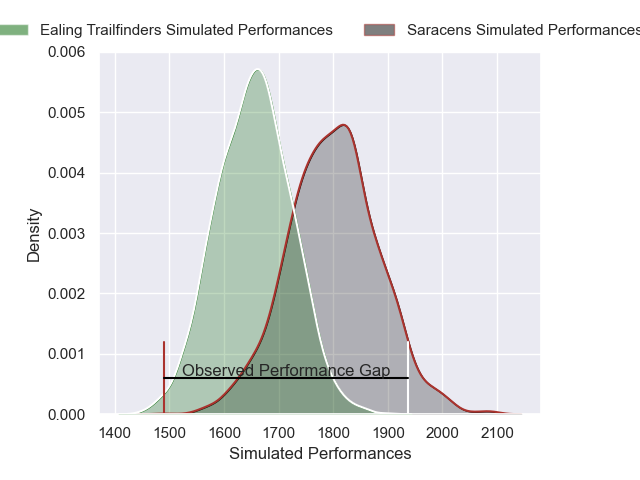
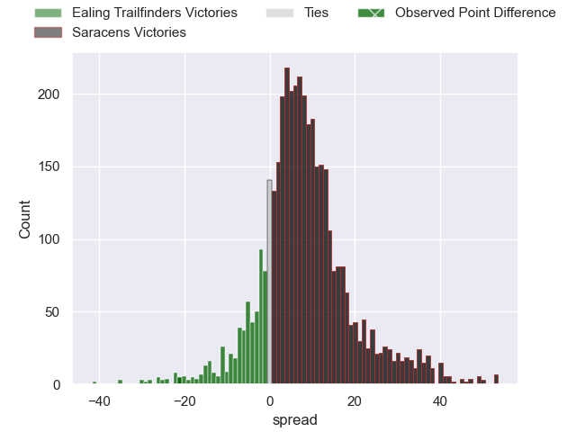
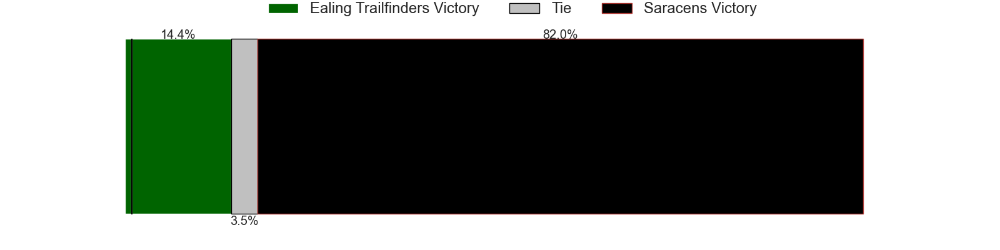
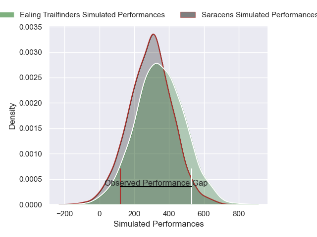
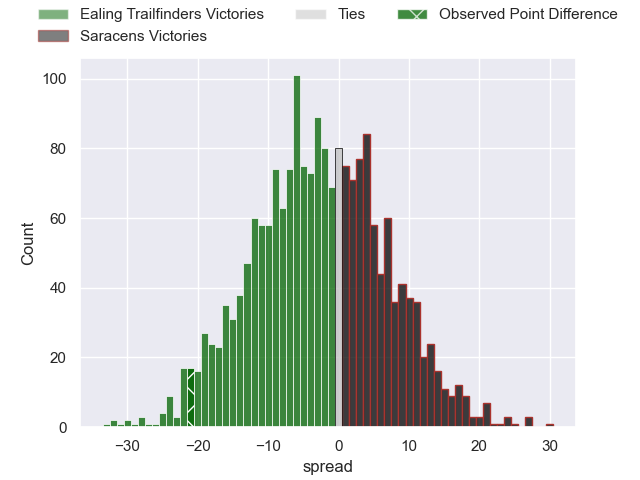

---  
layout: page  
title: Ealing Trailfinders at Saracens; 50-29  
date: 2025-02-01 18:00:00 -0500  
categories: "Premiership Rugby Cup 24/25" match review  
---
# Ealing Trailfinders at Saracens; 50-29

# Club Level Predictions

The first set of predictions treats a club as the smallest object, as the club develops its members, organizes a gameplan, and deploys its players as needed for each match. This club model has a prediction of 0.696, which translates to predicting Saracens to win by 7.3.

Our Over/Under is 59.5 - and combined with the spread above, we have a predicted scoreline of 26 to 33

Each club has a rating and a rating deviation (similar to a Glicko rating), and expected performances can be generated. This allows for simulated matches and spreads like the ones below.
## Projected Performances - Club Model

## Projected Spreads - Club Model

## Projected Results - Club Model

# Player Level Predictions

Treating teams instead as an entity made up of the currently active players, I have ratings for each player in an altogether different system. These can be combined to form team ratings once teamsheets are announced, weighting starters a bit higher than the reserves. After the match is played, players can be weighted by their minutes on the field, allowing for an accurate measure of the team's composition. With these compiled team ratings, we can make predictions, measure inaccuracy, and update the individual player ratings.
## Prediction without Player Minutes: Ealing Trailfinders by 1.5

Ealing Trailfinders by 12.5 on a neutral pitch

## Projected Performances - Player Model

## Projected Spreads - Player Model

## Projected Results - Player Model

|   Away Minutes | Away Player         |   Away Percentile |   Number |   Home Percentile | Home Player       |   Home Minutes |
|---------------:|:--------------------|------------------:|---------:|------------------:|:------------------|---------------:|
|             80 | Lefty Zigiriadis    |             96.36 |        1 |              4.57 | Rhys Carré        |             80 |
|             80 | Mike Willemse       |             89.95 |        2 |             60.82 | James Hadfield    |             80 |
|             80 | George Davis        |             85.52 |        3 |              1.61 | Fraser Balmain    |             80 |
|             80 | Bobby de Wee        |             96.95 |        4 |              0.49 | Harry Wilson      |             80 |
|             80 | Ehize Ehizode       |              4.62 |        5 |             19.45 | Kennedy Sylvester |             80 |
|             80 | Rob Farrar          |             89.54 |        6 |             17.18 | Max Eke           |             80 |
|             80 | Jordy Reid          |             81.44 |        7 |             32.18 | Toby Knight       |             80 |
|             80 | Will Montgomery     |             59.01 |        8 |             81.33 | Nathan Michelow   |             18 |
|             80 | Craig Hampson       |             91.35 |        9 |             42.7  | Charlie Bracken   |             80 |
|             80 | Dan Jones           |             88.96 |       10 |             32.68 | Tiff Eden         |             80 |
|             80 | Michael Dykes       |             88.36 |       11 |             47.62 | Rotimi Segun      |             80 |
|             80 | Jordan Holgate      |             90.26 |       12 |             26.88 | Olly Hartley      |             80 |
|             80 | Reuben Bird-Tulloch |             88.47 |       13 |             19.79 | Sam Spink         |             80 |
|             80 | Ben Harris          |             63.72 |       14 |             45.68 | Tobias Elliott    |             80 |
|             80 | Tobi Wilson         |             88.84 |       15 |             86.74 | Tom Parton        |             80 |

