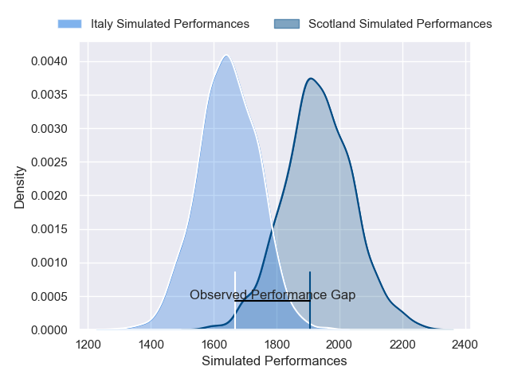
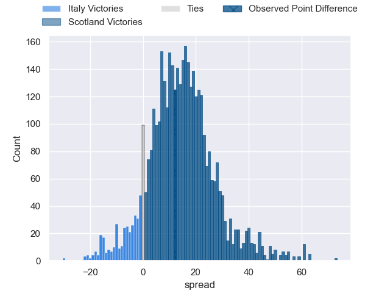
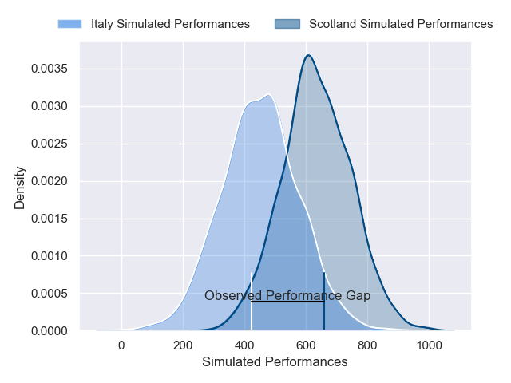
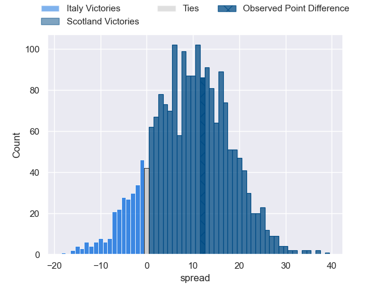

---  
layout: page  
title: Italy at Scotland; 19-31  
date: 2025-02-01 18:00:00 -0500  
categories: "Six Nations Championship 2025" match review  
---
# Italy at Scotland; 19-31

# Club Level Predictions

The first set of predictions treats a club as the smallest object, as the club develops its members, organizes a gameplan, and deploys its players as needed for each match. This club model has a prediction of 0.835, which translates to predicting Scotland to win by 14.7.

Our Over/Under is 57.5 - and combined with the spread above, we have a predicted scoreline of 21 to 36

Each club has a rating and a rating deviation (similar to a Glicko rating), and expected performances can be generated. This allows for simulated matches and spreads like the ones below.
## Projected Performances - Club Model

## Projected Spreads - Club Model

## Projected Results - Club Model

# Player Level Predictions

Treating teams instead as an entity made up of the currently active players, I have ratings for each player in an altogether different system. These can be combined to form team ratings once teamsheets are announced, weighting starters a bit higher than the reserves. After the match is played, players can be weighted by their minutes on the field, allowing for an accurate measure of the team's composition. With these compiled team ratings, we can make predictions, measure inaccuracy, and update the individual player ratings.
## Prediction without Player Minutes: Scotland by 14.8

Scotland by 8.8 on a neutral pitch

## Projected Performances - Player Model

## Projected Spreads - Player Model

## Projected Results - Player Model

|   Away Minutes | Away Player        |   Away Percentile |   Number |   Home Percentile | Home Player         |   Home Minutes |
|---------------:|:-------------------|------------------:|---------:|------------------:|:--------------------|---------------:|
|             68 | Danilo Fischetti   |             66.28 |        1 |             80.65 | Pierre Schoeman     |             26 |
|             58 | Giacomo Nicotera   |             96.98 |        2 |             77.85 | Dave Cherry         |             24 |
|             12 | Simone Ferrari     |             96.35 |        3 |             99.83 | Zander Fagerson     |             22 |
|             23 | Dino Lamb          |             66.25 |        4 |             93.29 | Jonny Gray          |             17 |
|             29 | Federico Ruzza     |             95.69 |        5 |             96.55 | Grant Gilchrist     |             26 |
|             80 | Sebastian Negri    |             84.96 |        6 |             99.81 | Jamie Ritchie       |             57 |
|             80 | Michele Lamaro     |             96.24 |        7 |             93.15 | Rory Darge          |             80 |
|             80 | Lorenzo Cannone    |             96.22 |        8 |             96.64 | Matt Fagerson       |             57 |
|             11 | Martin Page-Relo   |             66.84 |        9 |             95.21 | Ben White           |             56 |
|             57 | Paolo Garbisi      |             83.12 |       10 |             99.57 | Finn Russell        |             22 |
|             56 | Monty Ioane        |             96.68 |       11 |             89.75 | Duhan van der Merwe |             60 |
|             29 | Tommaso Menoncello |             94.74 |       12 |             91.33 | Stafford McDowall   |             82 |
|             82 | Juan Ignacio Brex  |             94.32 |       13 |             81.01 | Huw Jones           |             65 |
|             80 | Ange Capuozzo      |             98.01 |       14 |             47.53 | Darcy Graham        |             51 |
|             63 | Tommaso Allan      |             69.47 |       15 |            100    | Blair Kinghorn      |             69 |
|             80 | Gianmarco Lucchesi |             86.74 |       16 |             67.95 | Ewan Ashman         |             51 |
|             23 | Luca Rizzoli       |             62.38 |       17 |             30.81 | Rory Sutherland     |             80 |
|             51 | Marco Riccioni     |             82.31 |       18 |             49    | Will Hurd           |             52 |
|             72 | Niccolo Cannone    |             61.46 |       19 |             70.37 | Gregor Brown        |             68 |
|             80 | Manuel Zuliani     |             64.8  |       20 |             70.17 | Jack Dempsey        |             11 |
|              8 | Ross Vintcent      |             75.21 |       21 |             99.65 | George Horne        |             80 |
|             28 | Alessandro Garbisi |             60.82 |       22 |             50.64 | Tom Jordan          |             29 |
|             55 | Simone Gesi        |              8.54 |       23 |             82.35 | Kyle Rowe           |             80 |

