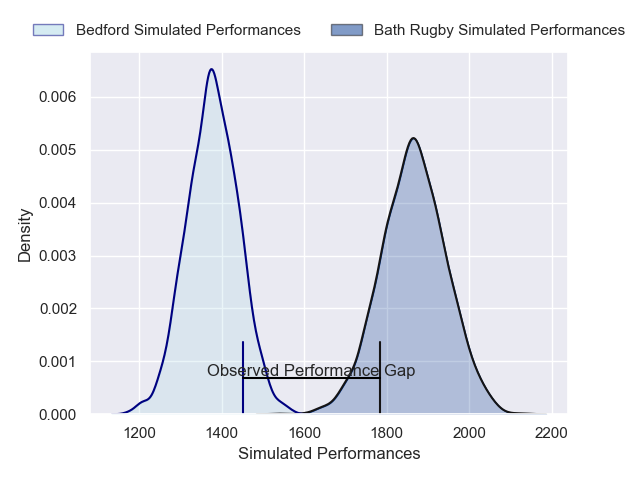
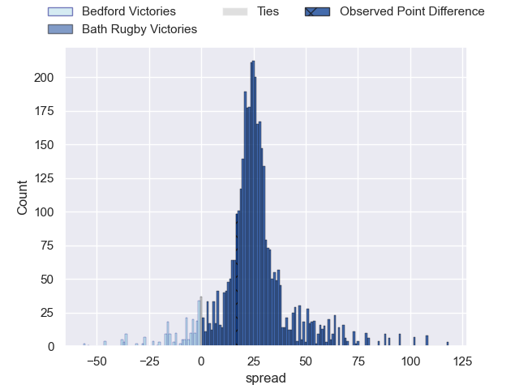
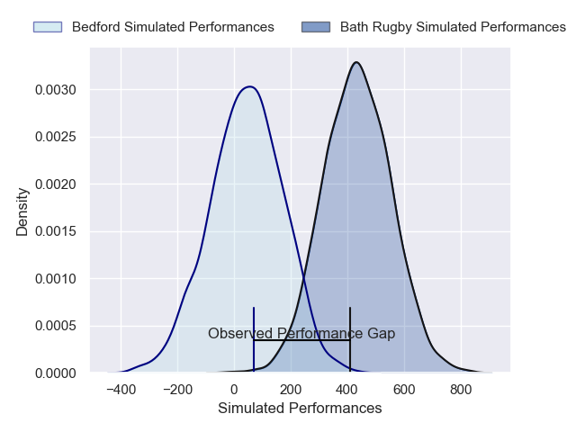
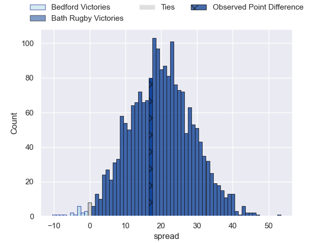

---  
layout: page  
title: Bedford at Bath Rugby; 26-43  
date: 2025-02-02 18:00:00 -0500  
categories: "Premiership Rugby Cup 24/25" match review  
---
# Bedford at Bath Rugby; 26-43

# Club Level Predictions

The first set of predictions treats a club as the smallest object, as the club develops its members, organizes a gameplan, and deploys its players as needed for each match. This club model has a prediction of 0.938, which translates to predicting Bath Rugby to win by 24.1.

Our Over/Under is 61.5 - and combined with the spread above, we have a predicted scoreline of 19 to 43

Each club has a rating and a rating deviation (similar to a Glicko rating), and expected performances can be generated. This allows for simulated matches and spreads like the ones below.
## Projected Performances - Club Model

## Projected Spreads - Club Model

## Projected Results - Club Model

# Player Level Predictions

Treating teams instead as an entity made up of the currently active players, I have ratings for each player in an altogether different system. These can be combined to form team ratings once teamsheets are announced, weighting starters a bit higher than the reserves. After the match is played, players can be weighted by their minutes on the field, allowing for an accurate measure of the team's composition. With these compiled team ratings, we can make predictions, measure inaccuracy, and update the individual player ratings.
## Prediction without Player Minutes: Bath Rugby by 20.9

Bath Rugby by 6.8 on a neutral pitch

## Projected Performances - Player Model

## Projected Spreads - Player Model

## Projected Results - Player Model

|   Away Minutes | Away Player          |   Away Percentile |   Number |   Home Percentile | Home Player         |   Home Minutes |
|---------------:|:---------------------|------------------:|---------:|------------------:|:--------------------|---------------:|
|             51 | Joey Conway          |             48.01 |        1 |             21.76 | Arthur Cordwell     |             80 |
|             40 | James Fish           |             20.47 |        2 |             57.72 | Jasper Spandler     |             80 |
|             43 | Oisin Heffernan      |             67.61 |        3 |             31.4  | Kieran Verden       |             80 |
|             57 | Rory Ward            |             34.23 |        4 |             59.16 | Harvey Cuckson      |             69 |
|             80 | Alex Woolford        |             78.04 |        5 |             70.85 | Ewan Richards       |             80 |
|             80 | Luke Frost           |              3.57 |        6 |             55.64 | Ethan Staddon       |             80 |
|             37 | Joe Howard           |              4.82 |        7 |             54.48 | Tom Cowan           |             45 |
|             80 | Cameron King         |              8.4  |        8 |             73.32 | Arthur Green        |             80 |
|             29 | Alex Day             |             75.89 |        9 |             53.55 | Tom Carr-Smith      |             35 |
|             80 | William Maisey       |             69.23 |       10 |             81.62 | Orlando Bailey      |             45 |
|             23 | Matt Worley          |             74.76 |       11 |             88.8  | Ruaridh McConnochie |             51 |
|             45 | Josh Matavesi        |             15.58 |       12 |             89.78 | Will Butt           |             45 |
|             12 | Lucas Titherington   |             24.87 |       13 |              5.57 | Louie Hennessey     |             80 |
|             29 | Alfie Garside        |             33.21 |       14 |             40.61 | Josh Noonan         |             26 |
|             32 | Louis James          |             15.16 |       15 |             60.86 | Ciaran Donoghue     |             35 |
|             68 | Curtis Langdon       |             93.46 |       16 |             56.56 | Austin Emens        |             35 |
|             49 | Jamie Jack           |              6.73 |       17 |             62.7  | Mackenzie Graham    |             26 |
|             66 | Jac Arthur           |             78.01 |       18 |            nan    | Neil Le Roux        |             80 |
|             80 | Beltus Nonleh        |              9.63 |       19 |             51.17 | Johnny Stewart      |             80 |
|             48 | Freddie Tuilagi      |              9.03 |       20 |            nan    | Jack Bennett        |             80 |
|             80 | Michael Le Bourgeois |             41.38 |       21 |            nan    | nan                 |            nan |
|             80 | Tommy Herman         |             39.43 |       22 |            nan    | nan                 |            nan |
|             45 | James Lennon         |             18.97 |       23 |            nan    | nan                 |            nan |

