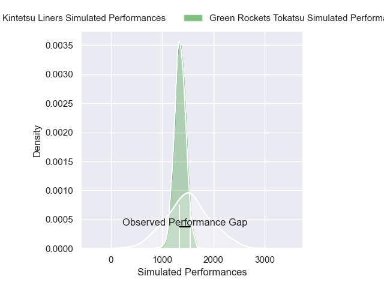
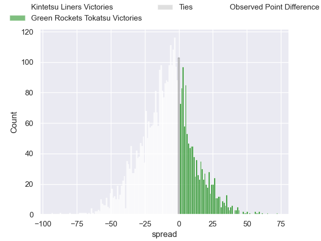
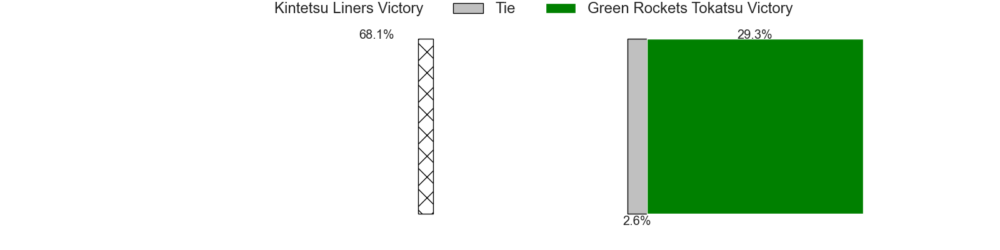
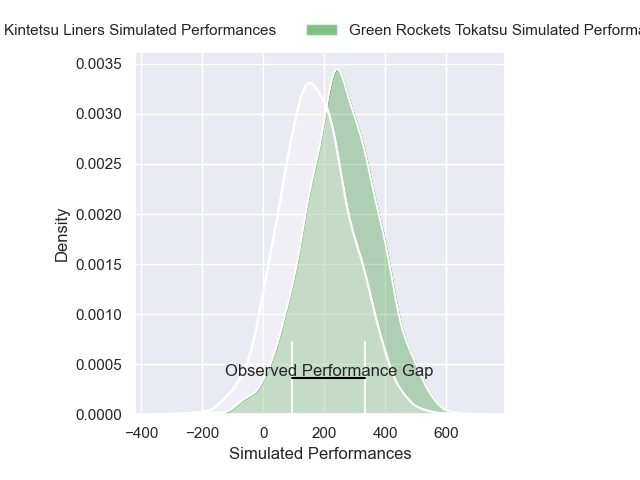
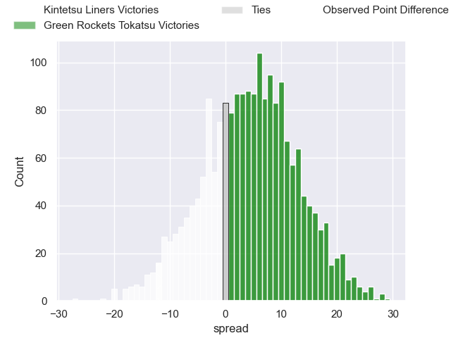
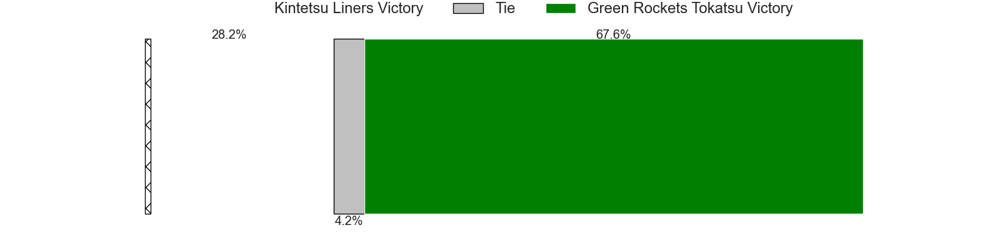

---  
layout: page  
title: Kintetsu Liners at Green Rockets Tokatsu; 31-19  
date: 2025-02-02 18:00:00 -0500  
categories: "Japan Rugby League One - Division 2 2025" match review  
---
# Kintetsu Liners at Green Rockets Tokatsu; 31-19

# Club Level Predictions

The first set of predictions treats a club as the smallest object, as the club develops its members, organizes a gameplan, and deploys its players as needed for each match. This club model has a prediction of 0.375, which translates to predicting Kintetsu Liners to win by 7.6.

Our Over/Under is 47.5 - and combined with the spread above, we have a predicted scoreline of 28 to 20

Each club has a rating and a rating deviation (similar to a Glicko rating), and expected performances can be generated. This allows for simulated matches and spreads like the ones below.
## Projected Performances - Club Model

## Projected Spreads - Club Model

## Projected Results - Club Model

# Player Level Predictions

Treating teams instead as an entity made up of the currently active players, I have ratings for each player in an altogether different system. These can be combined to form team ratings once teamsheets are announced, weighting starters a bit higher than the reserves. After the match is played, players can be weighted by their minutes on the field, allowing for an accurate measure of the team's composition. With these compiled team ratings, we can make predictions, measure inaccuracy, and update the individual player ratings.
## Prediction without Player Minutes: Green Rockets Tokatsu by 8.6

Green Rockets Tokatsu by 4.2 on a neutral pitch

## Projected Performances - Player Model

## Projected Spreads - Player Model

## Projected Results - Player Model

|   Away Minutes | Away Player      |   Away Percentile |   Number |   Home Percentile | Home Player           |   Home Minutes |
|---------------:|:-----------------|------------------:|---------:|------------------:|:----------------------|---------------:|
|             80 | Kenta Tanaka     |             70.1  |        1 |             39.12 | Kosei Yamamoto        |             20 |
|             69 | Kazuma Matsuda   |             68.29 |        2 |             40.27 | Ren Osawa             |             11 |
|              9 | Yuchol Mun       |             50    |        3 |             41.36 | Keisuke Kikuta        |             14 |
|              9 | Mitchell Brown   |             48.9  |        4 |             24.35 | Edward Annandale      |             22 |
|             25 | Sanaila Waqa     |             68.07 |        5 |             96.93 | Pari Pari Parkinson   |              5 |
|             11 | Taiki Miyashita  |             49.76 |        6 |             27    | Viliami Lutua Ahofono |             62 |
|             55 | Shohei Nonaka    |             62.39 |        7 |             25.07 | Ryoi Kamei            |             70 |
|             71 | Akira Ioane      |             97.06 |        8 |             32.35 | Aseri Masivou         |             25 |
|             11 | Will Genia       |             49.65 |        9 |             28.37 | Yusuke Maruo          |             73 |
|              9 | Will Harrison    |              4.27 |       10 |             33.33 | Ko Yoshimura          |             24 |
|             75 | Ryosuke Kataoka  |             65.65 |       11 |             25.95 | Kanta Omata           |             80 |
|             11 | Patrick Stehlin  |             47.37 |       12 |             28.69 | Orbyn Leger           |             57 |
|             69 | Timo Sufia       |             60.89 |       13 |             23.84 | Maritino Nemani       |             80 |
|             60 | Tomoya Kimura    |             63.09 |       14 |             25.95 | Keagen Faria          |             80 |
|             18 | Hiroki Kumoyama  |             48.77 |       15 |             97.54 | Rhys Patchell         |             61 |
|             66 | Keiichi Kaneko   |            nan    |       16 |            nan    | Miyu Arai             |             11 |
|             80 | Shintaro Okamoto |            nan    |       17 |            nan    | Suguru Kubo           |             80 |
|             80 | Ryo Iwakami      |            nan    |       18 |            nan    | Taku Toma             |             80 |
|             58 | Simeone Schmidt  |            nan    |       19 |            nan    | Geoff Cridge          |             51 |
|             80 | Jose Seru        |            nan    |       20 |            nan    | Mitieli Tuinakauvadra |             68 |
|             10 | Keitaro Hitora   |            nan    |       21 |            nan    | Tatsuya Fujii         |             80 |
|             80 | Quade Cooper     |             97.44 |       22 |            nan    | Christian Laui        |             80 |
|             80 | Semisi Masirewa  |              2.18 |       23 |            nan    | Hiroyuki Miyajima     |             59 |

