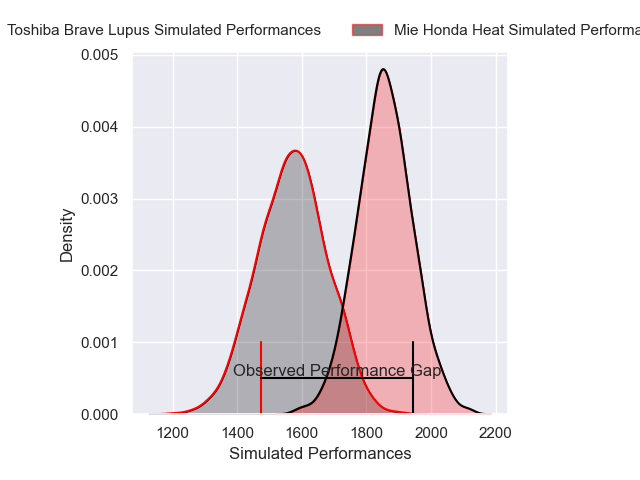
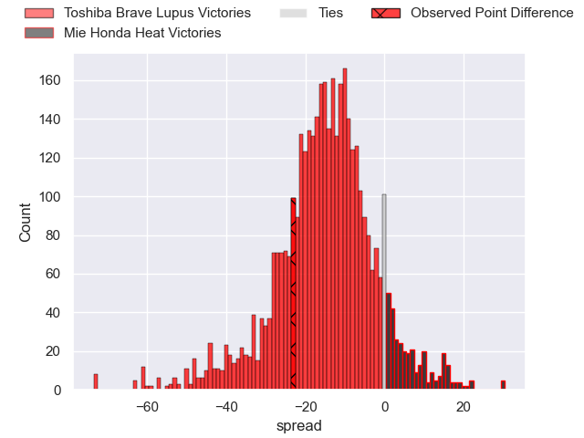
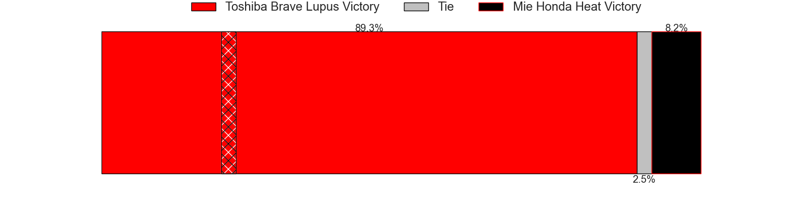
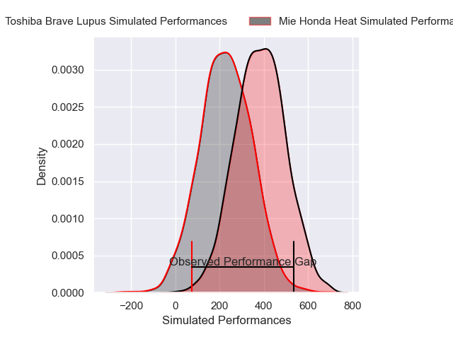
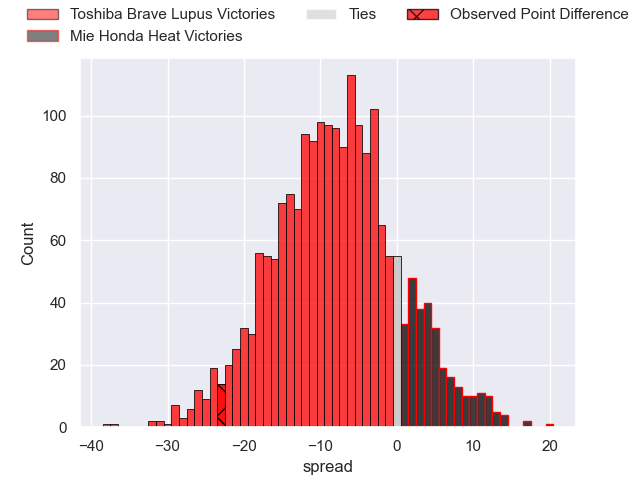
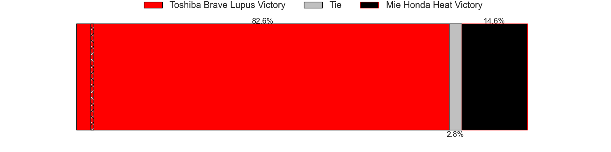

---  
layout: page  
title: Toshiba Brave Lupus at Mie Honda Heat; 35-12  
date: 2025-02-02 18:00:00 -0500  
categories: "Japan Rugby League One 24/25" match review  
---
# Toshiba Brave Lupus at Mie Honda Heat; 35-12

# Club Level Predictions

The first set of predictions treats a club as the smallest object, as the club develops its members, organizes a gameplan, and deploys its players as needed for each match. This club model has a prediction of 0.17, which translates to predicting Toshiba Brave Lupus to win by 14.3.

Our Over/Under is 50.5 - and combined with the spread above, we have a predicted scoreline of 32 to 18

Each club has a rating and a rating deviation (similar to a Glicko rating), and expected performances can be generated. This allows for simulated matches and spreads like the ones below.
## Projected Performances - Club Model

## Projected Spreads - Club Model

## Projected Results - Club Model

# Player Level Predictions

Treating teams instead as an entity made up of the currently active players, I have ratings for each player in an altogether different system. These can be combined to form team ratings once teamsheets are announced, weighting starters a bit higher than the reserves. After the match is played, players can be weighted by their minutes on the field, allowing for an accurate measure of the team's composition. With these compiled team ratings, we can make predictions, measure inaccuracy, and update the individual player ratings.
## Prediction without Player Minutes: Toshiba Brave Lupus by 10.6

Toshiba Brave Lupus by 14.1 on a neutral pitch

## Projected Performances - Player Model

## Projected Spreads - Player Model

## Projected Results - Player Model

|   Away Minutes | Away Player        |   Away Percentile |   Number |   Home Percentile | Home Player            |   Home Minutes |
|---------------:|:-------------------|------------------:|---------:|------------------:|:-----------------------|---------------:|
|             80 | Sena Kimura        |             90.78 |        1 |              2.24 | Tatsuhiko Tsurukawa    |             30 |
|             70 | Mamoru Harada      |             90.6  |        2 |             46.64 | Koki Hida              |             30 |
|             71 | Yuta Kokaji        |             93.11 |        3 |             14.29 | Katsuyuki Hoshino      |             80 |
|             21 | Shohei Ito         |             41.51 |        4 |             25.7  | Mark Abbott            |             80 |
|             32 | Jacob Pierce       |             98.85 |        5 |             92.23 | Franco Mostert         |             21 |
|             13 | Shannon Frizell    |             96.34 |        6 |             99.23 | Pablo Matera           |             50 |
|             25 | Takeshi Sasaki     |             87.66 |        7 |              7.71 | Tony Ray Hunt          |             48 |
|             25 | Michael Leitch     |             95.8  |        8 |             27.94 | Talifolofola Tangipa   |              9 |
|             59 | Yuhei Sugiyama     |             81.03 |        9 |             58.69 | Azuma Doei             |             17 |
|             59 | Richie Mo'unga     |            100    |       10 |             81.41 | Hayata Nakao           |             13 |
|             80 | Masaki Hamada      |             89.28 |       11 |             82.16 | Lomano Lemeki          |             76 |
|             21 | Taichi Mano        |             77.61 |       12 |              3.92 | Fraser Quirk           |             63 |
|             50 | Seta Tamanivalu    |             97.01 |       13 |             82.35 | Jonathan Faauli        |             61 |
|             10 | Jone Naikabula     |             63.66 |       14 |             51.71 | FC du Plessis          |             80 |
|             80 | Takuro Matsunaga   |             93.24 |       15 |             77.87 | Tom Banks              |             71 |
|             50 | Yuto Mori          |             68.5  |       16 |             43.65 | Kyogo Okano            |              9 |
|             21 | Daigo Hashimoto    |             77.52 |       17 |             88.97 | Ryoma Nishimura        |             71 |
|             30 | Samuela Anise      |             39.21 |       18 |            nan    | Feinga Kihe Lotu Fakai |             80 |
|             55 | Kohei Takahashi    |             64.89 |       19 |              2.89 | Ryo Furuta             |             59 |
|             80 | Teruo Makabe       |             85.47 |       20 |             86.58 | Janko Swanepoel        |             80 |
|             21 | Yoshitaka Tokunaga |             26.23 |       21 |             62.58 | Ikuma Yamada           |             13 |
|             80 | Gentaro Ikenaga    |            nan    |       22 |             20.04 | Taichi Takenaka        |             67 |
|             21 | Latu Taufa         |            nan    |       23 |             14.62 | Takumi Fuji            |             16 |

