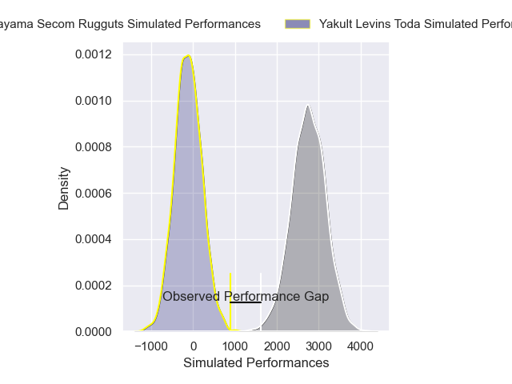
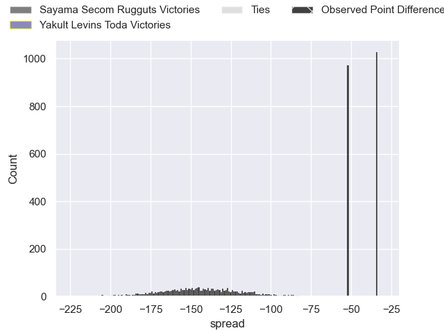
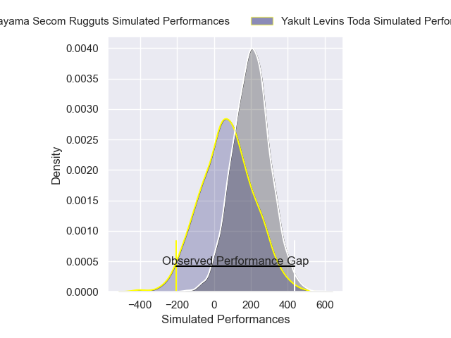
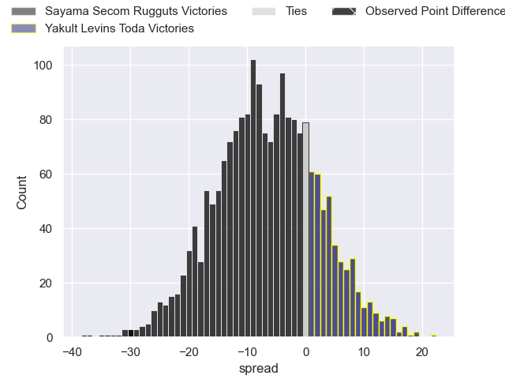
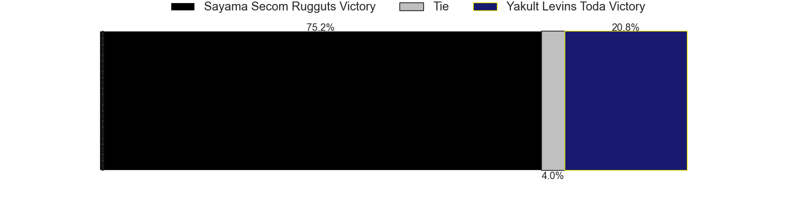

---  
layout: page  
title: Sayama Secom Rugguts at Yakult Levins Toda; 36-6  
date: 2025-02-02 18:00:00 -0500  
categories: "Japan Rugby League One D3 24/25" match review  
---
# Sayama Secom Rugguts at Yakult Levins Toda; 36-6

# Club Level Predictions

The first set of predictions treats a club as the smallest object, as the club develops its members, organizes a gameplan, and deploys its players as needed for each match. This club model has a prediction of 0.0, which translates to predicting Sayama Secom Rugguts to win by 143.5.

Our Over/Under is 54.5 - and combined with the spread above, we have a predicted scoreline of 99 to -44

Each club has a rating and a rating deviation (similar to a Glicko rating), and expected performances can be generated. This allows for simulated matches and spreads like the ones below.
## Projected Performances - Club Model

## Projected Spreads - Club Model

## Projected Results - Club Model

# Player Level Predictions

Treating teams instead as an entity made up of the currently active players, I have ratings for each player in an altogether different system. These can be combined to form team ratings once teamsheets are announced, weighting starters a bit higher than the reserves. After the match is played, players can be weighted by their minutes on the field, allowing for an accurate measure of the team's composition. With these compiled team ratings, we can make predictions, measure inaccuracy, and update the individual player ratings.
## Prediction without Player Minutes: Sayama Secom Rugguts by 8.9

Sayama Secom Rugguts by 11.0 on a neutral pitch

## Projected Performances - Player Model

## Projected Spreads - Player Model

## Projected Results - Player Model

|   Away Minutes | Away Player      |   Away Percentile |   Number |   Home Percentile | Home Player          |   Home Minutes |
|---------------:|:-----------------|------------------:|---------:|------------------:|:---------------------|---------------:|
|             10 | Kentaro Ueno     |             64.7  |        1 |              9.72 | Iori Nozaki          |             13 |
|             25 | Tatsuki Tanina   |             64.09 |        2 |             23.15 | Shunsuke Tani        |              8 |
|              8 | Motoki Kaneko    |             61.79 |        3 |             11.71 | Atsushi Furuya       |             80 |
|             80 | Cory Hill        |             98.56 |        4 |             24.16 | Masashi Ogawa        |             80 |
|             64 | Troy Callander   |             85.43 |        5 |             90.32 | James Tucker         |             80 |
|             67 | Paker Ash        |             37.7  |        6 |             24.11 | Yuto Usuda           |             63 |
|              5 | Koki Iida        |             67.31 |        7 |             12.05 | Kosuke Urabe         |             80 |
|             76 | Whetu Douglas    |             76.89 |        8 |              3.78 | Jaycob Matiu         |             72 |
|             11 | Rikuya Takashima |             36.35 |        9 |             13.3  | Junpei Tada          |             69 |
|              7 | Shota Kutsuna    |             55.34 |       10 |             15.17 | Nick Evemy           |             70 |
|              4 | Tatsuki Kanza    |             47.34 |       11 |             14.52 | Shun Sawamura        |             80 |
|             80 | TJ Faiane        |             97.83 |       12 |              4.54 | Antonio Mikaele-Tu'u |             80 |
|             16 | Fisipuna Tuiaki  |             15.17 |       13 |             20.95 | Atomu Shirai         |             59 |
|             27 | Yushi Okuda      |             55.5  |       14 |             30.36 | Hikaru Ishikawa      |             80 |
|             17 | Chase Tiatia     |             68.03 |       15 |              7.99 | Masatoshi Doi        |             80 |
|             16 | Toshiki Sato     |            nan    |       16 |             39.92 | Masaya Makino        |             55 |
|             67 | Kanaru Takahashi |            nan    |       17 |            nan    | Daichi Kono          |             59 |
|             80 | Shota Okuno      |            nan    |       18 |             30.34 | Takumi Hurukawa      |             80 |
|             59 | Itsuki Fujii     |             46.31 |       19 |             35.07 | Kosetu Kawachi       |             55 |
|             80 | Ryusuke Yamamoto |            nan    |       20 |            nan    | Takudo Okazaki       |             80 |
|             13 | Haruya Nakasu    |             23.43 |       21 |            nan    | Gen Mori             |             67 |
|              7 | Yuto Takano      |            nan    |       22 |            nan    | Genki Tokushige      |             80 |
|             20 | Kento Mizutani   |            nan    |       23 |             26.28 | Takuya Takahashi     |             80 |

