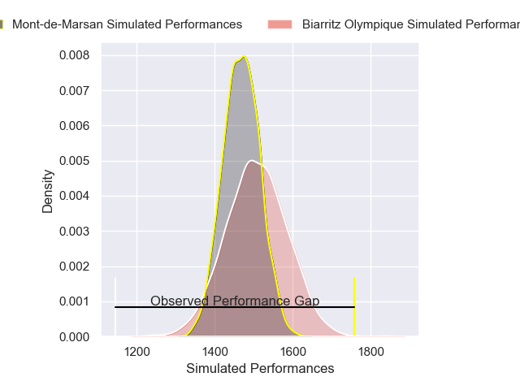
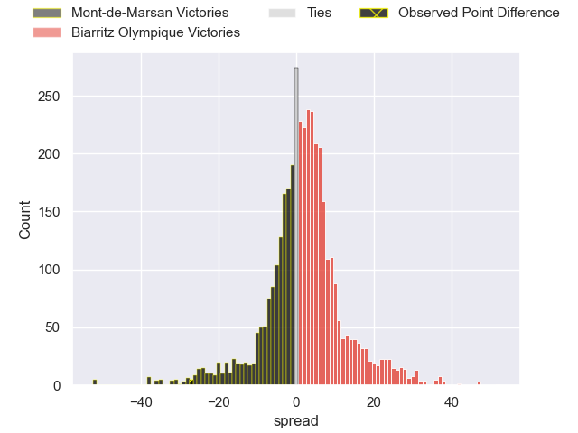
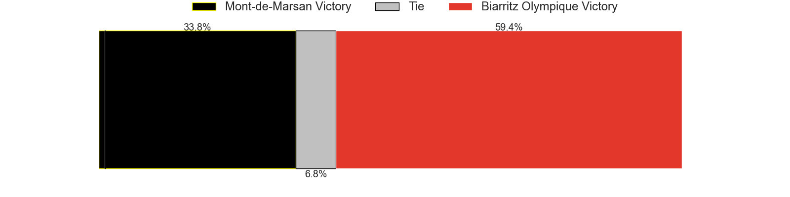
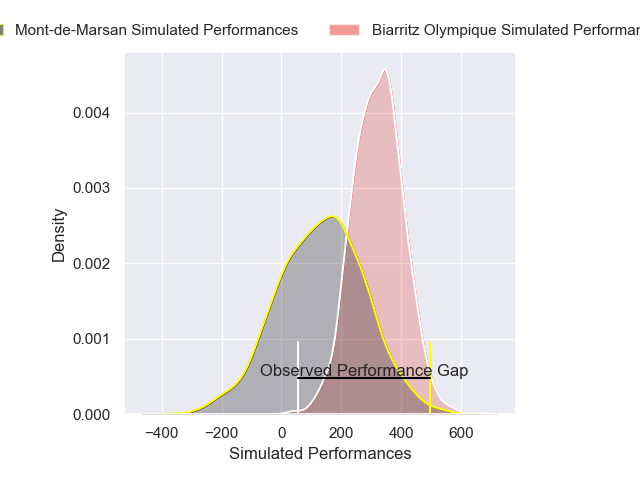
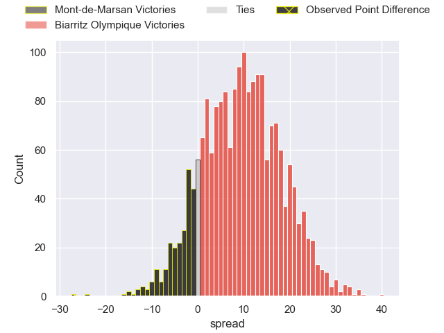
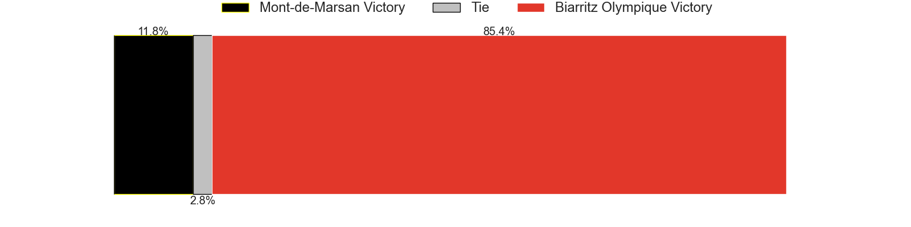

---  
layout: page  
title: Mont-de-Marsan at Biarritz Olympique; 27-0  
date: 2025-02-06 18:00:00 -0500  
categories: "Pro D2 24/25" match review  
---
# Mont-de-Marsan at Biarritz Olympique; 27-0

# Club Level Predictions

The first set of predictions treats a club as the smallest object, as the club develops its members, organizes a gameplan, and deploys its players as needed for each match. This club model has a prediction of 0.554, which translates to predicting Biarritz Olympique to win by 1.9.

Our Over/Under is 52.5 - and combined with the spread above, we have a predicted scoreline of 25 to 27

Each club has a rating and a rating deviation (similar to a Glicko rating), and expected performances can be generated. This allows for simulated matches and spreads like the ones below.
## Projected Performances - Club Model

## Projected Spreads - Club Model

## Projected Results - Club Model

# Player Level Predictions

Treating teams instead as an entity made up of the currently active players, I have ratings for each player in an altogether different system. These can be combined to form team ratings once teamsheets are announced, weighting starters a bit higher than the reserves. After the match is played, players can be weighted by their minutes on the field, allowing for an accurate measure of the team's composition. With these compiled team ratings, we can make predictions, measure inaccuracy, and update the individual player ratings.
## Prediction without Player Minutes: Biarritz Olympique by 11.5

Mont-de-Marsan by 3.9 on a neutral pitch

## Projected Performances - Player Model

## Projected Spreads - Player Model

## Projected Results - Player Model

|   Away Minutes | Away Player           |   Away Percentile |   Number |   Home Percentile | Home Player         |   Home Minutes |
|---------------:|:----------------------|------------------:|---------:|------------------:|:--------------------|---------------:|
|             80 | Ali-Amjad Osman-Bosch |             77.59 |        1 |              2.07 | Giorgi Nutsubidze   |             40 |
|             80 | Samuel Lagrange       |             82.77 |        2 |             10.98 | Yohan Beheregaray   |             40 |
|             61 | Mattéo Lalanne        |             76.18 |        3 |              1.49 | Zakaria El Fakir    |             50 |
|             55 | Albert Mataele        |             67.6  |        4 |              1.83 | Aitor Hourcade      |             35 |
|             19 | Aston Fortuin         |             13.27 |        5 |             41.54 | Piula Faasalele     |             35 |
|             25 | Raphaël Robic         |             81.86 |        6 |             14.84 | Thomas Hebert       |             56 |
|             24 | Nicolas Garrault      |             15.03 |        7 |             72.36 | Cornell du Preez    |             24 |
|             21 | Ioane Iashagashvili   |             95.16 |        8 |             28.63 | Nafi Ma'afu         |             54 |
|             80 | Christophe Loustalot  |             37.35 |        9 |             17.17 | Imanol Biscay       |             40 |
|             59 | Patricio Fernandez    |             61.44 |       10 |             17.8  | Edgar Retiere       |             80 |
|             80 | Mosese Dawai          |             88.22 |       11 |             95.1  | Mathieu Acebes      |             26 |
|             80 | Nacani Wakaya         |             78.37 |       12 |              1.99 | Francois Vergnaud   |             48 |
|             61 | Gatien Masse          |             58.1  |       13 |             26.85 | Tyler Morgan        |             26 |
|             80 | Alexandre de Nardi    |             29.22 |       14 |             53.82 | Yohan Tapie         |             26 |
|             80 | Yoann Laousse Azpiazu |             29.39 |       15 |              3.67 | Zach Kibirige       |             18 |
|             80 | Aurélien Laforgue     |             30.16 |       16 |             32.95 | Killian Taofifenua  |             12 |
|             80 | Mathis Bats           |            nan    |       17 |            nan    | Eliande Sanderson   |             32 |
|             64 | Jules Dussutour       |             51.44 |       18 |              2.81 | Jessy Jegerlehner   |             69 |
|             68 | Martin Villar         |             58.01 |       19 |             56.36 | Thomas Dolhagaray   |             54 |
|             54 | Florian Dufour        |              8.11 |       20 |             72.57 | Kerman Aurrekoetxea |             35 |
|             62 | Willie du Plessis     |             62.08 |       21 |             73.2  | Solomone Tukuafu    |             40 |
|             80 | Pierre Sayerse        |             90.01 |       22 |             62.9  | Yann David          |             30 |
|             80 | Nicolas Darquier      |             53.63 |       23 |            nan    | nan                 |            nan |

