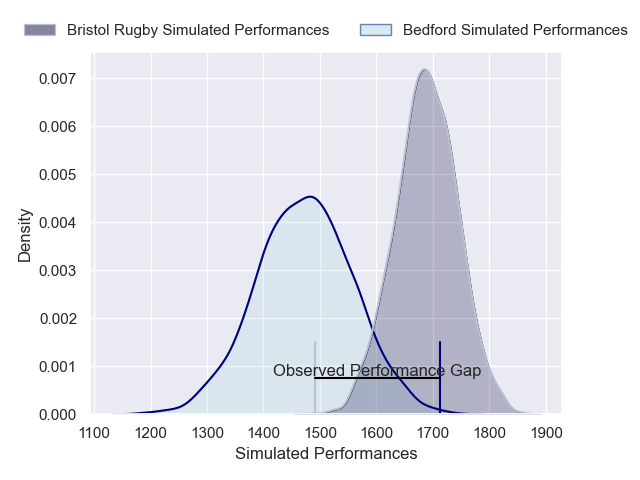
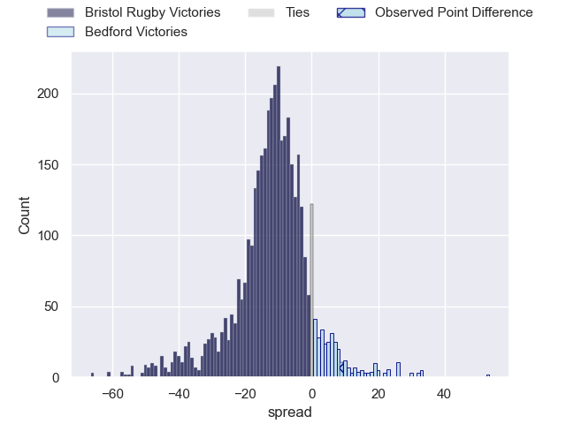
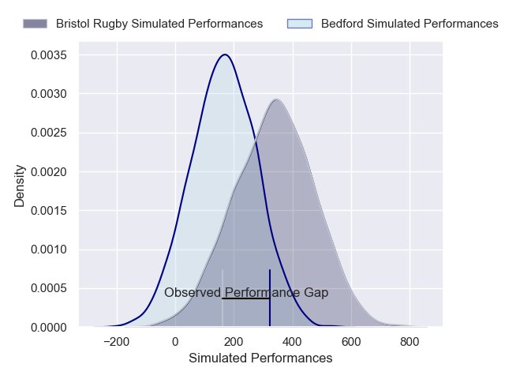
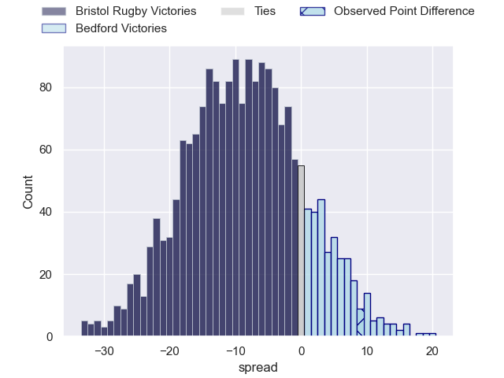

---  
layout: page  
title: Bristol Rugby at Bedford; 14-23  
date: 2025-02-07 18:00:00 -0500  
categories: "Premiership Rugby Cup 24/25" match review  
---
# Bristol Rugby at Bedford; 14-23

# Club Level Predictions

The first set of predictions treats a club as the smallest object, as the club develops its members, organizes a gameplan, and deploys its players as needed for each match. This club model has a prediction of 0.223, which translates to predicting Bristol Rugby to win by 11.0.

Our Over/Under is 46.5 - and combined with the spread above, we have a predicted scoreline of 29 to 18

Each club has a rating and a rating deviation (similar to a Glicko rating), and expected performances can be generated. This allows for simulated matches and spreads like the ones below.
## Projected Performances - Club Model

## Projected Spreads - Club Model

## Projected Results - Club Model

# Player Level Predictions

Treating teams instead as an entity made up of the currently active players, I have ratings for each player in an altogether different system. These can be combined to form team ratings once teamsheets are announced, weighting starters a bit higher than the reserves. After the match is played, players can be weighted by their minutes on the field, allowing for an accurate measure of the team's composition. With these compiled team ratings, we can make predictions, measure inaccuracy, and update the individual player ratings.
## Prediction without Player Minutes: Bristol Rugby by 7.9

Bristol Rugby by 12.5 on a neutral pitch

## Projected Performances - Player Model

## Projected Spreads - Player Model

## Projected Results - Player Model

|   Away Minutes | Away Player                 |   Away Percentile |   Number |   Home Percentile | Home Player          |   Home Minutes |
|---------------:|:----------------------------|------------------:|---------:|------------------:|:---------------------|---------------:|
|             80 | Samuel Alexander Grahamslaw |             80.99 |        1 |              7.82 | Jamie Jack           |             29 |
|             80 | Will Capon                  |             21.99 |        2 |             30.19 | Curtis Langdon       |             29 |
|             54 | Jimmy Halliwell             |             75.72 |        3 |             74.4  | Oisin Heffernan      |             48 |
|             67 | Josh Caulfield              |             78.32 |        4 |              6.97 | Luke Frost           |             29 |
|             80 | Steele Robert Barker        |             85.58 |        5 |             82.48 | Alex Woolford        |             59 |
|             56 | Paddy Pearce                |             63.42 |        6 |              9.85 | Freddie Tuilagi      |             22 |
|             10 | Jake Heenan                 |             67.95 |        7 |             78.76 | Jac Arthur           |             48 |
|             17 | Benjamin Grondona           |             79.14 |        8 |             16.34 | Cameron King         |             80 |
|             14 | Sam Wolstenholme            |             20.35 |        9 |             30    | James Lennon         |             51 |
|             80 | Harry Bazalgette            |             76.07 |       10 |             80.98 | William Maisey       |             80 |
|             80 | Deago Bailey                |             31.3  |       11 |             81.45 | Matt Worley          |             80 |
|             80 | Joe Jenkins                 |             61.01 |       12 |             54.79 | Michael Le Bourgeois |             47 |
|             63 | Kalaveti Ravouvou           |             77.98 |       13 |             47.73 | Lucas Titherington   |             80 |
|             80 | Toby Fricker                |             11.3  |       14 |             47.54 | Alfie Garside        |             49 |
|             80 | Benjamin Elizalde           |             86.67 |       15 |             27.08 | Louis James          |             76 |
|             62 | Yann Thomas                 |             93.25 |       16 |             31.69 | Joey Conway          |             44 |
|             80 | George Kloska               |             67.74 |       17 |             39.97 | Tommy Herman         |             80 |
|             11 | Kofi Cripps                 |             48.55 |       18 |            nan    | Austin Hay           |             80 |
|             80 | Joe Owen                    |             83.74 |       19 |            nan    | Charlie Ulcoq        |             31 |
|             52 | Kieran Marmion              |             94.91 |       20 |              5.12 | Joe Howard           |             36 |
|             21 | Richard Lane                |             76.88 |       21 |             77.37 | Alex Day             |             26 |
|            nan | nan                         |            nan    |       22 |             13.91 | Josh Matavesi        |             31 |

