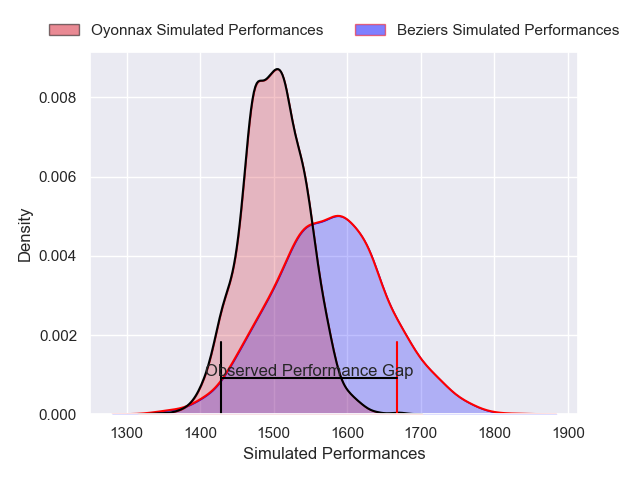
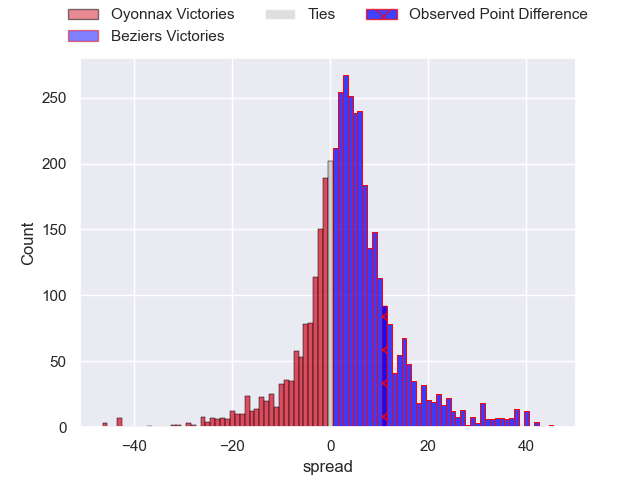
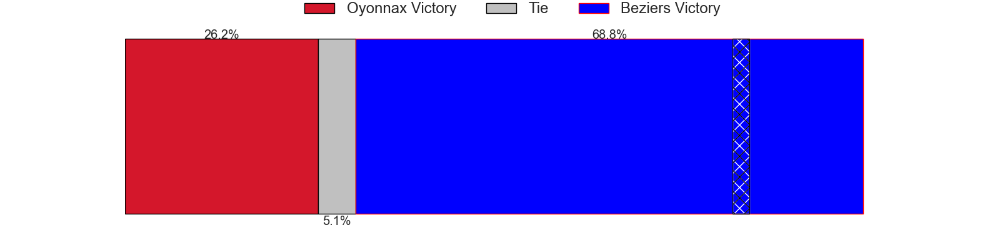
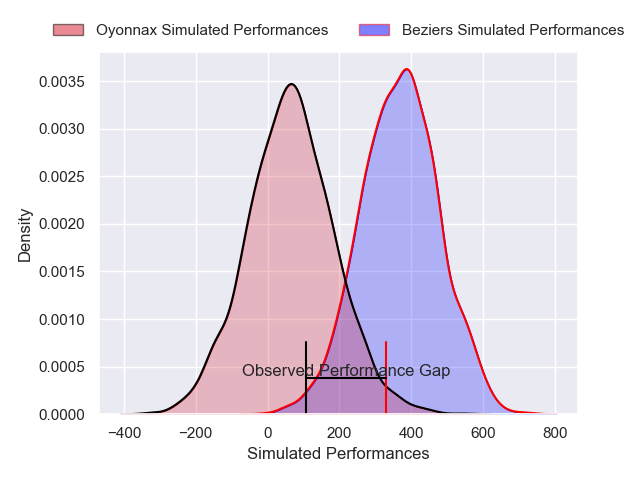
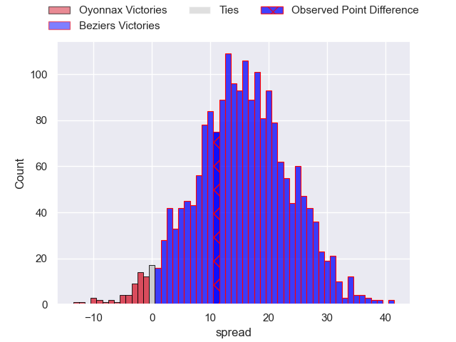
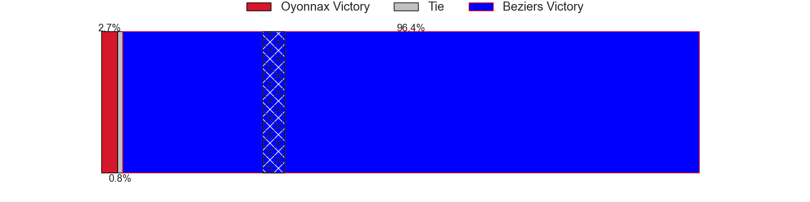

---  
layout: page  
title: Oyonnax at Beziers; 15-26  
date: 2025-02-07 18:00:00 -0500  
categories: "Pro D2 24/25" match review  
---
# Oyonnax at Beziers; 15-26

# Club Level Predictions

The first set of predictions treats a club as the smallest object, as the club develops its members, organizes a gameplan, and deploys its players as needed for each match. This club model has a prediction of 0.603, which translates to predicting Beziers to win by 3.6.

Our Over/Under is 61.5 - and combined with the spread above, we have a predicted scoreline of 29 to 32

Each club has a rating and a rating deviation (similar to a Glicko rating), and expected performances can be generated. This allows for simulated matches and spreads like the ones below.
## Projected Performances - Club Model

## Projected Spreads - Club Model

## Projected Results - Club Model

# Player Level Predictions

Treating teams instead as an entity made up of the currently active players, I have ratings for each player in an altogether different system. These can be combined to form team ratings once teamsheets are announced, weighting starters a bit higher than the reserves. After the match is played, players can be weighted by their minutes on the field, allowing for an accurate measure of the team's composition. With these compiled team ratings, we can make predictions, measure inaccuracy, and update the individual player ratings.
## Prediction without Player Minutes: Beziers by 16.4

Beziers by 2.2 on a neutral pitch

## Projected Performances - Player Model

## Projected Spreads - Player Model

## Projected Results - Player Model

|   Away Minutes | Away Player        |   Away Percentile |   Number |   Home Percentile | Home Player             |   Home Minutes |
|---------------:|:-------------------|------------------:|---------:|------------------:|:------------------------|---------------:|
|             80 | Rémi Di Pietro     |             70.56 |        1 |             45.19 | Yahnis El Maslouhi      |             80 |
|             50 | Teddy Durand       |              2.86 |        2 |             86.36 | Jose Luis Gonzalez      |             40 |
|             80 | Paulo Tafili       |             62.44 |        3 |             23.47 | Christian Judge         |             80 |
|             50 | Manuel Leindekar   |              1.54 |        4 |             63.63 | Cam Dodson              |             58 |
|             80 | Hugo Fabregue      |             23.9  |        5 |              0.48 | Shahn Eru               |             80 |
|             68 | Kevin Lebreton     |             19.4  |        6 |             55.52 | Baptiste Abescat-Leroy  |             12 |
|             50 | Wandrille Picault  |             82.71 |        7 |             83.19 | Clement Ancely          |             17 |
|             80 | Antoine Miquel     |             49.79 |        8 |             68.99 | Otonuku Jr Pauta        |             20 |
|             50 | Jonathan Ruru      |             92.17 |        9 |             85.91 | Samuel Marques          |             23 |
|             51 | Chris Smith        |             80.64 |       10 |             10.85 | Charly Malie            |             23 |
|             58 | Daniel Ikpefan     |             69.49 |       11 |             61.41 | Nicolas Plazy           |             50 |
|             15 | Lucas Mensa        |              9.68 |       12 |             49.01 | Taleta Tupuola          |             27 |
|             59 | Afusipa Taumoepeau |             58.38 |       13 |             42.04 | Paul Recor              |             80 |
|             22 | Maxime Salles      |             46.2  |       14 |             13.4  | Pierre Courtaud         |              4 |
|             30 | Martin Bogado      |             23.71 |       15 |             81.03 | Gabin Lorre             |             80 |
|             58 | Hugo Hermet        |              8.65 |       16 |            nan    | Romain Uruty            |             64 |
|             22 | Thibault Berthaud  |             64.84 |       17 |             23.13 | Damien Añon             |             60 |
|             80 | Loic Godener       |              2.74 |       18 |             69.58 | Watisoni Votu           |             80 |
|              6 | Victor Lebas       |            nan    |       19 |            nan    | Yvann Lalevee           |             50 |
|             29 | Darren Sweetnam    |             67.3  |       20 |             57.07 | Wilmar Arnoldi          |             46 |
|             51 | Peniami Narisia    |             91.92 |       21 |             30.85 | Youssef Amrouni         |             80 |
|             52 | Cameron Wright     |              3.13 |       22 |            nan    | Petero Taviraki Mailulu |             45 |

