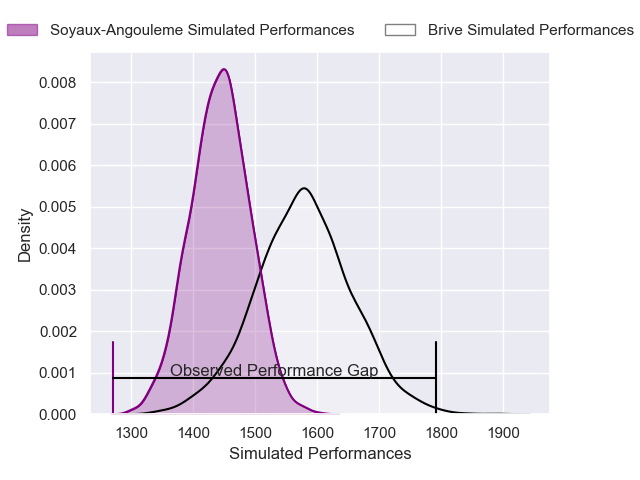
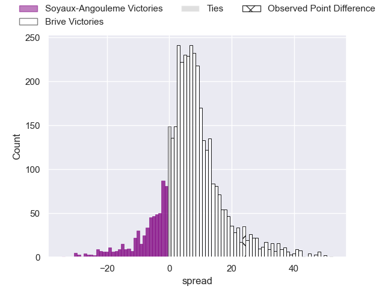
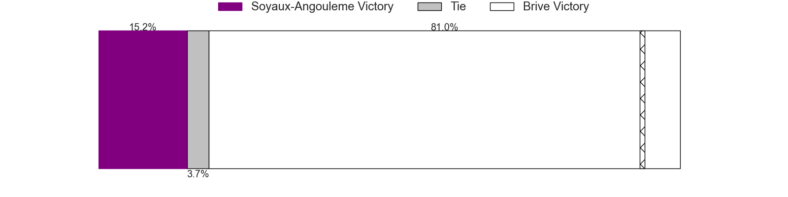
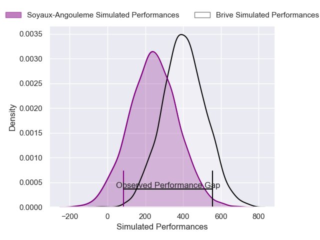
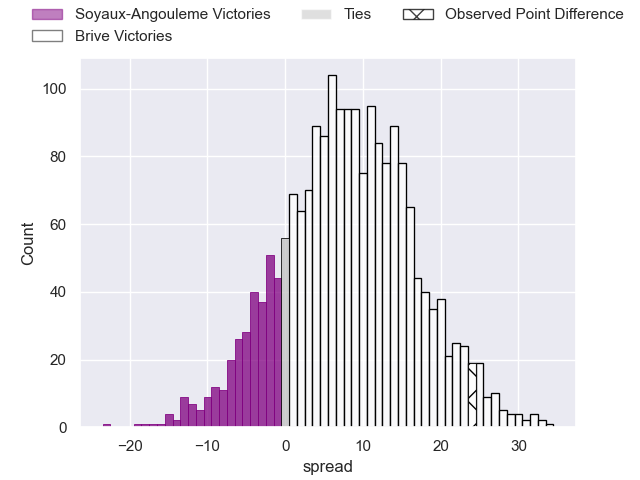
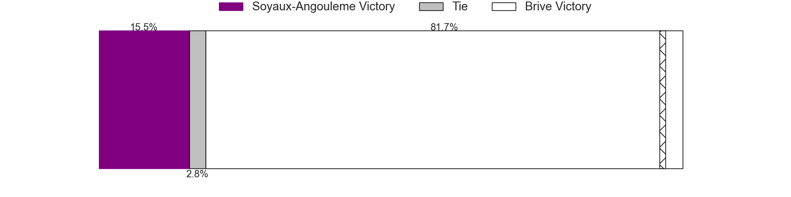

---  
layout: page  
title: Soyaux-Angouleme at Brive; 0-24  
date: 2025-02-07 18:00:00 -0500  
categories: "Pro D2 24/25" match review  
---
# Soyaux-Angouleme at Brive; 0-24

# Club Level Predictions

The first set of predictions treats a club as the smallest object, as the club develops its members, organizes a gameplan, and deploys its players as needed for each match. This club model has a prediction of 0.68, which translates to predicting Brive to win by 6.6.

Our Over/Under is 62.5 - and combined with the spread above, we have a predicted scoreline of 28 to 34

Each club has a rating and a rating deviation (similar to a Glicko rating), and expected performances can be generated. This allows for simulated matches and spreads like the ones below.
## Projected Performances - Club Model

## Projected Spreads - Club Model

## Projected Results - Club Model

# Player Level Predictions

Treating teams instead as an entity made up of the currently active players, I have ratings for each player in an altogether different system. These can be combined to form team ratings once teamsheets are announced, weighting starters a bit higher than the reserves. After the match is played, players can be weighted by their minutes on the field, allowing for an accurate measure of the team's composition. With these compiled team ratings, we can make predictions, measure inaccuracy, and update the individual player ratings.
## Prediction without Player Minutes: Brive by 16.5

Brive by 3.6 on a neutral pitch

## Projected Performances - Player Model

## Projected Spreads - Player Model

## Projected Results - Player Model

|   Away Minutes | Away Player        |   Away Percentile |   Number |   Home Percentile | Home Player               |   Home Minutes |
|---------------:|:-------------------|------------------:|---------:|------------------:|:--------------------------|---------------:|
|             80 | Georgy Balakarev   |             32.75 |        1 |             83.58 | Vakh Abdaladze            |             46 |
|             62 | Motu Matu'u        |              3.87 |        2 |             67.51 | Benjamin Boudou           |             80 |
|             65 | Seydou Diakité     |             27.53 |        3 |             14.51 | Marcel van der Merwe      |             67 |
|             18 | Léo Morand-Bruyat  |             80.9  |        4 |             70.63 | Renger van Eerten         |             80 |
|             80 | Ian Kitwanga       |             11.9  |        5 |             22.17 | Hendre Stassen            |             68 |
|             30 | Matt Beukeboom     |             15.37 |        6 |             83.77 | Retief Marais             |              3 |
|             66 | Germain Burgaud    |             87.42 |        7 |             97.31 | Courtney Lawes            |             13 |
|             18 | Samuel Nollet      |             18.14 |        8 |             71.52 | Rahboni Warren-Vosayaco   |             80 |
|             18 | Adrien Bau         |              5.39 |        9 |             56    | Mathis Ferté              |             29 |
|             18 | Corentin Glenat    |             59.57 |       10 |             78.51 | Curwin Bosch              |             31 |
|             80 | Nathan Farissier   |             38.88 |       11 |             91.54 | Erwan Dridi               |             32 |
|             80 | George Tilsley     |             94.07 |       12 |             22.68 | Paul Pimienta             |             32 |
|             22 | Arthur Proult      |              5.83 |       13 |             96.25 | Matias Moroni             |             29 |
|             80 | Matthys Gratien    |             84.22 |       14 |             73.48 | Benjamin Lefranc          |             29 |
|             51 | Jules Dubecq       |             67.01 |       15 |              6.39 | Thomas Zenon              |             80 |
|             46 | Clément Sentubery  |             67.92 |       16 |             33.62 | Tom Raffy                 |             48 |
|             48 | Maxence Lemardelet |             67.08 |       17 |             75.25 | Issam Hamel               |             80 |
|             80 | Patxi Bidart       |             89.23 |       18 |             57.21 | Francisco Coria Marchetti |             32 |
|             80 | Sami Zouhair       |             97.76 |       19 |             88.29 | Sitaleki Timani           |             58 |
|             51 | Karl Sorin         |             41.21 |       20 |             89.44 | Asier Usarraga            |             80 |
|             80 | Alexander Masibaka |             44.94 |       21 |            nan    | Nathan Fraissenon         |             48 |
|             34 | Ben Botica         |             91.06 |       22 |             59.65 | Samuel Maximin            |             72 |
|             51 | Lucas Zamora       |             61.39 |       23 |              8.35 | Hugo Verdu                |             80 |

