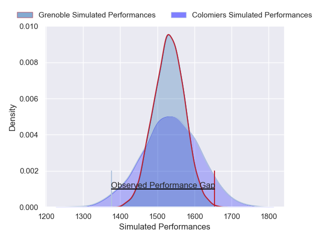
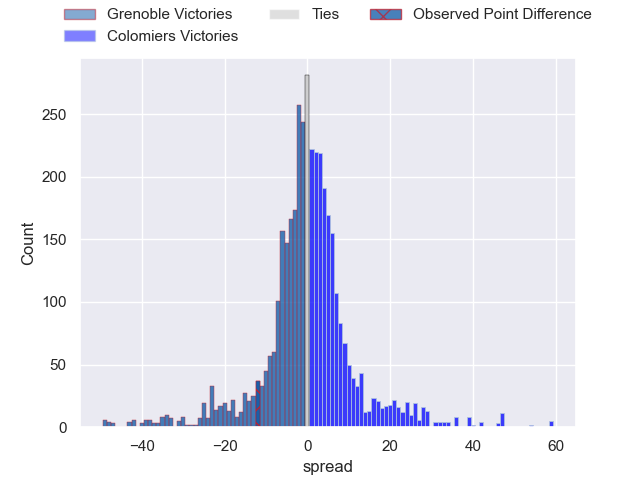
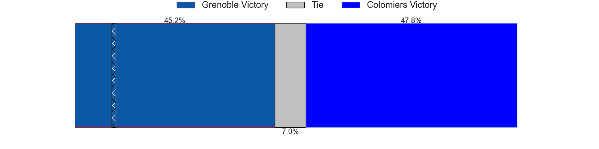
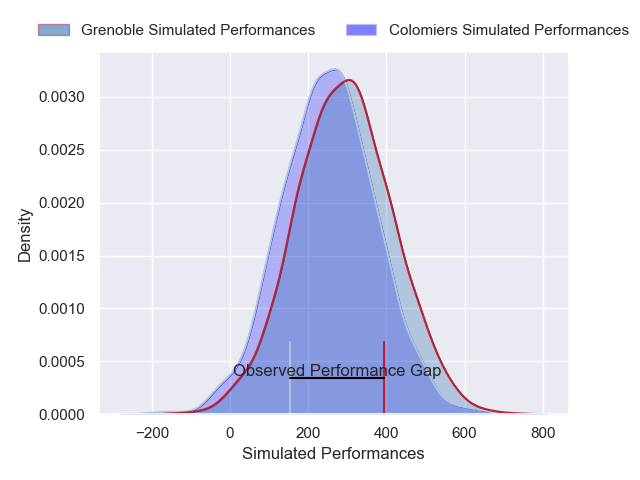
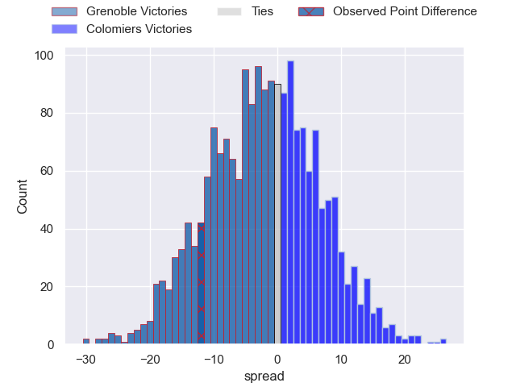

---  
layout: page  
title: Grenoble at Colomiers; 36-24  
date: 2025-02-07 18:00:00 -0500  
categories: "Pro D2 24/25" match review  
---
# Grenoble at Colomiers; 36-24

# Club Level Predictions

The first set of predictions treats a club as the smallest object, as the club develops its members, organizes a gameplan, and deploys its players as needed for each match. This club model has a prediction of 0.508, which translates to predicting Colomiers to win by 0.3.

Our Over/Under is 57.5 - and combined with the spread above, we have a predicted scoreline of 29 to 29

Each club has a rating and a rating deviation (similar to a Glicko rating), and expected performances can be generated. This allows for simulated matches and spreads like the ones below.
## Projected Performances - Club Model

## Projected Spreads - Club Model

## Projected Results - Club Model

# Player Level Predictions

Treating teams instead as an entity made up of the currently active players, I have ratings for each player in an altogether different system. These can be combined to form team ratings once teamsheets are announced, weighting starters a bit higher than the reserves. After the match is played, players can be weighted by their minutes on the field, allowing for an accurate measure of the team's composition. With these compiled team ratings, we can make predictions, measure inaccuracy, and update the individual player ratings.
## Prediction without Player Minutes: Grenoble by 4.4

Grenoble by 16.7 on a neutral pitch

## Projected Performances - Player Model

## Projected Spreads - Player Model

## Projected Results - Player Model

|   Away Minutes | Away Player        |   Away Percentile |   Number |   Home Percentile | Home Player               |   Home Minutes |
|---------------:|:-------------------|------------------:|---------:|------------------:|:--------------------------|---------------:|
|             50 | Tommy Raynaud      |             86.15 |        1 |              7.38 | Elias El Ansari           |             61 |
|             80 | Mathis Sarragallet |             74.58 |        2 |             58.75 | Pablo Dimcheff            |             10 |
|             30 | Johannes Jonker    |             30.1  |        3 |             39.14 | Michael Simutoga          |             30 |
|             19 | Thomas Lainault    |             45.87 |        4 |             39.64 | Jean Thomas               |             30 |
|             61 | Pierce Phillips    |             82.82 |        5 |              6.24 | Jack Whetton              |             24 |
|             19 | Ryno Pieterse      |             75.12 |        6 |              6.15 | Anthony Coletta           |             18 |
|              2 | Victor Guillaumond |             76.66 |        7 |             16.81 | Jeremy Bechu              |             80 |
|             25 | Thibaut Martel     |             76.79 |        8 |             14.56 | Caleb Timu                |             80 |
|             61 | Eric Escande       |             90.61 |        9 |             10.09 | Sadek Deghmache           |             80 |
|             29 | Sam Davies         |             90.64 |       10 |             13.62 | Joaquin de la Vega Mendia |             24 |
|             80 | Gerswin Mouton     |             78.04 |       11 |             13.21 | Anzelo Tuitavuki          |             64 |
|             80 | Romain Fusier      |             71.28 |       12 |             18.52 | Ray Nu'u                  |             80 |
|             80 | Julien Heriteau    |             82    |       13 |              4.58 | Martin Dulon              |             80 |
|             51 | Kaminieli Rasaku   |             86.31 |       14 |              5.8  | Martin Alonso Munoz       |             80 |
|             22 | Julien Farnoux     |             97.53 |       15 |             16.7  | Max Auriac                |             10 |
|             80 | Giorgi Pertaia     |             93.12 |       16 |             81.79 | Dorian Laborde            |             61 |
|             50 | Eli Eglaine        |             48.59 |       17 |             53.15 | Robin Bellemand           |             80 |
|             79 | Barnabe Couilloud  |             49.74 |       18 |             25.24 | Maxime Granouillet        |             80 |
|             29 | Hugo Trouilloud    |             53.4  |       19 |             78.28 | Guillaume Tartas          |             59 |
|             34 | Pio Muarua         |             50.84 |       20 |              4.38 | Theo Lachaud              |             78 |
|             80 | Bastien Soury      |             58.08 |       21 |             28.15 | Gregoire Bazin            |             16 |
|             71 | Thomas Ployet      |             79.85 |       22 |             47.3  | Mathis Galthié            |             19 |
|             61 | Max Clement        |             78.09 |       23 |            nan    | Elliott Maurel            |             21 |

